# 自動テスト管理アプリ 要件定義書（PoC：生産管理シミュレータ）

| 項目 | 内容 |
|---|---|
| 版 | 2.4 |
| 作成日 | 2026年9月22日 |
| 位置づけ | 本書は、別冊の「テスト工程の定義と自動化の方針（生産管理シミュレータ）」（以下、標準書）にもとづく、自動テスト管理アプリの要件定義書です。章の番号は標準書からの通し番号です |
| 変更履歴 | 1.0 初版（全体）／2.0 品質保証の観点のレビュー結果を反映／2.1 テストの標準とアプリの要件定義を2冊に分割／2.2 リポジトリ側の準備完了後の実機確認結果を反映（9.1：印の抽出方法）／2.3 技術検証（試作）の結果を受け、U-05・U-01を確定／2.4 アプリのコードの配置（同一リポジトリ内の新フォルダ）を確定 |

## 目次

- 本書について
- 6. 背景と目的
  - 6.1 解決したい課題
  - 6.2 目的と期待効果
  - 6.3 アプリの位置づけ
- 7. スコープ
  - 7.1 やる事
  - 7.2 やらない事
  - 7.3 将来の拡張候補
- 8. 利用者と業務の流れ
  - 8.1 利用者と権限
  - 8.2 業務フロー
  - 8.3 ユースケース一覧
- 9. 機能要件
  - 9.1 テスト計画管理
  - 9.2 テスト実行管理
  - 9.3 テスト結果管理
  - 9.4 分析
  - 9.5 通知・レポート
  - 9.6 共通機能
  - 9.7 主要な機能の受入条件
- 10. 非機能要件
  - 10.1 性能・規模
  - 10.2 可用性・運用
  - 10.3 セキュリティ
  - 10.4 保守性・拡張性
  - 10.5 AI利用に関する要件
- 11. 設計へのインプット
  - 11.1 技術的制約
  - 11.2 外部連携の概要
  - 11.3 主なデータの概要
  - 11.4 画面一覧（案）
  - 11.5 前提条件・未決事項

---

## 本書について

> **この章のポイント**
> - 本書は、標準書で定めたテストの工程と自動化の方針をもとに、自動テストを管理するアプリの要件を定めます。
> - 標準書の第4章（工程ごとの定義）、第5章（自動化と人間系の分類）が、本書の前提です。
> - 用語の説明、表記のルール、参考資料は、標準書の1.4と付録を参照してください。

### 本書の目的

自動テストの計画・実行・結果・分析を管理するアプリの要件を定め、設計に渡す情報を整理します。対象は、生産管理シミュレータを使ったPoC（小さく試して、考え方や仕組みが有効かを確かめること）です。

### 想定読者

標準書と同じく、内製チームの若手メンバーと、管理職・意思決定者を想定しています。管理職の方は、6章（背景と目的）と7章（スコープ）を中心にお読みください。

### 前提条件

本書は次の前提で書いています。

| 項目 | 前提 |
|---|---|
| 本書の位置づけ | 生産管理シミュレータを対象にしたPoC。当面はシミュレータのみを対象に書く |
| 対象システム | 生産管理シミュレータ（トレーニング用）。ブラウザだけで動くアプリで、サーバーやデータベースは持たない。React＋TypeScript＋Viteで作られ、受注・マスタ・調達・在庫・生産・出荷の6つの領域（ドメイン）で構成される。業務ロジックは純粋関数（同じ入力には必ず同じ結果を返し、外部の状態を変えない関数）で書かれ、vitestでテストしている。リポジトリはGitHubで管理する |
| 開発モデル | V字モデルを基本とし、W字モデルの考え方（設計と同時にテストの設計も行う）を取り入れる（標準書2.2）。ただし、シミュレータの実際の開発はAIとCIによる反復型のため、当てはめ方を4.7で定める |
| 対象とするテスト工程 | 単体テスト・結合テスト・総合テスト・受入テストの4工程 |
| 実施者 | 各工程を誰が実施するかは本書では定義しない。工程とテスト内容のみを定義する |
| アプリの守備範囲 | テストの実行はGitHub Actionsとテストツールが行う。アプリは計画・実行の指示・結果・分析を管理する |
| アプリの利用者 | 作成者本人の1名（検証用） |
| アプリの規模 | 管理対象は生産管理シミュレータ1つ |
| アプリの技術構成 | シミュレータと同じ構成（React＋TypeScript＋Vite）。GitHub PagesなどでWeb上に公開して使う |
| 設計時に決める事項 | テスト結果などのデータの保存先、AI分析の仕組み |

アプリの前提は、第3部で詳しく説明します。

### 標準書との関係

| 標準書の内容 | 本書での使い方 |
|---|---|
| 標準書の第3章（テストの種類） | アプリが扱うテストの種類の区分 |
| 標準書の第4章（工程別の定義、完了基準） | アプリが扱う工程の区分と、完了判定の材料 |
| 標準書4.7（反復型開発への当てはめ） | 完了判定をリリースの単位で行うという前提 |
| 標準書の第5章（自動化と人間系の分類、実行のタイミング） | アプリの管理対象と、実行のタイミングの区分 |
| 標準書1.4（表記のルール）、付録A（用語集）、付録B（参考資料） | 本書でも同じものを使う |

---

# 第3部 自動テスト管理アプリ 要件定義

## 6. 背景と目的

> **この章のポイント**
> - シミュレータのテストには、4つの課題（全体が見えない、原因調査に時間がかかる、工程・要件との対応が分からない、抜けや不足に気付きにくい）があります。
> - PoCでは、4つの目的を確かめます。目的ごとに、評価の方法と目標値の例を決めます。
> - PoCの期間は2週間程度です。
> - アプリはテストを実行せず、既存の仕組み（GitHub Actions）が実行したテストの計画・結果・分析を管理します。

### 6.1 解決したい課題

| 課題 | 具体的な状況 | 影響 |
|---|---|---|
| 課題1：テスト結果が散らばり、全体の状況が見えない | GitHub Actionsの結果は、実行ごとの記録（ログ）として残るが、複数回の実行をまたいだ一覧や推移は見にくい。手動テストの結果は、別の場所に記録される | 今の品質の状態を、すぐに説明・判断できない |
| 課題2：テストが失敗したときの原因調査に時間がかかる | 失敗するたびにログを読んで原因を探す必要がある。同じような失敗が繰り返されても気付きにくい。実行するたびに結果が変わるテスト（フレーキーテスト）と、本当の不具合の区別もつきにくい | 修正までに時間がかかり、開発の速さが落ちる |
| 課題3：どのテストがどの工程・要件に対応するか分からない | テストコードはあるが、どの工程・どのテストの種類・どの要件を確かめるものかが整理されていない | 標準書の第4章の完了基準を満たしたかを判断できない |
| 課題4：テストの抜けや不足に気付きにくい | 要件や工程ごとに、テストがあるか、足りているかを一覧で確かめる手段がない | テストのない部分の不具合が、後の工程や利用時に見つかる |

> **用語**
> **フレーキーテスト**：コードを変えていないのに、実行するたびに合格したり失敗したりするテスト。E2Eテストで、画面の表示を待つ時間が足りない場合などに起きやすく、本当の不具合を見落とす原因になります。

各課題に対して、アプリでは次の方向で解決を図ります。

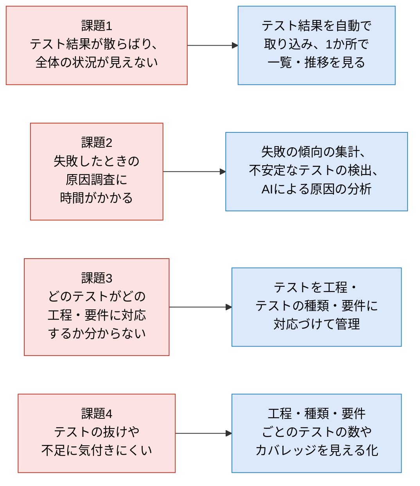

### 6.2 目的と期待効果

#### PoCの目的と評価の方法

PoCでは、次の4つを確かめます。目標値はあくまで例で、PoCの開始時に確定させます。

| # | PoCの目的 | 評価の観点 | 評価の方法 | 目標値の例 |
|---|---|---|---|---|
| 1 | 自動テストの計画〜分析を一元管理できるか | 計画・実行・結果・分析を、アプリだけで行えるか | PoC期間中の作業のうち、アプリとGitHub以外の道具（表計算ソフトなど）を使った作業を記録する | 計画から分析までの作業を、アプリとGitHubだけで完結できる |
| 2 | 本書のテスト工程の定義が実際に回るか | 標準書の第4章・第5章の定義に沿って、テストを登録・分類し、完了を判定できるか | すべての自動テストを、工程とテストの種類に対応づけられたかを確かめる。各工程の完了基準を、アプリの情報で判定できたかを確かめる | 自動テストの100%が工程と種類に対応づいている。単体・結合・総合の完了基準を、アプリの情報で判定できる |
| 3 | AI駆動開発でも品質を保てるか | AIを使った変更のあとでも、自動テストでデグレを見つけられるか。テスト自体が誤りを見つけられるか | 変更のたびにリグレッションテストが実行された割合を記録する。わざと入れた不具合（故障注入）を自動テストが検出できたかを記録する。ミューテーションスコア（標準書5.4）も測る | 変更の100%でリグレッションテストが実行される。故障注入した不具合の8割以上を自動テストが検出する |
| 4 | AIによる失敗原因の分析が役に立つか | AIが示す原因の候補は正しいか。調査の時間は減るか | 失敗のたびに、先に自分の推定を記録し、そのあとAIの回答と実際の原因を比べる。原因の特定にかかった時間を、AIを使った場合と使わない場合で比べる（使う・使わないは交互に割り当てる） | AIの原因候補が実際の原因と一致する割合が7割以上（最低10件で評価し、件数も併記する）。原因の特定にかかる時間が、ベースラインより短くなる |

#### 期待効果

PoCがうまくいった場合、次の効果が期待できます。

| 期待効果 | 対応する課題 |
|---|---|
| シミュレータの品質の状態を、いつでも1か所で説明できる | 課題1 |
| テストが失敗したときに、原因の特定と修正を速く行える | 課題2 |
| 各工程の完了を、根拠をもって判断できる | 課題3 |
| テストの抜けに早く気付き、不具合を後の工程に持ち込まない | 課題4 |
| AIを使って速く開発しても、品質を落とさずに済む | 課題1〜4 |

#### 評価を成り立たせるための進め方

2週間という短い期間では、評価に使えるデータが足りなくなりがちです。また、1人で開発と評価の両方を行うため、評価に偏りが入りやすくなります。そこで、次の進め方を前提とします。

| # | 進め方 | 理由 |
|---|---|---|
| 1 | 現状の値（ベースライン）を最初に測る。特に、テストが失敗したときに原因を特定するまでにかかる時間を、アプリを使わずに数件測っておく | 現状の値がないと、改善したかどうかを示せないため |
| 2 | GitHub Actionsの過去の実行履歴を取り込む（バックフィル） | フレーキーテストの検出や失敗の傾向の集計には、過去の履歴が必要なため |
| 3 | 原因が分かっている不具合を、わざとコードに入れて試す（故障注入） | 期間中に自然に起きる失敗は少ない。正解が分かっている失敗を作れば、AIの分析の当たり外れを正しく測れるため |
| 4 | AIの分析は「先に自分の推定を記録してから、AIの回答を見る」順で行う | 先にAIの回答を見ると、自分の判断が引きずられ、当たり外れを正しく測れないため |
| 5 | 失敗ごとに、AIを使う・使わないを交互に割り当てる | 「難しい失敗だけAIに聞く」といった偏りを避けるため |
| 6 | 結果は割合だけでなく、件数と具体的な事例で報告する | 件数が少ないと、割合だけでは判断を誤るため |

#### PoCの期間と進め方（案）

PoCの期間は2週間程度とします。

| 時期 | やること |
|---|---|
| 準備（最初の1〜2日） | 未決事項のうち、データの保存先と結果ファイルの取得方法を決める（11.5）。現状の値を測る。過去の実行履歴を取り込めるようにする |
| 前半（1週目） | アプリの中核の機能を作る。シミュレータの既存のテストを取り込み、要件・工程・テストの種類に対応づける |
| 後半（2週目） | シミュレータを実際に変更しながらアプリを使い、評価の観点に沿って記録する。故障注入による確認も行う |
| 最後 | 評価の結果をまとめ、下の判定基準にあてはめて、PoCのあとにどうするかを判断する |

2週間という短い期間のため、PoCで作る機能は絞り込みます。範囲は第7章で定めます。

#### PoCの後の判断の基準

評価のあと、次の基準で判断します。基準は、PoCの開始時に確定させます。

| 判断 | 条件（例） |
|---|---|
| 本格的に使う | 目的1と2を満たし、目的4（AIの分析）で原因の特定にかかる時間が短くなる傾向が見えた |
| 改善してもう一度試す | 目的1と2は満たしたが、AIの分析が役に立たなかった。または、評価に使えるデータが足りなかった |
| やめる | テストの結果を取り込めない、分類が続かないなど、仕組みとして成り立たないことが分かった |

### 6.3 アプリの位置づけ

アプリは、テストを自分では実行しません。テストの実行は既存の仕組み（GitHub Actionsとテストツール）が行い、アプリはその計画・実行の指示・結果・分析を管理します。

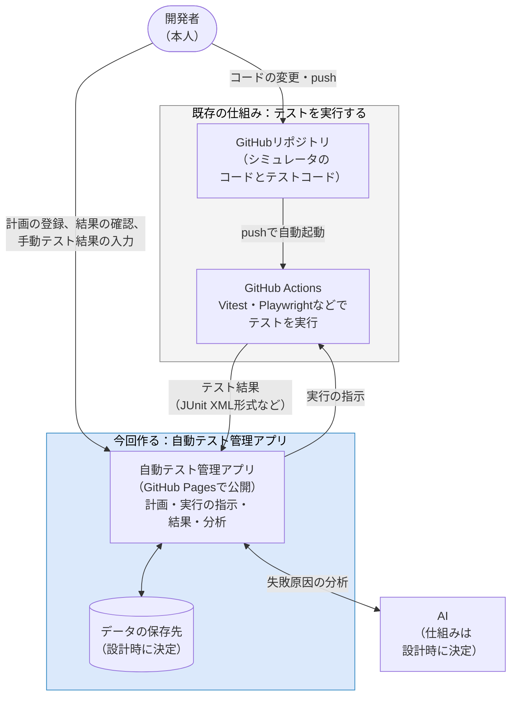

役割の分担は次のとおりです。

| 役割 | 担うもの |
|---|---|
| テストコードを書く | 開発者（Claude CodeなどのAIも使う）。アプリの外で行う |
| テストを実行する | GitHub Actionsとテストツール。アプリの外で行う |
| テストの計画を立て、管理する | アプリ |
| テストの実行を指示する | アプリ（GitHub Actionsに指示する）。pushによる自動実行は、GitHub Actionsの設定で行う |
| テストの結果を記録する | アプリ（自動テストの結果は自動で取り込み、手動テストの結果は手で入力する） |
| テストの結果を分析する | アプリ（集計、フレーキーテストの検出、AIによる失敗原因の分析） |
| 完了や合否を最終判断する | 人（アプリの情報を材料にする） |

---

## 7. スコープ

> **この章のポイント**
> - アプリで「やる事」と「やらない事」を分けます。やらない事には、代わりにどうするかも書きます。
> - 要件はすべてテストと対応づけます。要件の一覧は、リポジトリ内のMarkdownの仕様書から取り込みます。
> - テストと要件・工程・テストの種類は、テストコードに書いた印（タグ）で自動的に分類し、アプリの画面で直せるようにします。
> - 通知は作らず、レポートの出力だけを作ります。

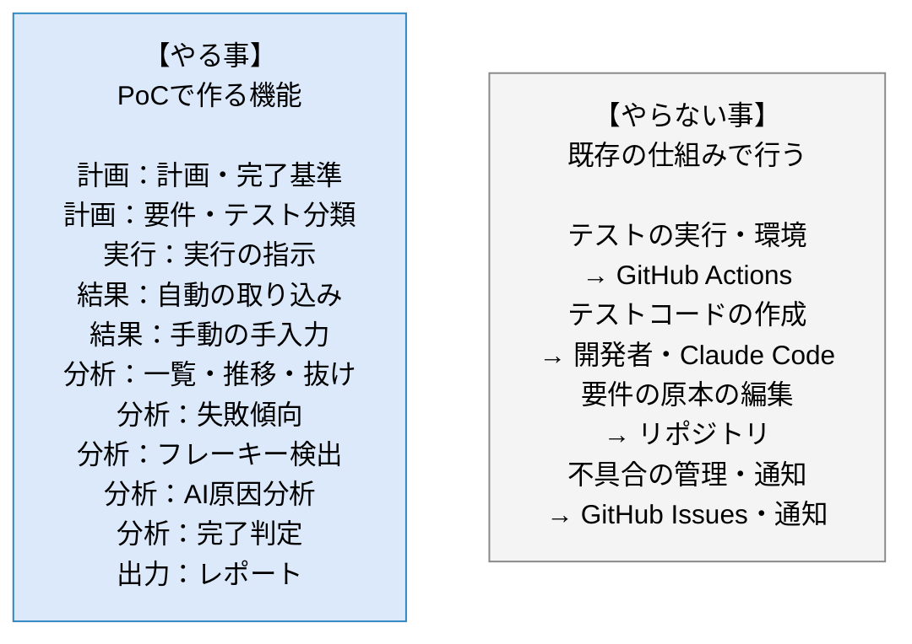

### 7.1 やる事

優先度は3つに分けます。「必須」はPoCの中核で必ず作るもの、「推奨」は余裕があれば作るもの、「PoC対象外（手運用）」はアプリでは作らず、Markdownのひな形を使って手で行うものです。

2週間という期間では、必須をどこまで絞れるかがPoCの成否を分けます。そこで、PoCの目的（6.2）に直接つながるもの（結果の取り込み、分類、要件との対応づけ、AIによる分析と評価の記録）を必須とし、計画の管理と完了の判定は手運用にしました。

| ID | 区分 | 項目 | 内容 | 対応する課題・目的 | 優先度 |
|---|---|---|---|---|---|
| S-01 | 計画 | テスト計画の管理 | 工程ごとのテスト計画（目的、対象範囲、完了基準とその目標値）を管理する。PoCではアプリで作らず、Markdownのひな形に書いて運用する | 目的2 | PoC対象外（手運用） |
| S-02 | 計画 | 要件の取り込み | リポジトリ内のMarkdownの仕様書（ユースケース一覧など）から、要件の一覧を取り込む。仕様書が更新されたら取り込み直せる | 課題3・4 | 必須 |
| S-03 | 計画 | テストの分類 | テストコードに書いた印（要件のID、工程、テストの種類）を読み取り、テストを自動で分類する。印がない・誤っているテストは、アプリの画面で直せる | 課題3、目的2 | 必須 |
| S-04 | 実行 | 実行の指示 | アプリからGitHub Actionsのテスト実行を起動する。実行の状況（実行中・完了）を確認できる | 目的1 | 推奨 |
| S-05 | 結果 | 自動テストの結果の取り込み | GitHub Actionsで実行したテストの結果（JUnit XML形式など）を、実行ごとに取り込む。pushによる自動実行の結果も取り込む | 課題1、目的1 | 必須 |
| S-06 | 結果 | カバレッジの取り込み | コードカバレッジの結果を取り込み、単体テストの完了基準の判定に使う | 課題4 | 推奨 |
| S-07 | 結果 | 手動テストの結果の手入力 | 人間系のテスト（ユーザビリティテスト、受入テストなど）の結果（合否、日付、メモ）を手で入力する | 課題1 | 推奨 |
| S-08 | 分析 | 状況の一覧・推移の表示 | 最新の結果、合格率の推移、工程・テストの種類・要件ごとの集計を表示する | 課題1、目的1 | 必須 |
| S-09 | 分析 | 抜け・不足の見える化 | テストのない要件、工程・テストの種類ごとのテストの数を表示する | 課題4 | 必須 |
| S-10 | 分析 | 失敗傾向の集計 | よく失敗するテストや、失敗の多い領域を集計して表示する | 課題2 | 推奨 |
| S-11 | 分析 | フレーキーテストの検出 | 同じコードに対して結果が変わったテストを検出して表示する | 課題2 | 推奨 |
| S-12 | 分析 | AIによる失敗原因の分析 | 失敗したテストの情報をもとに、AIが原因の候補を示す。PoCの評価のため、候補が正しかったかと、原因の特定にかかった時間を記録できる | 課題2、目的3・4 | 必須 |
| S-13 | 分析 | 完了判定の支援 | 工程ごとに、完了基準を満たしているかを判定する。PoCではアプリの画面で現在の値を見ながら、Markdownのひな形に手で記録する | 目的2 | PoC対象外（手運用） |
| S-14 | 分析 | レポートの出力 | 工程の完了判定や、PoCの評価に使う報告書を、Markdown形式で書き出す | 目的1〜4 | 推奨 |
| S-15 | 分析 | 不具合の状況の取り込み | GitHub Issuesから、ラベル（重大度、入り込んだ工程、見つかった工程）付きの不具合の件数を読み取り、完了基準の判定に使う | 課題1、目的2 | 推奨 |

> **2週間で作るための進め方（案）**
> 土台となる機能から順に作ります。1と2が動けば、評価のためのデータを集め始められます。
> 1. 結果を取り込んで表示する（S-05、S-08）。過去の実行履歴の取り込み（バックフィル）もここで行う
> 2. 要件の取り込みと、テストの分類・抜けの表示（S-02、S-03、S-09）
> 3. AIによる分析と、原因・評価の記録（S-12）
> 4. 余裕があれば、失敗傾向とフレーキーテストの検出（S-10、S-11）、手動テストの結果の入力（S-07）、実行の指示（S-04）
> 5. さらに余裕があれば、レポートの出力（S-14）、カバレッジの取り込み（S-06）、不具合の状況の取り込み（S-15）
>
> 時間が足りない場合は、後ろから削ります。計画の管理と完了の判定（S-01、S-13）は、アプリでは作らずMarkdownのひな形で運用します。

> **テストコードに書く印（タグ）のイメージ**
> テストの名前に、次のような印を書いておきます。書き方の細かい決まりは、9.1で定めます。
>
> ```text
> [UC-03][単体][機能] 在庫が不足する場合は、不足数を返す
> ```

### 7.2 やらない事

| 項目 | やらない理由 | 代わりの手段 |
|---|---|---|
| テストの実行そのもの | 守備範囲を「管理」に絞ったため | GitHub Actionsとテストツールが実行する |
| テスト環境の構築と管理 | 既存の仕組みで行えるため | GitHub Actionsのワークフローの設定で行う |
| pushでの自動実行や、定期実行の設定 | GitHub Actionsの機能で行えるため | GitHub Actionsのワークフローの設定で行う。アプリは、手動での実行の指示だけを行う |
| テストコードの作成・修正 | 開発者が行う作業のため | 開発者がエディタやClaude Codeで行う |
| AIによるテストコードの自動生成・自動修正 | アプリのAIは原因の候補を示すところまでとし、直すかどうかは人が判断するため | 開発者がClaude Codeなどで行う |
| 要件の原本の編集 | 原本はリポジトリのMarkdownとし、二重管理を避けるため | リポジトリの仕様書を編集し、アプリに取り込み直す |
| 手動テストの手順や進捗の管理 | 人間系のテストは、結果の手入力だけを扱うと決めたため | 手順は仕様書などで管理する |
| 不具合の管理（起票・追跡） | 既存の仕組みで行えるため | GitHub Issuesで管理する。ただしラベルの決まり（重大度、入り込んだ工程、見つかった工程）を定め、件数の読み取りだけはアプリで行う（S-15、推奨） |
| 通知 | 利用者が1名で、GitHubの標準の通知で足りるため | GitHubの通知（メールなど）を使う |
| 複数の利用者と権限の管理 | 利用者は本人1名のため | なし |
| 複数のシステムの管理 | 当面はシミュレータだけを対象とするため | なし |

### 7.3 将来の拡張候補

PoCでは作りませんが、PoCの結果によって検討するものです。

| 拡張候補 | 内容 |
|---|---|
| 他のシステムへの展開 | 生産管理システム基盤などを対象に加える。複数の利用者と権限の管理、GitLab CIへの対応が必要になる |
| 通知 | テストの失敗や、フレーキーテストの検出を、チャットなどに通知する |
| 不具合管理との連携 | 失敗したテストから、GitHub Issuesに不具合を起票する |
| 手動テストの管理 | 手動テストの手順書と、実施の進捗を管理する |
| AIの活用範囲の拡大 | テストの抜けに対して、追加すべきテストをAIが提案する。Claude Codeと連携して、テストコードの作成につなげる |
| 実行スケジュールの管理 | 定期実行のスケジュールを、アプリの画面から設定する |

---

## 8. 利用者と業務の流れ

> **この章のポイント**
> - 利用者は本人1名です。1人が「計画する人」「開発する人」「判断する人」などの役割を兼ねます。
> - アプリは、GitHubのリポジトリ、GitHub Actions、AIの3つの外部の仕組みとやり取りします。
> - 業務の流れは「準備 → 日々の開発 → 工程の完了判定 → PoCの評価」です。
> - アプリの使い方を、11個のユースケース（利用場面）に整理します。

### 8.1 利用者と権限

#### 利用者の役割

利用者は本人1名です。ただし、1人がいくつかの役割を兼ねるため、役割ごとに行うことを整理します。

| 役割 | 行うこと | 主に使う機能（7.1のID） |
|---|---|---|
| テストを計画する人 | 要件を取り込み、テスト計画と完了基準を登録する | S-01、S-02 |
| 開発する人 | コードとテストコードを書き、テストに印（タグ）を付ける。必要なときにテストの実行を指示する | S-03、S-04 |
| 手動テストを行う人 | 人間系のテストを行い、結果を入力する | S-07 |
| 分析・判断する人 | 結果と分析を見て原因を特定し、AIの分析の当たり外れを記録する。工程の完了を判定し、レポートを出力する | S-08〜S-14 |

#### 権限

利用者が1名のため、アプリの中で権限を分けることはしません（7.2参照）。本人は、アプリのすべての機能を使えます。

一方で、アプリはGitHub Pagesで公開するため、画面そのものは誰でも開けます。テスト結果などのデータは、本人以外が見たり変えたりできないようにする必要があります。具体的な要件は10.3で定めます。

#### アプリとやり取りする外部の仕組み

| 外部の仕組み | アプリとの関係 |
|---|---|
| GitHubのリポジトリ | 仕様書（要件の一覧）を読み取る |
| GitHub Actions | テストの実行を指示する。実行したテストの結果を受け取る |
| AI | 失敗したテストの情報を渡し、原因の候補を受け取る（仕組みは設計時に決める） |

### 8.2 業務フロー

#### 全体の流れ

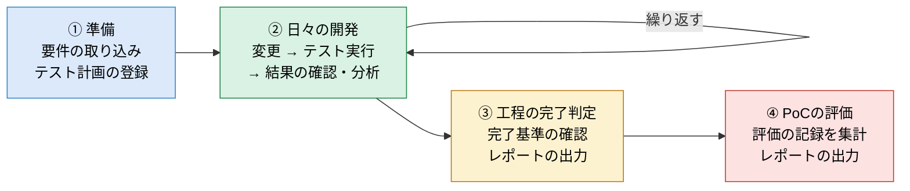

| 段階 | 行うこと | 主なユースケース（8.3） |
|---|---|---|
| ① 準備 | リポジトリの仕様書から要件を取り込む。工程ごとのテスト計画と完了基準を登録する。既存のテストの結果を取り込み、分類を確かめて補正する | AUC-01、AUC-02、AUC-03、AUC-05 |
| ② 日々の開発 | コードを変更してテストを実行し、結果を確かめる。失敗したら原因を分析する。手動テストを行ったら結果を入力する | AUC-03〜AUC-09 |
| ③ 工程の完了判定 | 工程ごとに完了基準を満たしているかを確かめ、判定の結果をレポートとして残す | AUC-10、AUC-11 |
| ④ PoCの評価 | PoCの期間の最後に、6.2の評価の方法に沿って記録を集計し、レポートとして残す | AUC-07、AUC-11 |

#### 日々の開発の流れ

②の日々の開発で、本人・アプリ・外部の仕組みがどうやり取りするかを、時間の順に示します。

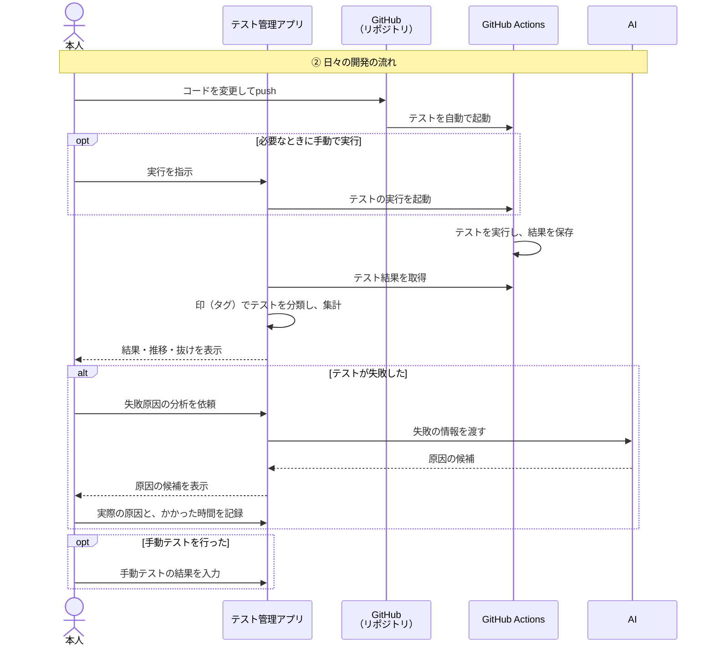

> **図の読み方**
> 縦の線が登場する人や仕組みで、上から下へ時間が進みます。「opt」の枠は必要なときだけ行うこと、「alt」の枠は条件に当てはまるときに行うことを表します。

### 8.3 ユースケース一覧

アプリの利用場面（ユースケース）を次のように整理します。シミュレータの仕様書のユースケース（UC-xx）と区別するため、アプリのユースケースは「AUC-xx」と表します。

| ID | ユースケース | 概要 | きっかけ | 結果 | 対応するやる事 |
|---|---|---|---|---|---|
| AUC-01 | 要件を取り込む | リポジトリの仕様書（Markdown）を読み取り、要件の一覧をアプリに登録する | PoCの開始時、仕様書の更新時 | 要件の一覧が最新になる | S-02 |
| AUC-02 | テスト計画を登録する | 工程ごとに、目的・対象範囲・完了基準と目標値を登録・更新する | PoCの開始時、計画の見直し時 | 工程ごとのテスト計画ができる | S-01 |
| AUC-03 | テストの分類を確かめて補正する | 印（タグ）から自動で分類された結果を確かめ、印がない・誤っているテストを画面で直す | 新しいテストが取り込まれたとき | すべてのテストが要件・工程・テストの種類に対応づく | S-03 |
| AUC-04 | テストの実行を指示する | アプリからGitHub Actionsのテスト実行を起動し、状況を確かめる | pushを伴わずにテストを流したいとき（公開前・必要時など） | テストが実行される | S-04 |
| AUC-05 | テスト結果を取り込む | GitHub Actionsで実行したテストの結果とカバレッジを取り込む | テストの実行が終わったとき | 結果がアプリに記録される | S-05、S-06 |
| AUC-06 | 手動テストの結果を入力する | 人間系のテストの結果（合否、日付、メモ）を入力する | 手動テストを行ったとき | 手動テストの結果が記録される | S-07 |
| AUC-07 | テストの状況を確かめる | 最新の結果、合格率の推移、要件・工程・テストの種類ごとの集計と、テストのない要件を見る | 日々、または判断が必要なとき | 品質の状態と、テストの抜けが分かる | S-08、S-09 |
| AUC-08 | 失敗の傾向を確かめる | よく失敗するテストや失敗の多い領域、フレーキーテストを見る | テストが失敗したとき、定期的な見直しのとき | 重点的に直すべき箇所が分かる | S-10、S-11 |
| AUC-09 | 失敗原因を分析する | 失敗したテストについてAIに原因の候補を出させ、実際の原因、候補の当たり外れ、かかった時間を記録する | テストが失敗したとき | 原因が特定され、PoCの評価の記録が残る | S-12 |
| AUC-10 | 工程の完了を判定する | 工程ごとに完了基準を満たしているかを確かめ、完了かどうかを判断する | 工程の終わり | 工程の完了が判定される | S-13 |
| AUC-11 | レポートを出力する | 完了判定の結果や、PoCの評価の結果をMarkdown形式で書き出す | 完了判定の後、PoCの最後 | レポートのファイルができる | S-14 |

---

## 9. 機能要件

> **この章のポイント**
> - 機能要件とは、アプリが「何をできるべきか」を定めたものです。第7章のやる事（S-xx）を、具体的な機能（F-xxx）に分けて定義します。
> - 機能は「計画」「実行」「結果」「分析」「出力」「共通」の6つに分かれ、全部で29個です。
> - 優先度は「必須」「推奨」「PoC対象外（手運用）」の3つです（7.1参照）。
> - 設計で迷いやすい決まりごと（要件の読み取り方、印の書き方、フレーキーテストの判定条件、完了判定の方法など）も、ここで定めます。

各機能には、対応するやる事（7.1のS-xx）、ユースケース（8.3のAUC-xx）、優先度を示します。優先度が「PoC対象外（手運用）」の機能は、アプリでは作らず、Markdownのひな形を使って手で行います。ただし、判定に使う値はアプリの画面で確認できます。

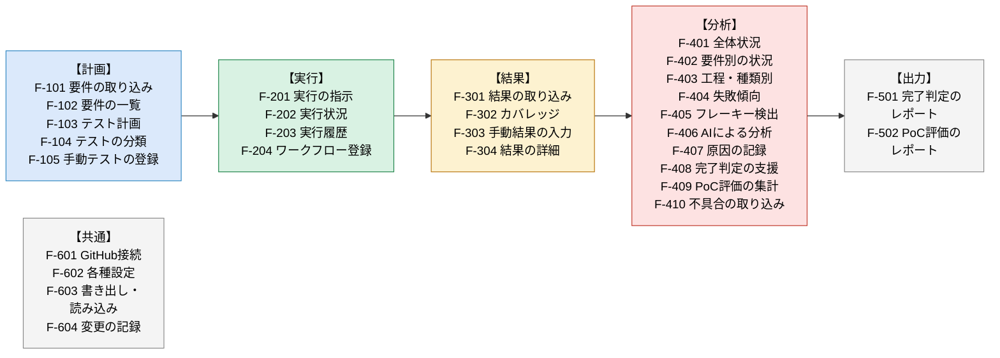

### 9.1 テスト計画管理

| ID | 機能 | 内容 | やる事 | ユースケース | 優先度 |
|---|---|---|---|---|---|
| F-101 | 要件の取り込み | リポジトリ内のMarkdownの仕様書から、要件のIDと名前を読み取って登録する。取り込む前に、前回との違い（追加・変更・削除）を表示し、確認してから確定する | S-02 | AUC-01 | 必須 |
| F-102 | 要件の一覧 | 登録した要件を一覧で表示する。要件ごとに、対応するテストの数と最新の合否を示す | S-02 | AUC-07 | 必須 |
| F-103 | テスト計画の登録 | 工程ごとに、目的、対象範囲、期間、完了基準（項目と目標値）を登録・更新する。初期値として、標準書の第4章の完了基準をひな形として用意する | S-01 | AUC-02 | PoC対象外（手運用） |
| F-104 | テストの分類 | 取り込んだテストの一覧を表示し、印（タグ）による分類の結果を示す。未分類や印の誤りのテストを、画面で補正する | S-03 | AUC-03 | 必須 |
| F-105 | 手動テストの登録 | 人間系のテスト（ユーザビリティテスト、受入テストなど）の項目を、名前・工程・テストの種類・要件とともに登録する。F-303で結果を入力する対象になる | S-07 | AUC-06 | 推奨 |

#### 要件の読み取りのルール（F-101）

仕様書の中の表から、要件を読み取ります。

```text
| ID    | ユースケース     |
|-------|------------------|
| UC-01 | 受注を登録する   |
| UC-02 | 在庫を引き当てる |
```

| 項目 | ルール |
|---|---|
| 対象のファイル | 設定で指定した、リポジトリ内のMarkdownファイル（複数指定できる） |
| 読み取る行 | 表の行のうち、IDの列の値が「要件IDの書式」に合う行 |
| 要件IDの書式 | 初期値は「UC-」と数字の組み合わせ（例：UC-01）。設定で変えられる |
| 読み取る列 | IDの列と名前の列。どの列かは設定で変えられる（初期値：1列目がID、2列目が名前） |
| 記録する項目 | 要件ID、要件の名前、読み取ったファイル名 |
| 仕様書から消えた要件 | 削除せず「廃止」とする。過去のテスト結果との対応を残すため |
| 同じIDが複数ある場合 | 警告を表示し、どちらを採用するかを本人が選ぶ |
| 仕様書の編集 | アプリでは行わない。原本はリポジトリのMarkdownとする（7.2参照） |

#### テスト計画の完了基準（F-103）

完了基準は、次の項目から選び、目標値を設定します。いずれもアプリが持つ情報から、現在の値を自動で求められる項目です。

| 完了基準の項目 | 意味 | 目標値の例 | 主に使う工程 |
|---|---|---|---|
| 合格率 | 最新の実行で合格したテストの割合（スキップしたテストは分母から除く） | 100% | すべて |
| 未解決の失敗の数 | 失敗したテストのうち、原因の記録（F-407）が済んでいないものの数 | 0件 | すべて |
| 要件の十分性 | 対象の要件のうち、下の「要件ごとに必要なテスト」を満たす要件の割合 | 100% | すべて |
| 静的解析のエラーの数 | 型チェックやESLintで見つかったエラーの数 | 0件 | 単体 |
| コードカバレッジ | テストで実行されたコードの割合（F-302が必要） | 80%以上 | 単体 |
| フレーキーテストの数 | F-405で検出されたテストの数 | 0件 | 総合 |
| スキップ率 | 全テストのうち、スキップしたテストの割合。失敗するテストをスキップして合格率を上げることを防ぐために見る | 5%以下 | すべて |
| ミューテーションスコア | テストが、わざと入れた誤りを見つけられた割合（標準書5.4参照）。測るには準備が必要なため、推奨の項目とする | 60%以上 | 単体 |
| 重大度が高い未解決の不具合の数 | GitHub Issuesのラベルから数える（F-410） | 0件 | すべて |
| 手動テストの実施率 | 登録した手動テストのうち、結果が入力されたものの割合 | 100% | 総合・受入 |
| 手動テストの合格率 | 結果が入力された手動テストのうち、合格したものの割合 | 100% | 受入 |

#### 要件ごとに必要なテスト（十分性の判定）【補完】

「その要件のテストが1件でもあればカバー済み」とすると、異常系や境界値のテストがなくても100%になり、誤った安心につながります。そこで、要件ごとに必要なテストを次のように定めます。初期値であり、設定で変えられます。

| 要件の種類 | 必要なテスト（最低限） |
|---|---|
| 業務ロジックを含む要件（計算・判定を伴うもの） | 単体テスト：正常系・異常系・境界値の3つの観点それぞれ1件以上。結合テスト：関係する領域の連携を確かめるもの1件以上 |
| 画面の操作を伴う要件 | 画面部品テスト1件以上。主要な操作の流れはE2Eテスト1件以上 |
| 研修の進め方に関わる要件 | 受入テスト（人が行う）の項目1件以上 |

観点（正常系・異常系・境界値）は、テストの印で区別します（次の項を参照）。

#### テストの分類のルール（F-104）

テストの分類には、テストコードに書いた印（タグ）を使います。

```text
[UC-03][単体][機能] 在庫が不足する場合は、不足数を返す
```

| 項目 | ルール |
|---|---|
| 印の書き方 | テストの名前、またはテストのまとまり（describe）の名前に、「[値]」の形で書く。VitestとPlaywrightで同じ書き方にする |
| 読み取る値 | 要件ID（複数書ける）、工程（単体・結合・総合・受入）、テストの種類（標準書の第3章の種類） |
| 略称 | 「[unit]＝単体」「[e2e]＝E2Eテスト」のような略称を使える。略称の対応表は設定で決める |
| まとまりの印の引き継ぎ | テストのまとまりに付けた印は、その中のテストに引き継ぐ。テスト自身に同じ区分の印があれば、テスト自身の印を優先する |
| 同じテストとみなす条件 | テストのファイルのパスと、印を除いたテストの名前が同じもの。名前を変えたテストは別のテストとして扱い、古いテストは「更新なし」として残す |
| 分類の状態 | 分類済み／未分類（印がない）／印の誤り（未知の値や、登録されていない要件ID）／補正済み（画面で直した） |
| 観点の印 | 業務ロジックの単体テストには、観点の印（[正常]／[異常]／[境界]）を付ける。十分性の判定に使う |
| AIが作成したテストの区別 | AIが書いたテストには[AI]の印を付けられるようにする（任意）。AIが書いたテストの有効性を比べるために使う |
| 画面での補正 | 画面で直した分類は、印より優先する。アプリはテストコードを書き換えない。補正と印が食い違う場合はその旨を表示し、テストコード側を直すように促す |
| 印の抽出方法【実機確認済み】 | Vitestの標準JUnitレポーターは、結果ファイルの`name`属性を「テストのまとまり（describe）の名前 &gt; テストの名前」の形式で連結して出力する。そのため印は`name`属性の先頭に来るとは限らない。抽出は**先頭一致ではなく、属性値全体に対する正規表現の部分一致**で行う（例：`\[UC-\d+.*?\]\[.*?\]\[.*?\](\[.*?\])?`）。2026年9月27日、実際のCI出力（`test-results/junit.xml`）で確認済み |

### 9.2 テスト実行管理

| ID | 機能 | 内容 | やる事 | ユースケース | 優先度 |
|---|---|---|---|---|---|
| F-201 | 実行の指示 | F-204で登録したワークフローを選び、対象のブランチを指定して、GitHub Actionsでの実行を起動する | S-04 | AUC-04 | 推奨 |
| F-202 | 実行状況の表示 | 起動した実行の状況（待機中・実行中・完了）と結果（成功・失敗）を表示する。GitHub Actionsの画面へのリンクを示す | S-04 | AUC-04 | 推奨 |
| F-203 | 実行履歴の表示 | 実行の一覧（日時、きっかけ、コミット、ブランチ、ワークフロー、合格・失敗の件数）を表示する。pushによる自動実行も含む | S-05 | AUC-07 | 推奨 |
| F-204 | ワークフローの登録 | 結果の取り込みと実行の指示の対象にするワークフローを登録する。ワークフローごとに、5.3の実行のタイミング（変更のたび・公開前・公開直後・定期／必要時）の区分を付ける | S-04 | AUC-04 | 必須 |

> **用語**
> - **ワークフロー**：GitHub Actionsで実行する処理のまとまり。リポジトリ内の設定ファイルで定義します（例：「単体・結合テスト」「E2Eテスト」）。
> - **ブランチ**：コードの変更を、本流とは分けて進めるための枝分かれ。
> - **コミット**：コードの変更を記録した単位。1回のpushに、1つ以上のコミットが含まれます。

| 項目 | ルール |
|---|---|
| アプリから起動できるワークフロー | 手動での起動を許可したワークフローに限る。許可の設定は、GitHub Actionsの設定ファイルで行う |
| 実行のタイミングの制御 | pushでの自動実行や定期実行の設定は、アプリでは行わない（7.2参照） |

### 9.3 テスト結果管理

| ID | 機能 | 内容 | やる事 | ユースケース | 優先度 |
|---|---|---|---|---|---|
| F-301 | 自動テストの結果の取り込み | 登録したワークフローの実行が完了したら、結果ファイル（JUnit XML形式など）を取得し、テストごとの結果を記録する。印を読み取って分類する | S-05 | AUC-05 | 必須 |
| F-302 | カバレッジの取り込み | コードカバレッジの結果ファイルを取得し、全体とファイルごとの割合を記録する | S-06 | AUC-05 | 推奨 |
| F-303 | 手動テストの結果の入力 | F-105で登録した手動テストについて、合否、実施日、実施した環境（ブラウザなど）、メモを入力する | S-07 | AUC-06 | 推奨 |
| F-304 | テスト結果の詳細 | 1件のテストについて、結果の履歴、失敗メッセージ、エラーの発生箇所を表示する。Playwrightのスクリーンショットなどがあれば、GitHub Actions上のファイルへのリンクを示す | S-05 | AUC-07、AUC-09 | 必須 |

#### 結果の取り込みと分類の流れ（F-301、F-104）

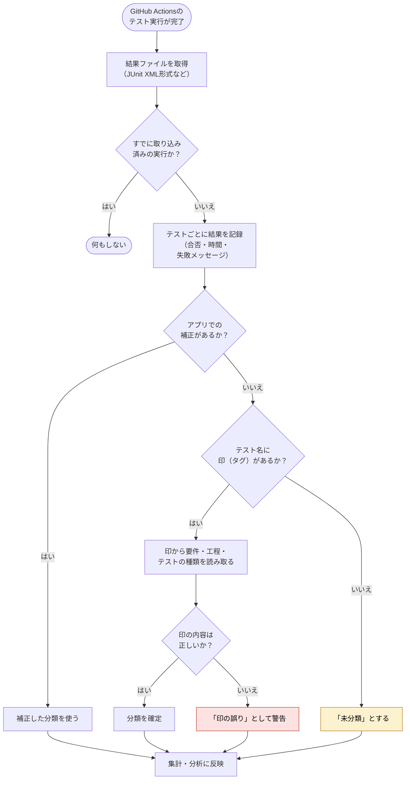

| 項目 | ルール |
|---|---|
| 取り込みのきっかけ | アプリを開いたときや画面を読み込み直したときに、新しい実行がないかを確かめて取り込む。本人が「取り込み」を操作したときにも取り込む |
| 実行ごとに記録する項目 | 実行のID、ワークフロー、きっかけ（push・アプリからの指示・定期）、コミット、ブランチ、開始と終了の日時 |
| テストごとに記録する項目 | ファイルのパス、テストの名前、合否、かかった時間、失敗メッセージ、エラーの発生箇所 |
| 合否の区分 | 合格・失敗・スキップの3つ。JUnit XML形式の「エラー」は失敗に含める |
| スキップの扱い | 合格率の分母からは除き、スキップ率として別に表示する。スキップしたテストは一覧で確認できる |
| 隔離したテスト | フレーキーなどの理由で一時的に実行から外したテストは、理由と、元に戻す期限とともに記録する。期限を過ぎたものは警告する |
| 二重の取り込み | 同じ実行は二度取り込まない |
| 取り込めなかった場合 | 結果ファイルが無い、形式が違うなどの場合は、その実行についてエラーを表示し、ほかの実行の取り込みは続ける |

### 9.4 分析

| ID | 機能 | 内容 | やる事 | ユースケース | 優先度 |
|---|---|---|---|---|---|
| F-401 | 全体状況の表示 | 最新の実行の合格・失敗の件数、合格率の推移、工程別・種類別の件数と合格率、要件のカバー率、未分類のテストの件数を1画面で表示する | S-08 | AUC-07 | 必須 |
| F-402 | 要件別の状況 | 要件ごとに、対応するテストの数（工程別）と最新の合否を表示する。テストのない要件と、必要なテストがそろっていない要件（下の「要件ごとに必要なテスト」を満たさない要件）を、一覧の先頭にまとめて表示する | S-08、S-09 | AUC-07 | 必須 |
| F-403 | 工程・種類別の状況 | 工程とテストの種類ごとに、テストの数と合格率を表示する。単体・結合・E2Eのテストの数の比から、テストピラミッド（標準書5.2）の形を示す | S-08、S-09 | AUC-07 | 推奨 |
| F-404 | 失敗傾向の集計 | 期間を指定し、失敗の回数が多いテスト、失敗の多い要件・工程・テストの種類、原因の分類ごとの件数を集計する | S-10 | AUC-08 | 推奨 |
| F-405 | フレーキーテストの検出 | 下の判定条件に当てはまるテストを検出し、結果の履歴とともに一覧で示す | S-11 | AUC-08 | 推奨 |
| F-406 | AIによる失敗原因の分析 | 本人が選んだ失敗について、AIに情報を渡し、原因の候補を受け取って表示する。AIの回答は保存する | S-12 | AUC-09 | 必須 |
| F-407 | 失敗の原因の記録 | 失敗ごとに、AIを見る前の自分の推定、実際の原因の分類、メモ、関連するGitHub Issueのリンク（任意）、AIの候補の当たり外れ、原因の特定にかかった時間、AIを使ったかどうか、故障注入によるものかを記録する | S-12 | AUC-09 | 必須 |
| F-408 | 完了判定の支援 | 工程ごとに、完了基準の各項目の現在の値と目標値を並べ、達成しているかを表示する。本人が判定の結果とコメントを記録する | S-13 | AUC-10 | PoC対象外（手運用） |
| F-410 | 不具合の状況の取り込み | GitHub Issuesから、ラベル付きの不具合の件数（重大度別、未解決の件数）を読み取り、完了判定に使う | S-15 | AUC-10 | 推奨 |
| F-409 | PoC評価の集計 | 6.2の評価の方法に沿って、評価の値を集計する（下の表を参照） | S-12、S-14 | AUC-07、AUC-11 | 必須 |

#### フレーキーテストの判定条件（F-405）

| 判定 | 条件 | 例 |
|---|---|---|
| フレーキー（確定） | 同じコミットに対する複数の実行で、合格と失敗の両方が出た | フレーキー検出用の実行で、1回目は失敗、2回目は合格 |
| フレーキー（確定） | 1回の実行の中で、失敗したあと再試行で合格した（Playwrightの再試行など、結果ファイルから分かる場合） | 1回目の試行で失敗、再試行で合格 |
| フレーキーの疑い | 直近N回の実行で、合格と失敗の切り替わりがM回以上ある（初期値：N＝10、M＝3。設定で変えられる） | 合格→失敗→合格→失敗→合格 |

> **判定を成り立たせるための運用**
> pushのたびに実行する運用では、同じコミットでテストが複数回流れることはほとんどありません。そのため、確定の条件が働きません。また、「切り替わりの回数」による判定は、コードの変更で壊れて直った本物の不具合も拾ってしまいます。そこで、次の運用を前提とします。
>
> - 同じコミットで全テストを複数回（例：3回）実行する「フレーキー検出用のワークフロー」を、定期的に（例：毎晩）動かす。確定の判定は、この実行の結果で行う
> - 「疑い」は候補の表示にとどめ、本人が確認して確定・取り消しを記録する
> - 確定したテストは、直すか、期限を決めて隔離する（9.3参照）

#### 失敗の原因の分類（F-404、F-406、F-407）

| 分類 | 意味 |
|---|---|
| 不具合 | シミュレータのコードの誤り |
| テストの誤り | テストコードや、期待する結果の誤り |
| 環境・たまたま | フレーキーテストや、実行環境の一時的な問題 |
| その他 | 上のどれにも当てはまらないもの |

#### AIによる失敗原因の分析（F-406）

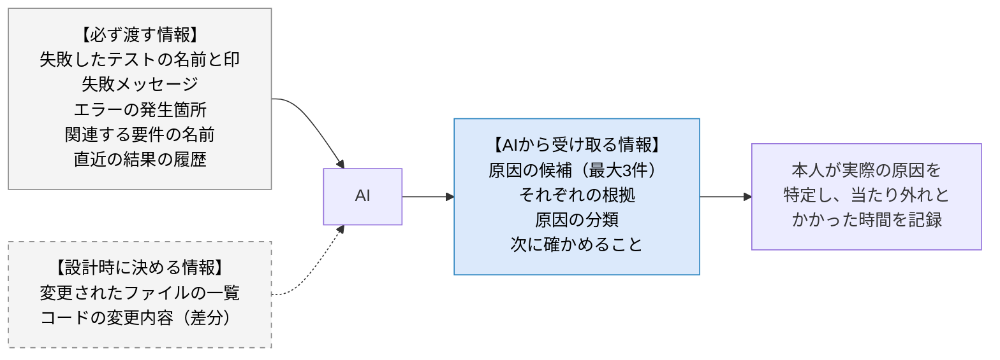

| 項目 | ルール |
|---|---|
| 分析のきっかけ | 本人が、失敗したテストを選んで依頼したときだけ行う。失敗のたびに自動では行わない（8.2参照） |
| 評価のための手順 | AIの回答を表示する前に、本人の推定を入力する画面を出す。これにより、AIの回答に引きずられずに当たり外れを測れる（6.2参照） |
| AIを使う・使わないの割り当て | 失敗ごとに、AIを使う場合と使わない場合を交互に割り当てて表示する。原因の特定にかかる時間を比べるため |
| 必ず渡す情報 | 失敗したテストの名前と印、失敗メッセージ、エラーの発生箇所、関連する要件の名前、そのテストの直近の結果の履歴（いつから失敗しているか、フレーキーか） |
| 設計時に決める情報 | 前回合格したときから変更されたファイルの一覧、コードの変更内容（差分）。送るかどうかは設計時に決める。あとで変えられるよう、送る情報の範囲を設定で切り替えられることが望ましい（推奨） |
| 受け取る情報 | 原因の候補（最大3件、確からしい順）、それぞれの根拠、原因の分類（上の表）、次に確かめること |
| 表示の仕方 | AIの回答は「候補」であることを明示し、最終的な判断は本人が行う（標準書5.5参照） |
| 保存 | AIの回答を保存し、F-407で当たり外れを記録できるようにする |

#### PoC評価の集計項目（F-409）

| PoCの目的（6.2） | 集計する値 |
|---|---|
| 1. 一元管理できるか | 計画・実行・結果・分析の各機能の利用回数。アプリ以外で行った作業は、本人がメモとして記録する |
| 2. テスト工程の定義が回るか | 分類済みのテストの割合。完了判定を記録した工程の数 |
| 3. AI駆動開発でも品質を保てるか | pushのうち、テストが実行された割合。原因が「不具合」だった失敗の件数。故障注入した不具合のうち、自動テストが検出した件数と割合 |
| 4. AIの分析が役立つか | AIの候補の当たりの割合（1位で当たり、3位までに当たり）と、その件数。本人の推定の当たりの割合。原因の特定にかかった時間の平均（AIを使った場合、使わない場合、ベースライン） |

### 9.5 通知・レポート

通知の機能は作りません（7.2参照）。レポートは、Markdown形式のファイルとして書き出します。

| ID | 機能 | 内容 | やる事 | ユースケース | 優先度 |
|---|---|---|---|---|---|
| F-501 | 完了判定のレポート | 工程の完了判定の結果を書き出す。含める内容：工程、期間、判定日、判定の結果とコメント、完了基準ごとの現在の値・目標値・達成状況、テストの種類ごとの数と合格率、テストのない要件の一覧、未解決の失敗、フレーキーテスト | S-14 | AUC-11 | 推奨 |
| F-502 | PoC評価のレポート | PoCの評価の結果を書き出す。含める内容：6.2の4つの目的ごとの評価の値と目標値、所見を書く欄 | S-14 | AUC-11 | 推奨 |

レポートには、書き出した時点の値を記録します。完了判定を記録した時点の値も保存しておき、あとで値が変わっても、判定の根拠が分かるようにします。

### 9.6 共通機能

| ID | 機能 | 内容 | やる事 | 優先度 |
|---|---|---|---|---|
| F-601 | GitHubとの接続 | 対象のリポジトリと、GitHubの認証情報（トークン）を設定し、接続できるかを確かめる。トークンの扱いは10.3で定める | S-02、S-04、S-05 | 必須 |
| F-602 | 各種設定 | 仕様書のファイルと要件の読み取りルール、印の略称の対応表、フレーキーテストの判定条件、AI分析の設定を変更する | S-02、S-03、S-11、S-12 | 必須 |
| F-603 | データの書き出し・読み込み | アプリのすべてのデータをファイル（JSON形式）に書き出し、別の環境で読み込めるようにする。データの保存先が決まっていないため、バックアップと移行の手段として用意する | ― | 必須 |
| F-604 | 変更の記録 | 分類の補正、原因の記録、完了判定、計画の変更について、行った日時を記録する。利用者は1名のため、「誰が」は記録しない | S-03、S-12、S-13 | 推奨 |

> **権限について**
> 利用者は本人1名のため、権限を分ける機能は作りません（8.1参照）。

### 9.7 主要な機能の受入条件

機能要件は「何をするか」だけでは、できあがったものが合格かどうかを判断できません。そこで、必須の機能について、合格とみなす条件を定めます。推奨および手運用の機能の受入条件は、設計のときに定めます。

| ID | 受入条件（これを満たせば合格とする） |
|---|---|
| F-101 | 仕様書の表から要件を読み取り、前回との違い（追加・変更・削除）を確認してから確定できる。仕様書から消えた要件は「廃止」と表示される。同じIDが2つあると警告が出る |
| F-102 | 要件の一覧に、要件ごとの対応するテストの数と、最新の合否が表示される |
| F-104 | 印のあるテストが自動で分類され、印のないテストが「未分類」として一覧に出る。画面で分類を直すと、次に結果を取り込んだあとも、直した内容が保たれる |
| F-204 | 登録したワークフローの実行だけが、結果の取り込みの対象になる |
| F-301 | 1回の実行の結果を取り込むと、テストごとの合否・時間・失敗メッセージが表示される。同じ実行を二度取り込んでも重複しない。過去の実行にさかのぼって取り込める |
| F-304 | 1件のテストについて、結果の履歴が時系列で表示され、失敗メッセージとエラーの発生箇所を確認できる |
| F-401 | 最新の合否、合格率の推移、未分類の件数が1つの画面で分かる。想定する規模のデータで、表示までが3秒以内（N-101） |
| F-402 | テストのない要件と、必要なテスト（9.1）がそろっていない要件が、一覧の先頭に表示される |
| F-406 | 失敗を選んで依頼すると、原因の候補が最大3件、根拠・分類・次に確かめることとともに表示される。回答を表示する前に、本人の推定を入力する画面が出る。AIが使えないときはエラーが表示され、ほかの機能は使える |
| F-407 | 本人の推定、実際の原因の分類、かかった時間、AIを使ったかどうかを記録でき、あとから一覧で確認できる |
| F-409 | 6.2の4つの目的ごとの値が集計され、割合と件数の両方が表示される |
| F-601 | トークンを入力すると、接続できるかどうかが表示される。トークンは画面上では伏せ字で表示される |
| F-602 | 要件IDの書式、印の略称、フレーキーテストの判定条件を変更すると、その設定で分類と判定が行われる |
| F-603 | すべてのデータをファイルに書き出し、別のブラウザで読み込むと、同じ状態を再現できる |

---

## 10. 非機能要件

> **この章のポイント**
> - 非機能要件とは、機能以外に求められる性質（速さ、使い続けられること、安全さ、直しやすさなど）を定めたものです。
> - PoCで想定する規模（テストの数や実行の回数）を仮に決め、その規模での速さの目標を定めます。
> - アプリはGitHub Pagesで公開するため、GitHubの認証情報（トークン）とデータを、本人以外が使えないようにすることを重視します。
> - AIの利用について、送る情報、費用、使えないときの扱いなどを定めます。

各要件にはIDを付けます（N-xxx）。

### 10.1 性能・規模

#### 想定する規模（仮の値）

次の値は、PoCでの見込みとして仮に置いたものです。実際の値が分かったら見直します。

| 項目 | 想定 |
|---|---|
| 管理するシステム | 1つ（生産管理シミュレータ） |
| 利用者 | 1名 |
| 要件の数 | 100件まで |
| 自動テストの数 | 1,000件まで |
| 手動テストの数 | 100件まで |
| テストの実行の回数 | 1日20回程度（PoCの2週間で300回程度） |
| 保存するテスト結果の件数 | 30万件程度（自動テスト1,000件 × 実行300回） |

保存するテスト結果の件数は、データの保存先を決めるとき（設計時）の重要な材料になります。

#### 性能の要件

| ID | 項目 | 要件 | 目標値 |
|---|---|---|---|
| N-101 | 画面の表示 | 想定する規模のデータがあっても、主要な画面を開いてから表示されるまでの時間 | 3秒以内 |
| N-102 | 集計・分析 | 期間を指定した集計（F-404など）の結果が表示されるまでの時間 | 5秒以内 |
| N-103 | 結果の取り込み | 1回の実行（テスト1,000件）の結果を取り込み、分類を終えるまでの時間 | 30秒以内 |
| N-104 | AIによる分析 | 依頼してから原因の候補が表示されるまでの時間。待っている間は、処理中であることを表示する | 60秒以内を目安 |
| N-105 | GitHubの利用の上限 | GitHubが定める呼び出し回数の上限を超えないように、取り込み済みのデータは再取得しない | 上限を超えない |

### 10.2 可用性・運用

| ID | 項目 | 要件 |
|---|---|---|
| N-201 | 使える時間 | 本人が使いたいときに使えればよい。24時間の稼働の保証は求めない。アプリの公開はGitHub Pagesに任せる |
| N-202 | 外部の仕組みが使えないとき | GitHubやAIが使えないときも、取り込み済みのデータの閲覧はできる。使えない機能については、理由が分かるメッセージを表示する |
| N-203 | データの保全 | データを失わないように、F-603でデータを書き出せるようにする。PoCの評価に使うデータ（原因の記録、AIの当たり外れ、時間）は、毎日リポジトリに書き出す。そのほかのデータは週1回以上書き出す |
| N-204 | データを残す期間 | PoCの期間中のデータは、すべて残す。PoCのあとの扱いは、PoCの評価のときに決める |
| N-205 | 対応するブラウザ | 本人が使うPCの、Google Chromeの最新版で動くこと。Microsoft Edgeの最新版でも動くことが望ましい。スマートフォンでの利用は対象外 |
| N-206 | 画面の大きさ | 横幅1280ピクセルの画面で、主要な画面が横方向のスクロールなしで表示されること |
| N-207 | 日々の運用の作業 | 仕様書を更新したときの要件の取り込み直し、GitHubのトークンの期限が切れたときの更新、データの定期的な書き出しを、本人が行う |

### 10.3 セキュリティ

アプリの画面はGitHub Pagesで公開されるため、誰でも開くことができます。そのため、画面（プログラム）とデータを分け、データとトークンは本人だけが使えるようにします。

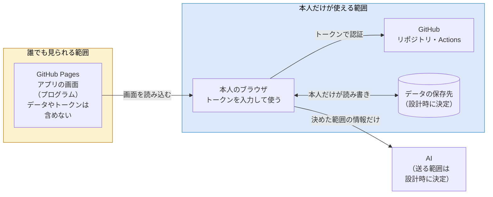

| ID | 項目 | 要件 |
|---|---|---|
| N-301 | 公開する内容 | GitHub Pagesに置くのは、アプリの画面（プログラム）だけとする。トークン、テスト結果などのデータ、AIの利用に必要な鍵は、公開する場所に含めない |
| N-302 | トークンの権限 | GitHubのトークンは、対象のリポジトリだけに使えるようにし、権限は必要なもの（リポジトリの内容とGitHub Actionsの結果の読み取り、ワークフローの起動）に限る。有効期限を設定する |
| N-303 | トークンの保管 | トークンは本人が画面から入力する。ソースコードやリポジトリには保存しない。画面上では伏せ字で表示する。端末のどこに保持するか（毎回入力する、ブラウザを閉じると消える領域に置く、など）は設計時に決め、長く残る保存領域には置かない |
| N-304 | データの保護 | テスト結果などのデータは、本人以外が読んだり書き換えたりできないこと。具体的な方法は、データの保存先とあわせて設計時に決める |
| N-305 | AIに送る情報 | AIに送るのは、設計時に決めた範囲の情報だけとする（9.4参照）。トークンや鍵などの秘密の情報は送らない |
| N-306 | AIの鍵の扱い | AIの利用に鍵（APIキーなど）が必要な場合は、N-303と同じ扱いとする。ブラウザから直接AIを呼び出す方式では鍵が本人のPCに置かれるため、その扱いを設計時に確認する |
| N-308 | 取り込んだデータの表示 | テストの名前、失敗メッセージ、AIの回答など、外部から取り込んだ文字は、必ず文字として表示し、HTMLやスクリプトとして解釈しない |
| N-309 | AIの回答の扱い | AIの回答に含まれる指示らしき文言を、アプリの動作の指示として扱わない。回答は表示するだけとする |
| N-310 | 秘密情報の伏せ字 | AIに送る前に、トークンや鍵らしき文字列を伏せる。失敗のログも対象とする |
| N-307 | アプリ自体の脆弱性 | アプリが使う外部のライブラリに、既知の脆弱性がないかを定期的に確かめる（npm auditやDependabotなど） |

### 10.4 保守性・拡張性

| ID | 項目 | 要件 |
|---|---|---|
| N-401 | 技術の構成 | シミュレータと同じ構成（React＋TypeScript＋Vite）で作る（標準書1.3参照） |
| N-402 | アプリ自体のテスト | 分類、集計、フレーキーテストの判定、完了判定などの計算は、純粋関数として画面から分けて作り、Vitestで単体テストを行う |
| N-403 | 設定で変えられる値 | 要件IDの書式、印の略称、フレーキーテストの判定条件などは、プログラムに直接書かず、設定で変えられるようにする（F-602） |
| N-404 | 結果ファイルの形式の追加 | 結果ファイルを読み取る部分を独立させ、JUnit XML形式以外（PlaywrightのJSON形式など）を後から追加しやすくする |
| N-405 | AIの仕組みの差し替え | AIとやり取りする部分を独立させ、AIの仕組み（設計時に決める）を後から変えやすくする |
| N-406 | 将来の拡張への備え | 将来、複数のシステムを扱えるように（7.3参照）、データにはどのリポジトリのものかを区別する項目を持たせる。PoCで扱うリポジトリは1つとする |
| N-407 | 説明書 | 使い方と設定の方法を、リポジトリのREADME（説明のファイル）にまとめる |

### 10.5 AI利用に関する要件

| ID | 項目 | 要件 |
|---|---|---|
| N-501 | 送る情報の範囲 | 必ず渡す情報と、設計時に決める情報を分ける（9.4参照）。範囲は設定で切り替えられることが望ましい |
| N-502 | 送る量の上限 | 長い失敗メッセージやログは、決めた長さで切り詰めてから送る。1回の分析で送る量に上限を設ける |
| N-503 | 利用の回数と費用 | 分析は本人が依頼したときだけ行う（自動では行わない）。PoCの期間中の費用の上限は、AIの仕組みとあわせて設計時に決める |
| N-504 | 回答の形式 | 原因の候補、根拠、原因の分類、次に確かめることを、決まった形（項目が決まったデータ）で受け取る。画面に表示する言葉は日本語とする |
| N-505 | 回答の扱い | AIの回答は「候補」として表示し、最終的な判断は本人が行う。回答は保存し、当たり外れを記録できるようにする（F-407） |
| N-506 | AIへの指示文の管理 | AIへの指示文（プロンプト）は、プログラムの本体と分けて管理し、PoCの途中でも改善できるようにする |
| N-507 | AIが使えないとき | AIが使えないときや、回答が決まった形になっていないときは、エラーを表示する。ほかの機能は使えるようにする |

---

## 11. 設計へのインプット

> **この章のポイント**
> - 設計を始めるときに必要な情報（技術的な制約、外部との連携、データ、画面、未決事項）をまとめます。
> - シミュレータのリポジトリ側でも、ワークフローの設定の追加など、PoCのための準備が必要です。
> - データの保存先、AIの仕組みなど、設計の初期に決めるべき事項を一覧にします。
> - ブラウザから結果ファイルを直接取得できるかは、設計の初期に試作で確かめるべき技術的な確認事項です。

### 設計のインプットの索引

設計で参照する情報が、本書のどこにあるかをまとめます。

| 設計で決めること | 参照する箇所 |
|---|---|
| 作る範囲と、作る順番 | 7.1（やる事と作る順番の案）、7.2（やらない事） |
| 画面と操作の流れ | 8.2（業務フロー）、8.3（ユースケース）、11.4（画面一覧） |
| 機能ごとの処理と決まりごと | 第9章（要件の読み取り、印の書き方、完了基準、フレーキーテストの判定、AI分析） |
| 各機能の受入条件（合格とみなす条件） | 9.7 |
| 性能、セキュリティなどの目標 | 第10章 |
| 技術の構成と外部との連携 | 11.1、11.2 |
| データの構造 | 11.3 |
| 設計の初期に決めること | 11.5 |
| テストの工程と種類の定義（アプリが扱う区分の元） | 標準書の第3章、第4章、第5章 |

### 11.1 技術的制約

| 区分 | 制約 | 参照 |
|---|---|---|
| 言語・フレームワーク | TypeScript、React、Vite（シミュレータと同じ構成） | 1.3、N-401 |
| 公開の方法 | GitHub Pages。GitHub Pagesは静的なファイル（画面のプログラム）を配信するだけで、サーバー側の処理は置けない | 1.3 |
| テストの実行 | GitHub Actions。シミュレータの既存のワークフローに、必要な設定を加える（1標準書1.2参照） | 6.3 |
| テストツール | Vitest、Playwright（どちらもシミュレータで使用中） | 5.4 |
| 結果ファイルの形式 | JUnit XML形式を基本とする。カバレッジはVitestのカバレッジの出力を使う | 5.4、N-404 |
| 要件の出どころ | リポジトリ内のMarkdownの仕様書の表 | 9.1 |
| GitHubへの接続 | 本人が入力するGitHubのトークン（対象のリポジトリと必要な権限に絞る） | N-302、N-303 |
| 対応するブラウザ | PCのGoogle Chromeの最新版 | N-205 |
| 利用者と期間 | 本人1名、PoCの期間は2週間程度 | 1.3、6.2 |
| 構成の選択肢 | **決定済み**：「CI側で結果を集約し、アプリは表示と入力に専念する」構成とする。試作による技術検証の結果、「アプリ（ブラウザ）が結果ファイルを直接取得する」構成は技術的に成立しないことを確認した（11.5のU-01・U-05） | 11.2 |
| アプリのコードの配置 | **決定済み**：生産管理シミュレータと同じリポジトリ（`production_system_sim`）内に新しいフォルダを作り、そこに置く。別リポジトリにはしない。同一リポジトリ内で完結するため、データ用ブランチの読み書きにクロスリポジトリの認証を要しない | 11.5 |
| 設計時に決めること | データの保存先、AIの仕組み、AIに送る情報の範囲 | 11.5 |

GitHub Pagesにはサーバー側の処理を置けないため、サーバー側の処理が必要になる場合（例：AIの鍵を本人のPCに置かないようにする中継の仕組み）は、別の仕組みを用意する必要があります。これは11.5の未決事項として扱います。

### 11.2 外部連携の概要

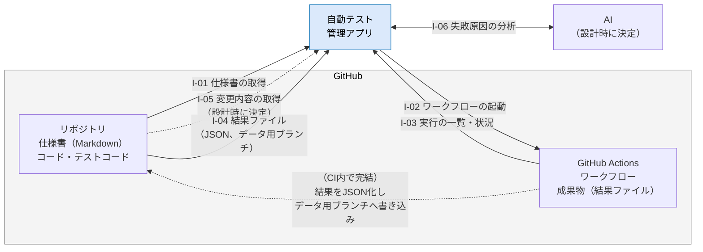

| ID | 連携先 | 向き | 内容 | 手段 | きっかけ | 関連する機能 |
|---|---|---|---|---|---|---|
| I-01 | GitHubのリポジトリ | GitHub → アプリ | 仕様書（Markdown）の取得 | GitHubのAPI（リポジトリの内容の取得） | 要件の取り込みの操作 | F-101 |
| I-02 | GitHub Actions | アプリ → GitHub | ワークフローの起動 | GitHubのAPI（ワークフローの手動起動） | 実行の指示の操作 | F-201 |
| I-03 | GitHub Actions | GitHub → アプリ | 実行の一覧と状況の取得 | GitHubのAPI（ワークフローの実行の一覧） | アプリを開いたとき、取り込みの操作 | F-202、F-203、F-301 |
| I-04 | GitHubのリポジトリ（データ用ブランチ） | GitHub → アプリ | 結果ファイル（JSON形式に集約済みのJUnit XML相当、カバレッジ）の取得 | GitHubのAPI（リポジトリの内容の取得。I-01と同じ手段）。【決定済み】試作の結果、成果物（zip）をアプリが直接取得することはブラウザのCORS制約でできないため、CI側でJSON形式に変換しデータ用ブランチへ書き込んだものを読む方式にした（11.2参照） | 実行の完了を確認したとき | F-301、F-302 |
| I-05 | GitHubのリポジトリ | GitHub → アプリ | 変更されたファイルの一覧、コードの変更内容（差分）の取得 | GitHubのAPI（コミットの比較） | AIによる分析の依頼（送るかどうかは設計時に決める） | F-406 |
| I-06 | AI | アプリ ⇄ AI | 失敗の情報を渡し、原因の候補を受け取る | 設計時に決める | AIによる分析の依頼 | F-406 |

> **APIとは**
> API（エーピーアイ）は、プログラムから別のサービスの機能を呼び出すための窓口です。アプリはGitHubのAPIを通じて、仕様書の読み取りやワークフローの起動を行います。

> **【決定済み】ブラウザから結果ファイルを直接取得できるかの検証結果**
> ブラウザには、別のサイトのデータを勝手に読み取れないようにする安全の仕組み（CORS）があります。2026年9月27日、試作（実機のブラウザ）で確かめた結果、GitHub Actionsの成果物一覧の取得はブラウザから直接できるものの、**成果物の本体（ZIPファイル）の取得はできない**ことを確認しました。GitHubの成果物ダウンロードは、必ず別のストレージ（BLOBストレージ）への転送（リダイレクト）を経由する作りになっており、転送先がブラウザからの読み取りを許可していないためです。
>
> そのため、「CI側で集約する構成」を採用することを決定しました。ワークフローの最後で、結果をアプリが読みやすい形（JSON形式）にまとめ、リポジトリのデータ用のブランチに保存します。アプリはそのファイルを読むだけになるため、この制限を受けず、読み取りのためにトークンをブラウザに置く必要も小さくなります（11.5のU-01・U-05）。

#### シミュレータのリポジトリ側で必要な準備

アプリで結果を取り込むために、シミュレータのリポジトリ側で次の準備を行います。

| # | 準備すること | 内容 |
|---|---|---|
| 1 | 結果をJUnit XML形式で書き出す | VitestとPlaywrightの設定に、JUnit XML形式で結果を書き出す設定を加える |
| 2 | カバレッジを書き出す（推奨） | Vitestのカバレッジの結果を、ファイルとして書き出す |
| 3 | 静的解析の結果を書き出す | 型チェックとESLintの結果を、アプリが読める形で書き出す（方法は設計時に決める：U-06） |
| 4 | 結果ファイルを成果物として保存する | ワークフローの最後に、結果ファイルを成果物として保存する。成果物の名前の付け方を決めておく（例：test-results-unit、test-results-e2e） |
| 4' | 【U-05決定に伴い追加】結果をJSON形式に集約し、データ用ブランチへ書き込む | ワークフローの最後に、JUnit XML等の結果ファイルをアプリが読みやすいJSON形式にまとめ、リポジトリのデータ用ブランチへコミットするステップを追加する。書き込みにはワークフロー自身の権限（GITHUB_TOKENのpermissions設定）を使う。データ用ブランチの名前・ディレクトリ構成、コミット時のメッセージの決まりを設計時に定める |
| 5 | 手動での起動を許可する | アプリから起動するワークフローに、手動での起動を許可する設定を加える |
| 7 | フレーキー検出用のワークフローを用意する | 同じコミットで全テストを複数回実行するワークフローを作り、定期的に（例：毎晩）動かす（9.4参照） |
| 8 | 不具合のラベルの決まりを定める | GitHub Issuesに、重大度・入り込んだ工程・見つかった工程のラベルを付ける決まりを作る（S-15） |
| 6 | テストに印を付ける | 既存のテストの名前（またはテストのまとまりの名前）に、要件ID・工程・テストの種類の印を付ける（9.1参照）。AIの支援を使ってもよい |

### 11.3 主なデータの概要

アプリで扱う主なデータと、その関係を示します。これは「どんなデータがあり、どうつながるか」を示す概念のモデルで、データの保存先や詳しい形は設計で決めます。

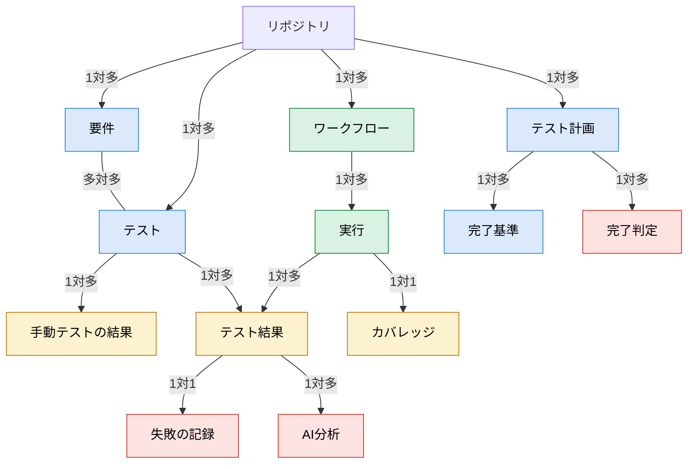

「1対多」は、左（矢印の元）の1件に対して、右（矢印の先）が複数あることを表します。例えば、1回の実行には、複数のテスト結果があります。「多対多」は、1つの要件に複数のテストが対応し、1つのテストが複数の要件に対応することを表します。

色は、青が計画、緑が実行、黄が結果、赤が分析・判定に関するデータです。

| データ | 内容 | 主な項目 | 関連する機能 |
|---|---|---|---|
| リポジトリ | 管理の対象とするリポジトリ。PoCでは1つ | 名前、仕様書のファイル、各種設定 | F-601、F-602 |
| 要件 | 仕様書から取り込んだ要件 | 要件ID、名前、読み取ったファイル、状態（有効・廃止） | F-101、F-102 |
| テスト | 自動テストと手動テストの1件ずつ | ファイルのパス、テストの名前（印を除く）、工程、テストの種類、自動・手動の区別、分類の状態、補正の内容 | F-104、F-105 |
| ワークフロー | 結果を取り込むワークフロー | 名前、実行のタイミングの区分、手動起動の可否 | F-204 |
| 実行 | ワークフローの1回の実行 | 実行のID、きっかけ、コミット、ブランチ、開始・終了の日時、取り込みの状態 | F-201〜F-203、F-301 |
| テスト結果 | 1回の実行での、1件のテストの結果 | 合否、かかった時間、失敗メッセージ、エラーの発生箇所、再試行の有無 | F-301、F-304 |
| 手動テストの結果 | 手動テストの結果 | 実施日、合否、実施した環境、メモ | F-303 |
| カバレッジ | 1回の実行でのカバレッジ | 全体の割合、ファイルごとの割合 | F-302 |
| 失敗の記録 | 失敗したテスト結果に対する、原因の記録 | 原因の分類、メモ、GitHub Issueのリンク、特定にかかった時間、AIを使ったかどうか | F-407 |
| AI分析 | AIへの依頼と回答 | 依頼の日時、送った情報の範囲、回答（原因の候補・根拠・分類・次に確かめること）、当たり外れ | F-406、F-407 |
| テスト計画 | 工程ごとのテスト計画 | 工程、目的、対象範囲、期間 | F-103 |
| 完了基準 | テスト計画ごとの完了基準 | 項目、目標値 | F-103、F-408 |
| 完了判定 | 工程の完了判定の記録 | 判定の日時、結果、コメント、判定した時点の各項目の値 | F-408、F-501 |

このほか、変更の記録（F-604）と設定（F-602）のデータを持ちます。

### 11.4 画面一覧（案）

| ID | 画面 | 主な内容 | 主な機能 |
|---|---|---|---|
| G-01 | ダッシュボード | 全体の状況（最新の合否、合格率の推移、工程・種類別、要件のカバー率、未分類の件数）。起動した実行の状況 | F-401、F-202 |
| G-02 | 要件 | 要件の取り込み、要件の一覧、要件別の状況（テストのない要件を目立たせる） | F-101、F-102、F-402 |
| G-03 | テストの一覧 | テストの一覧と分類の状態、分類の補正、工程・種類別の状況（テストピラミッドの形） | F-104、F-403 |
| G-04 | テストの詳細 | 1件のテストの結果の履歴と失敗の内容。AIによる分析の依頼と、原因の記録 | F-304、F-406、F-407 |
| G-05 | 実行 | 実行の履歴、実行の指示、結果の取り込み | F-201〜F-203、F-301、F-302 |
| G-06 | 失敗の分析 | 失敗傾向の集計、フレーキーテストの一覧 | F-404、F-405 |
| G-07 | 手動テスト | 手動テストの登録と、結果の入力 | F-105、F-303 |
| G-08 | 計画・完了判定 | 工程ごとのテスト計画と完了基準、完了判定、完了判定のレポートの出力 | F-103、F-408、F-501 |
| G-09 | PoC評価 | PoCの評価の集計と、評価のレポートの出力 | F-409、F-502 |
| G-10 | 設定 | GitHubとの接続、ワークフローの登録、要件の読み取りルール、印の略称、判定条件、AI分析の設定、データの書き出し・読み込み | F-204、F-601〜F-603 |

画面の移り変わりは次のとおりです。すべての画面から、ダッシュボードに戻れるようにします。

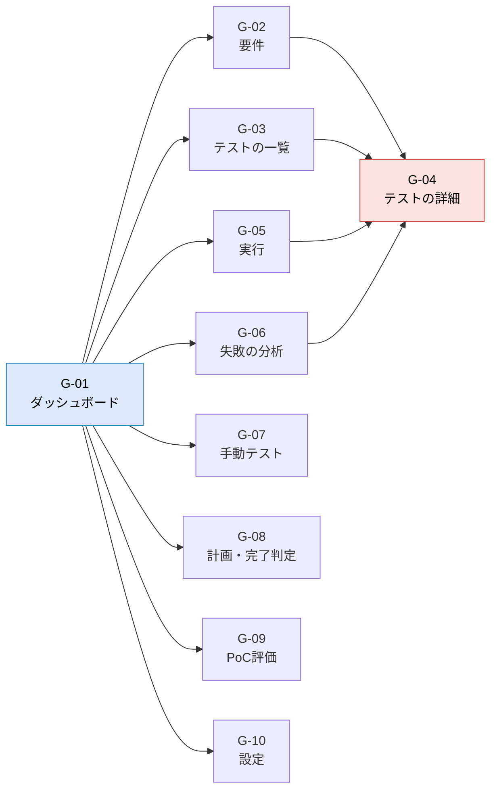

テストの詳細（G-04）は、要件、テストの一覧、実行、失敗の分析のどこからでも開けるようにします。失敗の原因を調べるときの中心になる画面です。

### 11.5 前提条件・未決事項

#### 前提条件

| # | 前提条件 |
|---|---|
| 1 | 利用者は本人1名で、PoCの期間は2週間程度である |
| 2 | 対象は生産管理シミュレータ1つである |
| 3 | シミュレータの要件は、リポジトリ内のMarkdownの仕様書に、表の形で書かれている |
| 4 | シミュレータには、VitestとPlaywrightのテストがある |
| 5 | シミュレータのワークフローとテストコードに、PoCのための変更（11.2の準備）を加えてよい |
| 6 | テストに印を付ける作業は、PoCの準備として本人が行う |

#### 未決事項

| ID | 事項 | 内容 | 決める時期 | 関連 |
|---|---|---|---|---|
| U-01 | データの保存先 | **決定：GitHubリポジトリ（JSON形式、専用のデータ用ブランチ）**。U-05でCI側集約構成に決めたため、結果データはすでにCIからリポジトリへ書き込む経路がある。テスト計画・分析記録などアプリの他のデータも、同じ経路（データ用ブランチへのJSONファイルの書き込み）に統一する。30万件規模のデータを継続してコミットすることによるリポジトリの肥大化は既知のリスクとして残し、PoC前半で実際のデータ量（U-07）を見たうえで、必要なら見直す | 決定済み（2026-09-27）。実データ量はPoC前半で再確認 | 10.1、N-203、N-304 |
| U-02 | AIの仕組み | 候補：アプリからAIのAPIを直接呼ぶ、中継の仕組みを用意する、Claude Codeと連携するなど。AIの鍵の扱い（N-306）もあわせて決める | 設計の初期 | F-406、N-306 |
| U-03 | AIに送る情報の範囲 | 変更されたファイルの一覧やコードの差分を送るかどうか | 設計の初期 | F-406、N-501 |
| U-04 | AI利用の費用の上限 | PoCの期間中の費用の上限 | U-02とあわせて | N-503 |
| U-05 | 結果ファイルの取得方法と全体の構成 | **決定：B（CI側で集約する構成）**。ブラウザからGitHub Actionsの成果物を直接取得できるかを試作で確認した結果、成果物一覧の取得はできるが、成果物本体（ZIP）はGitHubの転送先ストレージがブラウザからの読み取りを許可しないため取得できないことを確認した（2026-09-27実施。docs/report/browser-fetch-spike-report.md参照）。CI側で結果をJSON形式に集約し、リポジトリのデータ用ブランチに保存する構成で進める | 決定済み（2026-09-27、試作により確認） | I-04、U-01 |
| U-06 | 静的解析の結果の書き出し方 | 型チェックとESLintの結果を、アプリが読める形で書き出す方法 | 設計時 | 11.2 |
| U-07 | 想定する規模の実際の値 | テストの数、実行の回数の実際の値 | 設計の初期 | 10.1 |
| U-08 | 印の略称の初期値 | 工程とテストの種類の略称の対応表 | 設計時 | 9.1 |
| U-09 | PoCの目標値と判定基準 | 6.2の目標値と、PoCの後の判断の基準の確定 | PoCの開始時 | 6.2 |
| U-10 | 不具合のラベルの決まり | 重大度、入り込んだ工程、見つかった工程のラベルの名前と使い方 | 設計時 | S-15、F-410 |
| U-11 | ミューテーションテストの導入 | 導入するかどうかと、実行にかかる時間。時間がかかる場合は、業務ロジックの部分だけを対象にする | 設計時（PoCでは推奨） | 5.4、9.1 |
| U-12 | 故障注入の進め方 | わざと入れる不具合の種類と件数、戻し方の手順 | PoCの開始時 | 6.2 |

> **リスク：2週間の期間**
> 品質保証の観点のレビューを受けて、必須の機能を14個に絞り、計画の管理と完了の判定は手運用にしました（7.1）。それでも余裕のある計画ではないため、7.1の作る順番に沿って進め、時間が足りない場合は後ろから削ります。
>
> U-01とU-05（構成の決定）は、ほかの設計の前提になるため最優先で決めることを勧めていましたが、2026-09-27の試作により両方とも決定済みです（上表参照）。

> **リスク：評価に使えるデータが足りないこと**
> 2週間で自然に起きる失敗は多くありません。そのままでは、AIの分析の当たり外れもフレーキーテストの検出も評価できません。過去の実行履歴の取り込み（バックフィル）と、故障注入（U-12）を必ず行います（6.2参照）。
