# テスト工程の定義と自動化の方針（生産管理シミュレータ）

| 項目 | 内容 |
|---|---|
| 版 | 2.1 |
| 作成日 | 2026年9月22日 |
| 位置づけ | 本書はテストの進め方を定めた標準です。この標準にもとづく自動テスト管理アプリの要件は、別冊の「自動テスト管理アプリ 要件定義書（PoC：生産管理シミュレータ）」に定めます |
| 変更履歴 | 1.0 初版（全体）／2.0 品質保証の観点のレビュー結果を反映／2.1 テストの標準とアプリの要件定義を2冊に分け、V字モデルの流儀、E2Eテストの実行タイミング、非機能の目標値のチェックリストを追記 |

## 目次

1. はじめに
   - 1.1 本書の目的
   - 1.2 想定読者と読み方ガイド
   - 1.3 前提条件
   - 1.4 参考資料と表記ルール

**第1部 テスト工程の定義**

2. テストの基礎知識
   - 2.1 テストの目的と、工程を分ける理由
   - 2.2 V字モデルとW字モデル
   - 2.3 テストの分類軸
   - 2.4 テスト活動の流れ
3. テストの種類
   - 3.1 目的別テストの一覧
   - 3.2 追加するテスト【補完】
   - 3.3 確認テストとリグレッションテストの違い【補正】
4. 工程別の定義
   - 4.1 工程とテスト種類の対応表
   - 4.2 単体テスト工程
   - 4.3 結合テスト工程
   - 4.4 総合テスト工程
   - 4.5 受入テスト工程
   - 4.6 工程間のインプット／アウトプットのつながり
   - 4.7 反復型開発への当てはめ

**第2部 自動化と人間系の分類**

5. 自動テストと人間系テストの分類
   - 5.1 分類の判断基準
   - 5.2 テストピラミッド
   - 5.3 工程・テスト種類ごとの分類結果
   - 5.4 自動化で使う主なツールの例【補完】
   - 5.5 人間系で行う領域とその理由

**付録**

- A. 用語集
- B. 参考資料
- C. 非機能の目標値のチェックリスト

---

## 1. はじめに

> **この章のポイント**
> - 本書は、生産管理シミュレータを対象にしたPoC（小さく試して、考え方や仕組みが有効かを確かめること）として作成します。
> - 「テスト工程の定義」と「自動化と人間系の分類」の2部で構成します。自動テスト管理アプリの要件は、別冊に定めます。
> - 読者ごとに、読むべき章を案内します。
> - 記事にない内容を補った箇所や、記事の説明を直した箇所には印を付けます。

### 1.1 本書の目的

システム開発では、作ったものが正しく動くかを確かめる「テスト」を、開発の段階に合わせて何回かに分けて行います。どの段階で何のテストをするのか、テストを始めるのに何が必要で、テストの結果として何が出来上がるのかを決めておかないと、テストの抜けや重複が起きたり、人によって判断がばらついたりします。

本書は、まず小さなシステムである生産管理シミュレータを対象に、テストの進め方と、自動テストを管理する仕組みを試すためのPoCとして作成します。

本書の目的は次の3つです。

| # | 目的 | 対応する部 |
|---|---|---|
| 1 | 単体・結合・総合・受入の4つのテスト工程について、実施するテストと、インプット・アウトプットを定義する | 第1部（第2〜4章） |
| 2 | 定義したテストを、機械に任せる「自動テスト」の領域と、人が判断する「人間系」の領域に分ける | 第2部（第5章） |
| 3 | 自動テストの計画・実行・結果・分析を管理するアプリの要件を定義し、設計に渡す情報を整理する | 別冊の要件定義書（第6〜11章） |

ここでいうインプットは「その工程を始めるために必要な資料や成果物」、アウトプットは「その工程で作られ、次の工程や判断に使われるもの」を指します。

3つの部の関係は次のとおりです。

第1部で「何を・いつ・何をもとに」テストするかを決め、第2部でそれを「機械に任せるもの」と「人が行うもの」に分けます。機械に任せるものは、別冊で要件を定めるアプリでまとめて管理します。人が行うテストはアプリの主な対象ではありませんが、結果だけはアプリに手で入力できるようにします。

### 1.2 想定読者と読み方ガイド

本書は次の2種類の読者を想定しています。

| 読者 | 主に知りたいこと | おすすめの読み方 |
|---|---|---|
| 内製チームの若手メンバー | テストの基本、工程ごとにやること、自動化の考え方、アプリの仕様 | 第1章から順に全章。まずは第2〜5章で基本を押さえる |
| 管理職・意思決定者 | 工程ごとの全体像、自動化する範囲、アプリで何をして何をしないか | 第1章 → 4.1（工程とテスト種類の対応表） → 5.3（分類結果） → 第6〜7章（背景・目的・スコープ） |

前提知識としては、プログラムを書いたことがあり、GitHub Actions（GitHubに付属する仕組みで、コードの変更をきっかけにビルドやテストを自動で動かすもの）という言葉を聞いたことがある程度を想定しています。専門用語は初めて出てきたところで簡単に説明し、付録Aの用語集にもまとめます。

### 1.3 前提条件

本書は次の前提で書いています。

| 項目 | 前提 |
|---|---|
| 本書の位置づけ | 生産管理シミュレータを対象にしたPoC。当面はシミュレータのみを対象に書く |
| 対象システム | 生産管理シミュレータ（トレーニング用）。ブラウザだけで動くアプリで、サーバーやデータベースは持たない。React＋TypeScript＋Viteで作られ、受注・マスタ・調達・在庫・生産・出荷の6つの領域（ドメイン）で構成される。業務ロジックは純粋関数（同じ入力には必ず同じ結果を返し、外部の状態を変えない関数）で書かれ、vitestでテストしている。リポジトリはGitHubで管理する |
| 開発モデル | V字モデルを基本とし、W字モデルの考え方（設計と同時にテストの設計も行う）を取り入れる（2.2）。ただし、シミュレータの実際の開発はAIとCIによる反復型のため、当てはめ方を4.7で定める |
| 対象とするテスト工程 | 単体テスト・結合テスト・総合テスト・受入テストの4工程 |
| 実施者 | 各工程を誰が実施するかは本書では定義しない。工程とテスト内容のみを定義する |
| アプリの守備範囲 | テストの実行はGitHub Actionsとテストツールが行う。アプリは計画・実行の指示・結果・分析を管理する |
| アプリの利用者 | 作成者本人の1名（検証用） |
| アプリの規模 | 管理対象は生産管理シミュレータ1つ |
| アプリの技術構成 | シミュレータと同じ構成（React＋TypeScript＋Vite）。GitHub PagesなどでWeb上に公開して使う |
| 設計時に決める事項 | テスト結果などのデータの保存先、AI分析の仕組み |

アプリの前提は、別冊の要件定義書で詳しく説明します。

### 1.4 参考資料と表記ルール

#### 参考資料

| # | 資料 | 本書での使い方 |
|---|---|---|
| 1 | Sun*（サンアスタリスク）「システム開発におけるテストの種類とは？工程別に目的と特徴を徹底解説」（2026年8月5日更新） https://sun-asterisk.com/service/development/topics/systemdev/3238/ | 本書の土台。テストの種類、テスト工程、テストの流れ、テストの分類 |
| 2 | JSTQB（ソフトウェアテスト技術者資格認定）の用語やシラバスにある一般的な定義 | 記事にない内容の補完と、記事の説明の補正 |

#### 表記ルール

記事の内容と、本書で補った内容を区別できるように、次の印を付けます。

| 印 | 意味 |
|---|---|
| （印なし） | 記事の内容にもとづく記述 |
| 【補完】 | 記事にない内容を、一般的な知識で補った箇所 |
| 【補正】 | 記事の説明を、一般的な定義に合わせて直した箇所。直した理由も書く |

用語は次のようにそろえます。

| 本書での呼び方 | 記事での呼び方 | 補足 |
|---|---|---|
| 総合テスト | システムテスト | 同じものを指す |
| 受入テスト | 受け入れテスト | 同じものを指す |

そのほか、次のルールで書きます。

- 図はMermaid記法で書きます。GitHubなどMermaidに対応した環境で、図として表示されます。
- 各章の冒頭に「この章のポイント」として要点をまとめます。

---

# 第1部 テスト工程の定義

## 2. テストの基礎知識

> **この章のポイント**
> - テストの目的は、不具合を見つけることと、次へ進んでよいかを判断する材料をそろえることです。
> - テストを工程に分けるのは、小さな単位で早く不具合を見つけるほど、原因を探しやすく、直す手間も小さく済むからです。
> - V字モデルでは、設計の各段階とテスト工程が対になります。W字モデルでは、設計と同時にテストも設計します。
> - テストは「機能／非機能」「ホワイトボックス／ブラックボックス」などの軸で分類できます。
> - どの工程のテストも、計画→設計→環境構築→実行→分析の順に進めます。

### 2.1 テストの目的と、工程を分ける理由

#### テストの目的

テストとは、作ったプログラムやシステムを動かしたり調べたりして、不具合がないか、求められたとおりに作られているかを確かめる作業です。開発中のさまざまな段階でテストを行うことで、利用者に渡す前に不具合を見つけて直せます。

テストの目的は、大きく次の3つです。

| # | 目的 | 説明 |
|---|---|---|
| 1 | 不具合を見つける | プログラムの誤り（バグ）を、利用者に渡す前に見つける |
| 2 | 要件・設計どおりかを確かめる | 決めたとおりに作られているか、求められた品質を満たしているかを確かめる |
| 3 | 判断の材料をそろえる【補完】 | 次の工程に進んでよいか、リリースしてよいかを判断するための根拠を残す |

> **知っておきたいこと【補完】**
> テストで「不具合がある」ことは示せますが、「不具合がまったくない」ことは証明できません。入力や操作のすべての組み合わせを試すことは、現実にはできないためです。そのため、どこを重点的にテストするかを、問題が起きたときの影響の大きさ（リスク）に応じて決めることが大切です。

#### 工程を分ける理由

いきなりシステム全体をテストすると、不具合が見つかっても、どの部品が原因なのかを突き止めるのに時間がかかります。そこで、小さな部品から順に確かめ、少しずつ範囲を広げていきます。早い段階で不具合を見つけて直しておけば、後の工程で起きる不具合を少なくできます。

4つのテスト工程を、製造業の検査と生産管理シミュレータの例にたとえると、次のようになります。

| テスト工程 | 確かめる範囲 | 製造業の検査にたとえると【補完】 | 生産管理シミュレータでの例【補完】 |
|---|---|---|---|
| 単体テスト | 関数やモジュールなど、最小の部品 | 部品ごとの検査 | 在庫を引き当てる関数が、在庫が足りる場合・足りない場合のそれぞれで正しい結果を返すか |
| 結合テスト | 部品を組み合わせたとき | 組立途中のユニットの検査 | 受注を登録したとき、在庫・生産・調達などの領域へ正しく情報が渡るか |
| 総合テスト | システム全体 | 完成品の出荷前検査 | 画面を操作して、受注から出荷までの一連の流れが最後まで通るか |
| 受入テスト | 利用者の立場から見たシステム | 納入先での受入検査 | 研修で使う立場から見て、教材としての目的を果たせるか |

### 2.2 V字モデルとW字モデル

開発の進め方（開発モデル）によって、テストを行うタイミングが変わります。記事では、代表的なものとしてV字モデルとW字モデルが紹介されています。

#### V字モデル

V字モデルは、設計と実装を終えてからテストに移る開発モデルです。設計の工程を左上から下へ、テストの工程を下から右上へ並べるとV字に見えることから、こう呼ばれます。

左側の設計の各段階と、右側のテスト工程が対になっているのが特徴です。例えば、詳細設計で決めた内容は単体テストで、基本設計で決めた内容は結合テストで確かめます。大規模な開発に向いています。

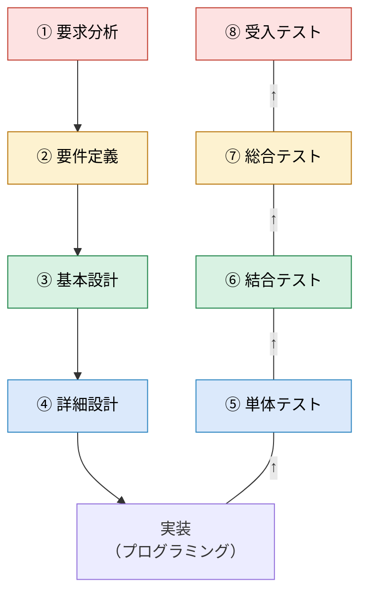

同じ色どうしが対になる工程です。右側のテストは、下の単体テストから上の受入テストへ向かって進みます。

| 設計の工程 | 対になるテスト工程 | テストで確かめること【補完】 |
|---|---|---|
| ① 要求分析 | ⑧ 受入テスト | 利用者が求めていたことを満たしているか |
| ② 要件定義 | ⑦ 総合テスト | 要件定義で決めた機能や性能などを、システム全体として満たしているか |
| ③ 基本設計 | ⑥ 結合テスト | 部品どうしのつなぎ方（インターフェース）やデータの受け渡しが設計どおりか |
| ④ 詳細設計 | ⑤ 単体テスト | 1つ1つの部品が設計どおりに動くか |

#### W字モデル

W字モデルは、設計とテストの準備を並行して進める開発モデルです。設計の各段階で、対になるテストの設計と、そのレビュー（関係者で内容を確認すること）も同時に行います。実装が終わったら、テストの実行と、不具合のデバッグ・修正を繰り返します。

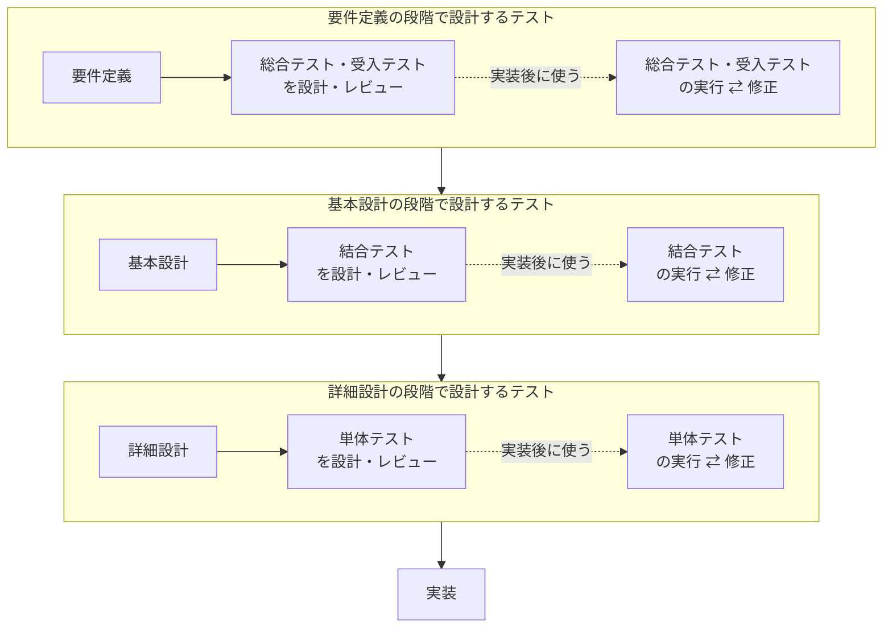

設計は上の段から下の段へ進み、実装のあとのテストの実行は、下の段（単体テスト）から上の段（総合テスト・受入テスト）へ向かって進みます。

設計の段階でテストを考えると、「この仕様はどうやって確かめるのか」を具体的に考えることになります。そのため、設計書のあいまいな点や抜けに早く気付けます。【補完】

#### 比較と本書での扱い

| 観点 | V字モデル | W字モデル |
|---|---|---|
| テストを設計する時期 | テスト工程に入ってから行うことが多い | 設計の各段階で、同時に行う |
| 利点 | 設計の工程とテスト工程の対応が分かりやすい。大規模な開発に向く | 設計の誤りやあいまいさに早く気付けるため、手戻りを減らせる |
| 注意点【補完】 | 設計の誤りに気付くのが、テストを実行する後半になりやすい | 設計の段階でテストも考えるぶん、設計時の作業が増える |

本書では、設計の工程とテスト工程の対応はV字モデルにならい、テストの設計はW字モデルにならって設計の段階で行います。

> **社内で使うときの注意：対応には2つの流儀がある**
> 上の対応は、記事とJSTQBのシラバスにならったものです。一方、日本の受託開発などでは、「要件定義と受入テスト」「基本設計と総合テスト」「詳細設計と結合テスト」「実装と単体テスト」を対にする流儀もよく使われます。
>
> どちらが正しいということはなく、各設計工程の資料に何を書くか（基本設計書に画面や機能の仕様を書くのか、部品の分け方を書くのか）によって決まります。JSTQBも、工程名ではなく「テストのもとになる資料」で対応を決めています。
>
> 混乱を避けるため、本書ではJSTQBにならった上の対応を標準とします。社内の別の資料と対応が違う場合は、どちらを標準とするかを決めてから使ってください。そのため、第4章の工程別の定義では、各テスト工程のインプットに「対になる設計書」と「設計の段階で作ったテストの設計」が入ります。

### 2.3 テストの分類軸

テストは、見る観点（分類軸）によって、いくつかの種類に分けられます。1つのテストは、複数の軸で同時に分類できます。例えば、vitestで関数を確かめる単体テストは「機能テスト・ホワイトボックステスト・動的テスト・自動テスト・スクリプト型テスト」です。

| 分類軸 | 区分 | 意味 | 例 |
|---|---|---|---|
| 何を確かめるか | 機能テスト | 仕様どおりに正しく動くかを確かめる | 受注を登録できるか、在庫が正しく減るか |
| | 非機能テスト | 機能以外の性質（速さ、使いやすさ、安全性など）を確かめる | 性能テスト、ユーザビリティテスト、セキュリティテスト、負荷テスト |
| 中身を見るか | ホワイトボックステスト | プログラムの内部構造（コード）を見ながら確かめる。開発者の目線 | 関数の条件分岐をすべて通るように入力を用意する |
| | ブラックボックステスト | 内部構造を見ずに、仕様書と照らして入力と出力を確かめる。利用者の目線 | 画面を操作し、仕様どおりの結果が表示されるかを確かめる |
| 動かすか | 動的テスト | プログラムを実際に動かして確かめる | 単体テスト、結合テスト、総合テスト |
| | 静的テスト | プログラムを動かさずに、コードや設計書を調べる | 設計書のレビュー、コードレビュー、静的解析ツールによるチェック【補完】 |
| 誰が行うか | 手動テスト | 人が操作して確かめる。手間はかかるが、利用者の目線で幅広い問題に気付ける | 画面の見やすさの確認 |
| | 自動テスト | 事前に用意したスクリプトやツールを、コンピュータに実行させる。繰り返しや大量のデータを扱うテストに向く | vitestによる関数のテスト |
| 手順を決めておくか | スクリプト型テスト | あらかじめ手順と期待する結果を決めてから行う。網羅的に確かめられる | テスト仕様書に沿ったテスト |
| | 非スクリプト型テスト | 手順を決めず、担当者の知識や経験をもとに行う。再現性は低いが、想定していなかった不具合が見つかることがある | 探索的テスト【補完】（操作しながら、次に何を試すかを考えるテスト） |

> **【補正】機能テストと非機能テストの分け方**
> 記事では、構成テストとリグレッションテストを機能テストに含めています。しかし一般には、構成テスト（OSやブラウザなど、環境の違いによらず動くかを確かめるテスト）は、互換性を確かめる非機能テストに分類されます。また、リグレッションテストは「変更に関係するテスト」で、機能と非機能のどちらについても行います。本書では、この一般的な考え方で分類します。リグレッションテストについては3.3で詳しく説明します。

ホワイトボックステストとブラックボックステストの違いを図にすると、次のとおりです。

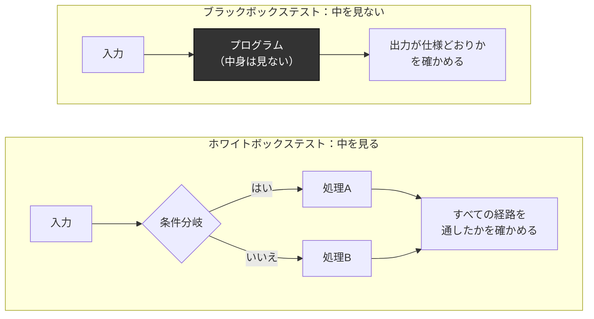

一般に、工程が進むほどブラックボックステストの割合が増えます。単体テストはコードを見ながら行うことが多く、総合テストや受入テストは仕様書や利用者の目線で行うためです。【補完】

### 2.4 テスト活動の流れ

記事では、テストは「計画・設計」「環境構築」「実行」「分析」の4段階で進むと説明されています。本書では、別冊のアプリで管理する単位に合わせるため、「計画」と「設計」を分けて5段階で扱います。また、記事は総合テストの流れとして説明していますが、この流れはどの工程のテストにも共通します。【補完】

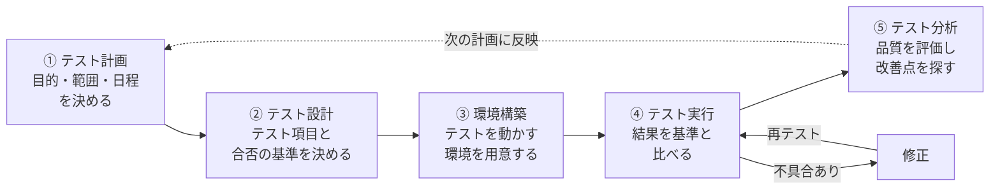

| 段階 | やること | 主な成果物 |
|---|---|---|
| ① テスト計画 | テストの目的、対象範囲、スケジュール、完了の基準を決める | テスト計画書 |
| ② テスト設計 | テストの項目（テストケース）、手順、期待する結果、合否の基準を決める | テスト仕様書（テストケース一覧） |
| ③ 環境構築 | テスト用の環境やテストデータを用意する。環境は、利用者が使う環境にできるだけ近づける | テスト環境、テストデータ【補完】 |
| ④ テスト実行 | テスト仕様書に沿ってテストを行い、結果を合否の基準と比べる。不具合があれば、修正と再テストを繰り返す | テスト結果、不具合の記録【補完】 |
| ⑤ テスト分析 | 結果をもとに品質を評価し、課題や改善点を洗い出す | テスト結果報告書【補完】 |

> **別冊（要件定義書）とのつながり**
> 別冊の要件定義書で定める自動テスト管理アプリは、自動テストについて、この流れのうち「計画」「実行」「結果の記録」「分析」を管理する想定です。テストの設計（テストコードを書くこと）と環境の構築は、アプリの外（開発者の手元やGitHub Actions）で行います。範囲の詳細は別冊の要件定義書7章で定めます。

---

## 3. テストの種類

> **この章のポイント**
> - 記事で紹介されている11種類のテストを、目的別に説明します。
> - 記事にないテストのうち、生産管理シミュレータに必要な6種類を追加します。
> - 記事の「リグレッションテスト」の説明を直し、「確認テスト」と分けて定義します。
> - 各テストをシミュレータで行うか（対象か対象外か）も整理します。

第2章の「テスト工程」は、テストを**いつ**行うか（単体・結合・総合・受入）による分け方です。この章の「テストの種類」は、テストで**何を**確かめるかによる分け方です。この2つは別の軸で、どの工程でどの種類のテストを行うかは、第4章で対応づけます。

この章で扱うテストの全体像は、次のとおりです。

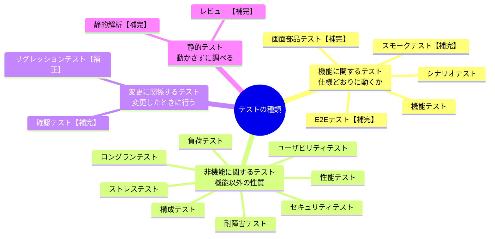

### 3.1 目的別テストの一覧

#### 記事で紹介されている11種類のテスト

| # | テストの種類 | 何を確かめるか | 分類 |
|---|---|---|---|
| 1 | 機能テスト | 設計どおりにプログラムが動くか。本番と同じような環境で、機能全体に不具合がないかを確かめる | 機能 |
| 2 | 性能テスト | 処理の速さや応答時間を条件を変えて測り、想定した状況で性能を保てるかを評価する | 非機能 |
| 3 | ユーザビリティテスト | 操作のしやすさや画面の見やすさを、実際の利用者の目線で確かめる。開発者ではなく利用者が行い、潜在的な課題を集める | 非機能 |
| 4 | セキュリティテスト | 不正アクセスや情報漏えいのおそれ、脆弱性（セキュリティ上の弱点）がないかを確かめる | 非機能 |
| 5 | リグレッションテスト | 【補正】変更によって、変更していない箇所に悪影響が出ていないかを確かめる（3.3で説明） | 変更に関係 |
| 6 | 構成テスト（機種テスト） | OS、ブラウザ、端末などの環境ごとに問題なく動くか、環境によって起きる不具合がないかを確かめる | 非機能【補正】 |
| 7 | シナリオテスト | 利用者が実際に行う操作の流れ（シナリオ）に沿って、システム全体の動きや機能どうしの連携に問題がないかを確かめる | 機能 |
| 8 | ロングランテスト | 長時間動かし続けたときに、性能が落ちたり不具合が起きたりしないかを確かめる | 非機能 |
| 9 | 負荷テスト | 本番で想定される負荷（アクセスの集中など）をかけて、処理速度や応答時間に問題がないかを確かめる | 非機能 |
| 10 | ストレステスト（高負荷テスト） | 想定を超える極端な負荷や大量のデータを与えて、耐えられるかを確かめる | 非機能 |
| 11 | 耐障害テスト | 障害が起きたときに、最低限のサービスを続けられるか、自動で復旧できるか、データを回復できるかを確かめる | 非機能 |

性能テスト・負荷テスト・ストレステスト・ロングランテストは混同しやすいため、違いを表にまとめます。【補完】

| テストの種類 | かける負荷 | 動かす時間 | 主な関心 |
|---|---|---|---|
| 性能テスト | 通常〜想定の範囲内 | 短時間 | 速さは十分か |
| 負荷テスト | 本番で想定される最大 | 短時間〜中程度 | 最大の負荷でも速さを保てるか |
| ストレステスト | 想定を超える | 短時間 | 限界はどこか、限界を超えたときにどうなるか |
| ロングランテスト | 通常 | 長時間 | 時間とともに悪くならないか |

#### 生産管理シミュレータでの扱い

シミュレータはブラウザだけで動き、サーバーやデータベースを持ちません。この特徴をふまえ、各テストを行うかどうかを次のように整理します。この整理は、第4章でテストを工程に割り当てるときの前提になります。

記号の意味：◎ 重点的に行う／○ 行う／△ 一部だけ行う／× 対象外

| テストの種類 | 扱い | 理由・シミュレータでの例 |
|---|---|---|
| 機能テスト | ◎ | 受注・マスタ・調達・在庫・生産・出荷の6つの領域の機能が、仕様どおりに動くか |
| 性能テスト | ○ | 品目数やBOMの階層が多いときでも、計算や画面の反応が遅くならないか |
| ユーザビリティテスト | ○ | 研修の受講者が迷わず操作できるか、画面が見やすいか |
| セキュリティテスト | △ | サーバーや利用者の個人データを持たないため、不正アクセスの検証は対象外。使っている外部ライブラリに、既知の脆弱性がないかを確かめる |
| リグレッションテスト | ◎ | 変更のたびに、既存の機能が壊れていないかを確かめる |
| 構成テスト | ○ | 研修で使うブラウザや画面サイズで、正しく表示・動作するか |
| シナリオテスト | ◎ | 受注から出荷までなど、研修で行う操作の流れが最後まで通るか |
| ロングランテスト | △ | 研修中に長時間使い続けても、動作が遅くならないか（ブラウザのメモリ使用量が増え続けないか） |
| 負荷テスト | × | サーバーがなく、利用者ごとのブラウザで動くため、アクセスが集中する箇所がない |
| ストレステスト | △ | 極端に大きなデータ（品目数や受注件数など）を与えても、画面が固まらず、適切に処理または警告できるか |
| 耐障害テスト | × | サーバーやデータベースを持たず、障害から復旧させる仕組みがない。誤った入力への対処は機能テストで確かめる |

### 3.2 追加するテスト【補完】

記事は、主に総合テストの観点からテストの種類を整理しています。そのため、開発の早い段階で行うテスト（静的解析、レビュー、画面部品テスト）や、自動化と相性のよいテスト（E2Eテスト、スモークテスト）が含まれていません。シミュレータはブラウザだけで動くReactのアプリなので、次の6種類を追加します。

| テストの種類 | 何を確かめるか | 分類 | シミュレータでの例 |
|---|---|---|---|
| 静的解析 | プログラムを動かさずにツールでコードを調べ、型の誤りや書き方の問題を見つける | 静的 | TypeScriptの型チェックで、数量を入れるべき所に文字列を渡すような誤りを見つける。ESLintで、決めた書き方のルールへの違反を見つける |
| レビュー | 設計書やコードを人（またはAI）が読んで、誤りや抜け、分かりにくさを見つける | 静的 | 在庫引当の設計書を読み、在庫が足りない場合の扱いが決まっているかを確かめる。AIによるコードレビューも含む |
| 画面部品テスト（UIコンポーネントテスト） | 画面の部品（ボタン、入力欄、一覧など）を単独で表示・操作し、正しく表示され、操作に正しく反応するかを確かめる | 機能 | 受注の入力欄に数量0を入れたときに、エラーメッセージが表示されるか |
| E2Eテスト（エンドツーエンドテスト） | ブラウザをツールで自動操作し、利用者と同じ操作で、画面の入力から結果の表示までを通して確かめる | 機能 | 受注を入力してから出荷されるまでの流れを、ブラウザの自動操作で確かめる |
| スモークテスト | 新しい版を公開した直後などに、主要な機能が最低限動くかを短時間で確かめる | 機能 | 公開したシミュレータが開けて、主要な画面が表示されるか |
| 確認テスト（再テスト） | 見つかった不具合を修正したあと、その不具合が直ったかを確かめる | 変更に関係 | 3.3で説明 |

> **用語の注意**
> 「コンポーネントテスト」という言葉は、JSTQBでは単体テストと同じ意味で使われます。本書では混同を避けるため、Reactの画面部品を対象とするテストを「画面部品テスト」と呼びます。

> **シナリオテストとE2Eテストの関係**
> シナリオテストは「何を確かめるか（利用者の操作の流れ）」による呼び方で、E2Eテストは「どう確かめるか（画面を通して最初から最後まで）」による呼び方です。そのため、両者は重なります。本書では、シナリオテストのうち、ツールで自動化したものをE2Eテストと呼びます。

### 3.3 確認テストとリグレッションテストの違い【補正】

#### 記事の説明と、直した理由

記事では、リグレッションテストを「修正した不具合の箇所が、正しく直っているかを確かめるテスト」と説明しています。しかし、この内容は一般に**確認テスト（再テスト）**と呼ばれるものです。

JSTQBなどの一般的な定義では、**リグレッションテスト**は「変更によって、変更していない箇所に意図しない悪影響が出ていないかを確かめるテスト」です。このような悪影響で、それまで動いていた機能が動かなくなることを「デグレード（デグレ）」と呼びます。

2つは目的が異なり、特にリグレッションテストは自動化の効果が最も大きいテストの1つです。そのため、本書では両者を分けて定義します。

#### 2つのテストの違い

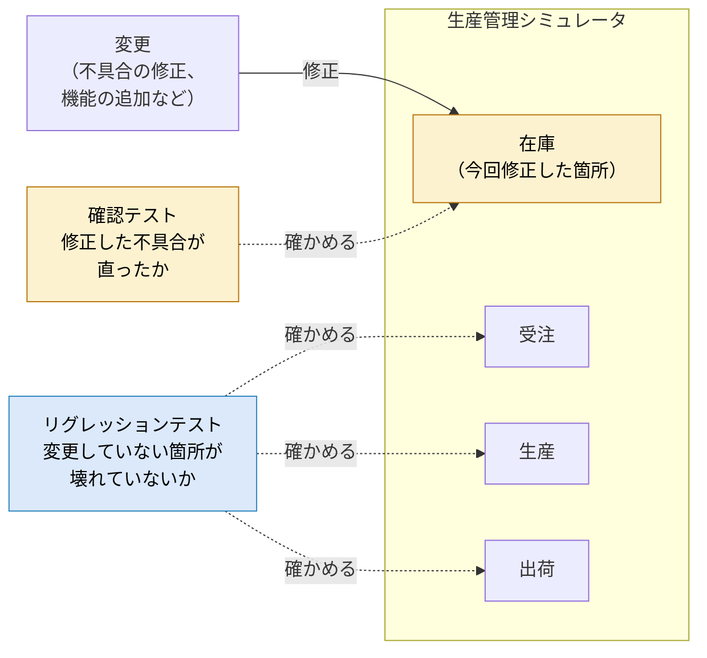

例えば、在庫の引当の計算に不具合があり、修正したとします。確認テストでは、その不具合が直ったかを確かめます。リグレッションテストでは、在庫の修正の影響で、出荷する数量の計算など、他の領域の機能がおかしくなっていないかを確かめます。実際には、リグレッションテストでは変更した箇所も含めて、用意した自動テストをまとめて流すことが一般的です。

| 観点 | 確認テスト | リグレッションテスト |
|---|---|---|
| 目的 | 見つかった不具合が直ったかを確かめる | 変更によって、他の箇所が壊れていないかを確かめる |
| 確かめる範囲 | 修正した箇所 | 変更していない箇所を含む、広い範囲 |
| きっかけ | 不具合の修正 | あらゆる変更（不具合の修正、機能の追加、ライブラリの更新、設定の変更など） |
| 行う回数 | 不具合ごとに行う | 変更のたびに繰り返す |
| 自動化との相性 | 不具合を再現するテストを作って自動テストに加えると、以後はリグレッションテストの一部として繰り返し使える | 非常に良い。同じテストを何度も繰り返すため、自動化による効果が大きい |

> **AIを使った開発との関係**
> Claude CodeなどのAIを使った開発では、短時間に多くのコードが変更されます。変更の量と回数が増えるほど、リグレッションテストを自動で素早く回せることが、品質を保つうえで重要になります。第5章の自動化の方針と、別冊のアプリは、この点を重視します。

---

## 4. 工程別の定義

> **この章のポイント**
> - 4つの工程それぞれで、どの種類のテストを行うかを対応表にまとめます。
> - 各工程を「目的・対象・実施するテスト・インプット・アウトプット・開始／完了基準」などの同じ型で定義します。
> - 前の工程のアウトプットが、次の工程のインプットになります。
> - 各工程で作った自動テストは積み上がり、リグレッションテストとして繰り返し使われます。

4.2〜4.5の各工程の定義のうち、目的と対象は記事にもとづいています。それ以外の項目（インプット、アウトプット、開始・完了基準など）は、記事にないため【補完】した内容です。

### 4.1 工程とテスト種類の対応表

各工程で主に行うテストは、次のとおりです。確認テストとリグレッションテストは、すべての工程で行います。

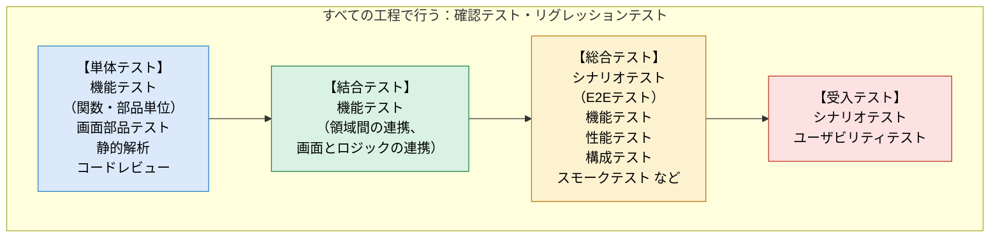

色は、2.2のV字モデルの図と対応しています。

すべてのテストの種類と工程の対応は、次の表のとおりです。

記号の意味：● 主に行う／○ 必要に応じて行う・一部だけ行う／空欄 行わない

| 分類 | テストの種類 | 単体 | 結合 | 総合 | 受入 |
|---|---|:-:|:-:|:-:|:-:|
| 静的 | 静的解析 | ● | | | |
| 静的 | レビュー（コードレビュー） | ● | | | |
| 機能 | 機能テスト | ● | ● | ● | ○ |
| 機能 | 画面部品テスト | ● | | | |
| 機能 | シナリオテスト | | | ● | ● |
| 機能 | E2Eテスト | | | ● | |
| 機能 | スモークテスト | | | ● | ○ |
| 非機能 | 性能テスト | ○ | | ● | |
| 非機能 | 構成テスト | | | ● | ○ |
| 非機能 | ユーザビリティテスト | | | ○ | ● |
| 非機能 | セキュリティテスト | | | ○ | |
| 非機能 | ロングランテスト | | | ○ | |
| 非機能 | ストレステスト | | | ○ | |
| 変更に関係 | 確認テスト | ● | ● | ● | ● |
| 変更に関係 | リグレッションテスト | ● | ● | ● | ○ |

- 負荷テストと耐障害テストは、シミュレータでは対象外です（3.1参照）。
- 設計書のレビューは、W字モデルにならって設計の段階で行います（2.2参照）。表のレビューは、テスト工程で行うコードレビューを指します。
- 単体テストの性能テストは、計算に時間がかかる関数（例：BOMの階層をたどる計算）を対象にします。
- 総合テストのユーザビリティテストは、受入テストの前に開発側で行う事前確認です。

### 4.2 単体テスト工程

| 項目 | 内容 |
|---|---|
| 目的 | 最小の部品（関数や画面部品）が、設計どおりに動くかを確かめる。不具合をこの段階で直し、後の工程に持ち込まない |
| 対象 | 業務ロジックの関数（純粋関数）、画面部品（Reactのコンポーネント） |
| 対になる設計工程 | 詳細設計 |
| 実施するテスト | ● 機能テスト（関数・部品単位）、画面部品テスト、静的解析、コードレビュー、確認テスト、リグレッションテスト ○ 性能テスト（計算に時間がかかる関数） |
| 主な確認観点 | 正しい入力で、正しい結果になるか 誤った入力（異常系）を正しく扱えるか 境界値（例：在庫がちょうど0、必要数と在庫数が同じ）で正しく動くか 条件分岐のすべての経路を通したか |
| テスト環境 | 開発者のPCと、GitHub Actions。ブラウザは使わず、Node.js上でテストを実行する（画面部品は、ブラウザを模した環境で実行する） |
| インプット | 詳細設計書（関数や画面部品の仕様） 単体テスト仕様書（詳細設計の段階で作成） ソースコード 静的解析のルール設定 |
| アウトプット | 単体テストのテストコード 単体テスト結果（合否、コードカバレッジ） 静的解析の結果 コードレビューの記録 不具合の記録 |
| 開始基準 | 対象のコードが実装され、ビルドできる 単体テスト仕様書のレビューが済んでいる |
| 完了基準 | すべてのテストケースが合格している 静的解析（型チェック・ESLint）のエラーがない コードカバレッジが目標値を満たしている（目標値はテスト計画で決める。例：業務ロジックの分岐の80%以上） コードレビューが済んでいる 未解決の不具合がない |
| シミュレータでの例 | 在庫を引き当てる関数に、在庫が十分な場合・不足する場合・ちょうど0の場合の入力を与え、それぞれ正しい引当結果になるかをvitestで確かめる |

> **用語**
> - **異常系**：誤った入力や想定外の状況のこと。正しい入力の場合は「正常系」と呼びます。
> - **境界値**：条件が切り替わる境目の値。「在庫が0以下なら不足」のような条件では、0の前後で不具合が起きやすいため、重点的に確かめます。
> - **コードカバレッジ**：テストで、コード全体のうちどれだけを実行したかを示す割合。テストの抜けを見つける目安になります。

> **テストコードを仕様書として使う場合【補完】**
> シミュレータのように、テストコードを書きながら開発を進める場合は、テストコード（各テストの名前と期待する結果）を単体テスト仕様書の代わりにすることもできます。その場合も、テストコードのレビューで、テストケースの抜けがないかを確かめます。

### 4.3 結合テスト工程

| 項目 | 内容 |
|---|---|
| 目的 | 単体テストを終えた部品を組み合わせたときに、部品どうしのデータの受け渡しや連携が正しく行われるかを確かめる。単体では見つからない、組み合わせたときに起きる不具合を見つける |
| 対象 | ① 領域どうしの連携：受注・マスタ・調達・在庫・生産・出荷の間での、データの受け渡しと状態の更新 ② 画面とロジックの連携：画面の操作によって状態が正しく更新され、画面の表示に反映されるか |
| 対になる設計工程 | 基本設計 |
| 実施するテスト | ● 機能テスト（領域間の連携、画面とロジックの連携）、確認テスト、リグレッションテスト |
| 主な確認観点 | ある領域の処理結果が、次の領域に正しく渡るか 1つの操作で、複数の領域の状態が矛盾なく更新されるか 操作の順序を変えても正しく動くか |
| テスト環境 | 開発者のPCと、GitHub Actions（単体テストと同じ） |
| インプット | 基本設計書（領域間のデータの受け渡し、状態の設計、画面の構成） 結合テスト仕様書（基本設計の段階で作成） 単体テストを完了したソースコード 単体テスト結果 テストデータ（マスタや受注などの組み合わせ） |
| アウトプット | 結合テストのテストコード 結合テスト結果 不具合の記録 |
| 開始基準 | 単体テストの完了基準を満たしている 結合テスト仕様書のレビューが済んでいる |
| 完了基準 | すべてのテストケースが合格している 基本設計で決めた領域間のデータの受け渡しを、すべて確かめている 未解決の不具合がない |
| シミュレータでの例 | 受注を登録したときに在庫が引き当てられ、その結果が生産や調達の領域に正しく渡り、それぞれの画面の表示に反映されるかを確かめる |

### 4.4 総合テスト工程

| 項目 | 内容 |
|---|---|
| 目的 | すべての部品を組み合わせたシステム全体が、要件定義で決めた機能と非機能の要件を満たすかを確かめる。利用者に渡す前の最終確認 |
| 対象 | シミュレータ全体（ビルドして公開した状態） |
| 対になる設計工程 | 要件定義 |
| 実施するテスト | ● 機能テスト、シナリオテスト（E2Eテスト）、性能テスト、構成テスト、スモークテスト、確認テスト、リグレッションテスト ○ ユーザビリティテスト（開発側での事前確認）、セキュリティテスト（外部ライブラリの脆弱性の確認）、ロングランテスト、ストレステスト |
| 主な確認観点 | 要件定義で決めた機能がすべて使えるか 研修で行う操作の流れ（シナリオ）が最後まで通るか 性能が目標値を満たすか（例：画面操作への反応が1秒以内。目標値は要件定義で決める） 対象のブラウザで正しく動くか |
| テスト環境 | 本番に近い環境。ビルドしたシミュレータをテスト用の公開先に置き、実際のブラウザで動かす |
| インプット | 要件定義書（機能要件・非機能要件） 総合テスト仕様書（要件定義の段階で作成。シナリオを含む） 結合テストを完了したシステム 結合テスト結果 テストデータ（研修で使うデータに近いもの） 対象ブラウザの一覧 |
| アウトプット | E2Eテストのテストコード 総合テスト結果（機能・非機能） 性能の測定結果 不具合の記録 総合テスト結果報告書（品質の評価と、受入テストに進めるかの判断材料） |
| 開始基準 | 結合テストの完了基準を満たしている テスト環境とテストデータの準備が済んでいる |
| 完了基準 | すべてのシナリオが合格している 非機能の目標値（性能など）を満たしている 対象のすべてのブラウザで動作を確かめている 重大な不具合が残っていない 総合テスト結果報告書ができている |
| シミュレータでの例 | 研修の流れに沿って、マスタの準備から受注・生産・出荷までをブラウザの自動操作（E2Eテスト）で通し、途中の在庫数や最終的な出荷数が期待どおりかを確かめる |

### 4.5 受入テスト工程

| 項目 | 内容 |
|---|---|
| 目的 | 利用者の立場から、システムが求めていたこと（要求）を満たし、実際に使える状態かを確かめて、受け入れるかどうかを判断する。システム開発の最後の工程 |
| 対象 | 総合テストを終えたシミュレータ（実際の利用環境に置いた状態） |
| 対になる設計工程 | 要求分析 |
| 実施するテスト | ● シナリオテスト（研修での実際の使い方）、ユーザビリティテスト、確認テスト ○ 機能テスト、構成テスト（研修で実際に使うPC・ブラウザ）、スモークテスト、リグレッションテスト（受入テスト中に修正が入った場合） |
| 主な確認観点 | 研修の目的を果たせるか（教材として必要なことを学べるか） 受講者が迷わず操作できるか 研修で実際に使う環境で、問題なく動くか |
| テスト環境 | 実際の利用環境（研修で使うPC、ブラウザ、ネットワーク） |
| インプット | 要求（研修の目的や、利用者が求めていること）をまとめた資料 受入テスト仕様書（受入の基準を含む。要件定義の段階で作成） 総合テストを完了したシステム 総合テスト結果報告書 操作手順書（ある場合） |
| アウトプット | 受入テスト結果 利用者からの指摘・改善要望 受入判定（合格・条件付き合格・不合格） |
| 開始基準 | 総合テストの完了基準を満たしている 総合テスト結果報告書で品質を確認している |
| 完了基準 | 受入の基準を満たしている 受入判定について関係者の合意がとれている 条件付き合格の場合は、残った課題と対応の期限が決まっている |
| シミュレータでの例 | 利用者の立場で、実際の研修と同じ手順でシミュレータを使い、教材として目的を果たせるか、受講者がつまずく箇所がないかを確かめる |

> **受入テスト仕様書を作る時期**
> V字モデルでは、受入テストは要求分析と対になります。一方、W字モデルでは、受入テストの設計を要件定義の段階で行います。本書では、要求分析の結果をもとに、要件定義の段階で受入テスト仕様書を作ります。

### 4.6 工程間のインプット／アウトプットのつながり

各工程のアウトプットは、次の工程のインプットになります。また、前の工程の完了基準を満たしていることが、次の工程の開始基準になります。

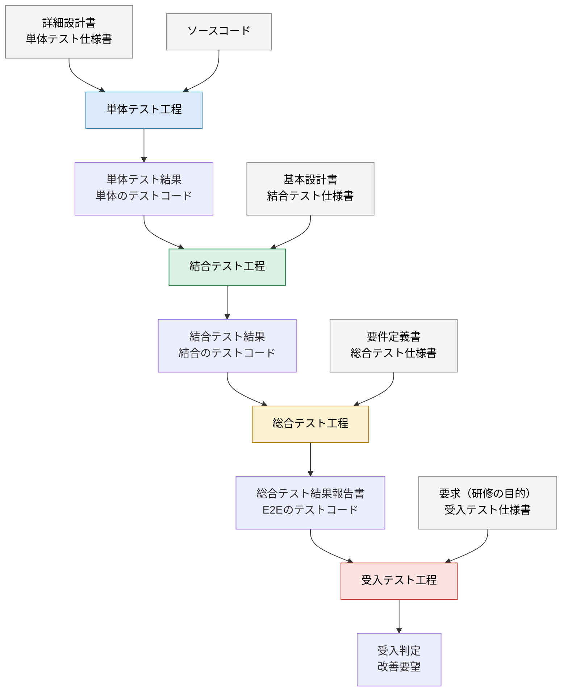

灰色の箱は、設計の段階で作る資料（とソースコード）です。色付きの箱が各テスト工程、紫色の箱が各工程のアウトプットです。

#### 自動テストは積み上がって、リグレッションテストになる

各工程で作った自動テストのテストコードは、その工程で使って終わりではありません。積み上がって「リグレッションテスト一式」となり、コードを変更するたびに繰り返し実行されます。

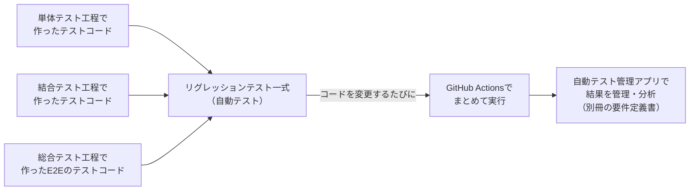

この積み上がった自動テストを、どの範囲まで作るか（自動化するか）を第5章で整理します。そして、その実行結果を管理・分析する仕組みが、別冊の要件定義書で定める自動テスト管理アプリです。

### 4.7 反復型開発への当てはめ

V字モデルは、設計と実装を終えてからテストに移る進め方を前提にしています。一方、シミュレータの開発は、AIとCIを使って短い周期で変更とテストを繰り返す反復型です。この違いをそのままにすると、4.2〜4.5の定義が実際の進め方と合いません。そこで、次のように当てはめます。【補完】

#### 「テストレベル」と「品質の関門」を分ける

| 呼び方 | 意味 | 4.2〜4.5のどこにあたるか | いつ行うか |
|---|---|---|---|
| テストレベル | 何を、どの範囲で確かめるか（部品／組み合わせ／全体／利用者の立場） | 目的、対象、実施するテスト、主な確認観点 | 変更のたびにCIで実行する |
| 品質の関門 | 次に進んでよいかを判断する区切り | 開始基準、完了基準 | リリースの単位で判定する |

反復型では、工程を時間で区切るのではなく、すべてのテストレベルを変更のたびに実行し、完了基準の判定はリリースの単位で行います。

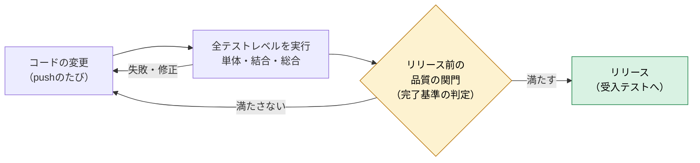

#### 設計書がそろっていない場合の代替

V字モデルのインプット（要件定義書、基本設計書、詳細設計書、各テスト仕様書）がそろっていない場合は、次のもので代えます。代えたものは、テストのもとになる資料として、内容が確かめられる状態（最新であり、レビューされている）である必要があります。

| V字モデルでの成果物 | 代わりに使うもの |
|---|---|
| 要求・要件定義書 | 仕様書のユースケース一覧と、その受入条件 |
| 基本設計書 | 画面と領域（ドメイン）の構成をまとめた資料や、設計の検討の記録 |
| 詳細設計書 | 関数の仕様を説明したコメントや、テストコードの名前 |
| 各テスト仕様書 | テストコード（テストの名前と期待する結果）。ただしレビューを行う |

> **注意：テストの期待する結果は、コードから作らない**
> テストコードをテスト仕様書の代わりにする場合、期待する結果をコードの動きから作ると、コードの誤りがそのままテストの正解になってしまいます。AIがコードとテストの両方を書くときは特に起こりやすい問題です。期待する結果は、必ず仕様書（ユースケースと受入条件）から作ります。テストの有効性の測り方は5.4で扱います。

---

# 第2部 自動化と人間系の分類

## 5. 自動テストと人間系テストの分類

> **この章のポイント**
> - 「合否を機械で判定できるか」「繰り返し実行するか」などの基準で、テストを「自動テスト」「併用」「人間系」に分けます。
> - 自動テストは、速くて安定した単体テストを土台に多く作り、遅くて壊れやすいE2Eテストは少なく絞ります（テストピラミッド）。
> - シミュレータでは、単体・結合のテストはすべて自動化し、総合テストは主要なシナリオを自動化します。受入テストとユーザビリティテストは人が行います。
> - 自動テストをいつ実行するか（実行のタイミング）も決めます。これは別冊のアプリの要件のインプットになります。

記事では、自動テストは繰り返しのテストや大量のデータを扱うテストに向き、手動テストは利用者の目線で細かな操作感などを確かめるのに向いていると説明されています。そして、すべてを自動化するのではなく、目的に応じて使い分けることが勧められています。この章では、その使い分けの基準を具体的にし、シミュレータのテストに当てはめます。

### 5.1 分類の判断基準

#### 判断の観点【補完】

| # | 観点 | 自動化に向く | 人が行うのに向く |
|---|---|---|---|
| 1 | 合否の判定 | 期待する結果を事前に決められ、機械で比べられる（例：出荷数が100になる） | 人の感覚や判断が必要（例：画面が分かりやすいか） |
| 2 | 実行の回数 | 何度も繰り返す（例：変更のたびに流すリグレッションテスト） | 1回だけ、またはまれにしか行わない |
| 3 | 人の手での難しさ | 大量のデータ、多数のブラウザ、正確な時間の計測など、人の手では難しい | 人の手で無理なく行える |
| 4 | 対象の安定性 | 仕様が安定している（例：業務ロジックの計算） | 仕様や画面がまだ頻繁に変わる |
| 5 | 期待する効果 | 決まった手順で、同じ結果を確実に確かめたい | 想定していない不具合を、人の気づきで見つけたい |

観点4について補足します。自動テストは、対象が変わるたびに直す手間（保守の手間）がかかります。画面がまだ頻繁に変わる段階でE2Eテストをたくさん作ると、テストを直す手間が大きくなります。そのような対象は、まず人が確かめ、仕様が安定してから自動化します。

#### 判断の流れ

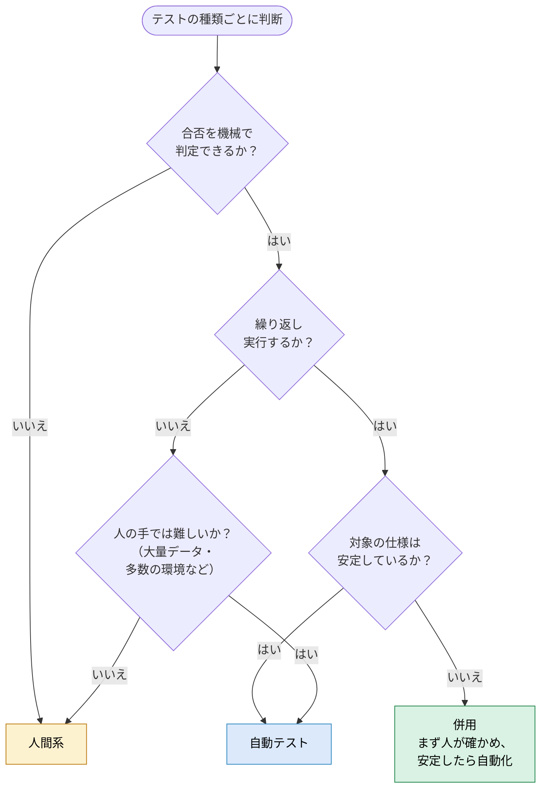

本書では、分類を次の3つとします。

| 分類 | 意味 |
|---|---|
| 自動テスト | ツールが実行し、合否も機械が判定する |
| 併用 | 一部を自動テストで行い、残りを人が行う |
| 人間系 | 人が実行し、人が判断する |

### 5.2 テストピラミッド

自動テストをどのような割合で作るかの考え方として、「テストピラミッド」が広く使われています。【補完】

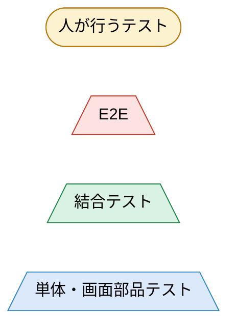

ピラミッドの幅は、テストの数の目安を表します。下の層ほど数を多く、上の層ほど少なくします。

| 層 | テストの数 | 実行の速さ | 壊れやすさ | 失敗したときの原因の探しやすさ |
|---|---|---|---|---|
| E2Eテスト | 少なく絞る | 遅い（数秒〜数分／件） | 壊れやすい（画面の変更で直しが必要） | 探しにくい（どこが原因か分かりにくい） |
| 結合テスト | 中くらい | 中くらい | 中くらい | 中くらい |
| 単体テスト・画面部品テスト | 多く作る | 速い（数ミリ秒／件） | 壊れにくい | 探しやすい（失敗した関数が原因） |

逆に、E2Eテストや手動テストばかりで単体テストが少ない状態は、上下が逆さまの形になるため「アイスクリームコーン」と呼ばれ、避けるべき形とされています。テストに時間がかかり、失敗の原因も探しにくくなるためです。

> **シミュレータとの相性**
> シミュレータの業務ロジックは純粋関数で書かれています。純粋関数は、同じ入力には必ず同じ結果を返すため、単体テストで速く・安定して確かめられます。そのため、ピラミッドの土台を厚くしやすい構造です。

### 5.3 工程・テスト種類ごとの分類結果

#### 分類の全体像

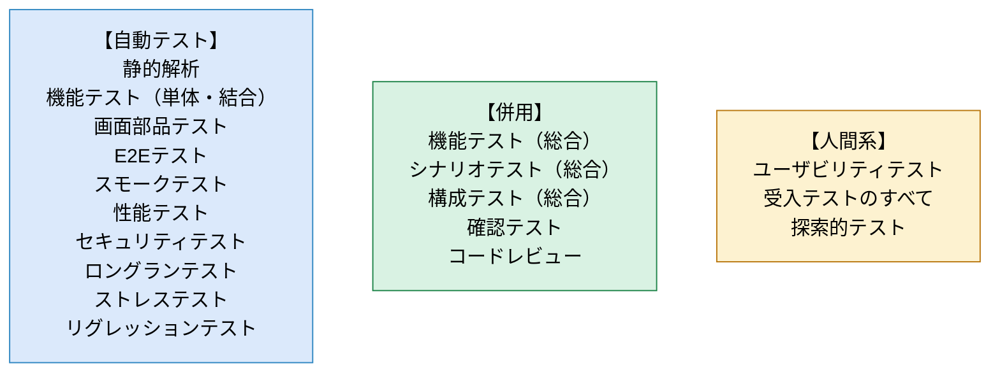

#### 実行のタイミング

自動テストは、いつ実行するかも決めておきます。実行に時間がかかるテストを変更のたびに流すと、結果が出るまで待たされるためです。

ただし、AIを使った開発では変更が多いため、主要な操作の流れが壊れたことに気付くのが遅れると手戻りが大きくなります。そこで、主要なシナリオのE2Eテスト（数本）は変更のたびに実行し、E2Eテスト全体は公開前に実行します。

| タイミング | 意味 |
|---|---|
| 変更のたび | コードをGitHubに送る（push）たびに、GitHub Actionsで自動実行する |
| 公開前 | 新しい版を公開する前に実行する。時間のかかるテスト（E2Eテスト全体など）はここで行う |
| 公開直後 | 新しい版を公開した直後に実行する |
| 定期・必要時 | 決まった間隔（例：毎週）で自動実行するか、必要なときに起動する |

#### 分類結果の一覧

| 工程 | テストの種類 | 分類 | 自動化する内容／人が行う内容 | 実行のタイミング |
|---|---|---|---|---|
| 単体 | 静的解析 | 自動 | 型チェックとESLintを実行し、エラーの有無を判定する | 変更のたび |
| 単体 | 機能テスト（関数） | 自動 | 関数に入力を与え、期待する結果と比べる | 変更のたび |
| 単体 | 画面部品テスト | 自動 | 画面部品を表示・操作し、表示内容を期待と比べる | 変更のたび |
| 単体 | コードレビュー | 併用 | 自動：AIによるレビューで指摘を洗い出す 人：設計の意図に合っているかを最終判断する | 変更のたび |
| 単体 | 性能テスト（関数） | 自動 | 計算に時間がかかる関数の処理時間を測り、目標値と比べる | 定期・必要時 |
| 結合 | 機能テスト（領域間・画面とロジック） | 自動 | 複数の領域を組み合わせて動かし、状態や表示を期待と比べる | 変更のたび |
| 総合 | 機能テスト・シナリオテスト | 併用 | 自動：主要なシナリオをE2Eテストで確かめる 人：自動化していないシナリオや、画面の見た目を確かめる | 主要なシナリオ（数本）は変更のたび、そのほかは公開前 |
| 総合 | 性能テスト | 自動 | E2Eテストの中で画面操作への反応時間を測り、目標値と比べる | 公開前 |
| 総合 | 構成テスト | 併用 | 自動：複数のブラウザでE2Eテストを実行する 人：実際の端末や画面サイズでの見た目を確かめる | 公開前 |
| 総合 | スモークテスト | 自動 | 公開したシミュレータを開き、主要な画面が表示されるかを確かめる | 公開直後 |
| 総合 | セキュリティテスト | 自動 | 外部ライブラリに既知の脆弱性がないかを調べる | 変更のたび・定期 |
| 総合 | ロングランテスト | 自動 | シナリオを長時間繰り返し、動作の速さやメモリ使用量の変化を記録する | 必要時 |
| 総合 | ストレステスト | 自動 | 大量のデータを自動で作って与え、処理できるかを確かめる | 必要時 |
| 総合 | ユーザビリティテスト（事前確認） | 人間系 | 開発側で実際に操作し、分かりにくい点を洗い出す | 公開前 |
| 受入 | シナリオテスト | 人間系 | 研修と同じ手順で使い、目的を果たせるかを判断する | 受入テスト時 |
| 受入 | ユーザビリティテスト | 人間系 | 受講者の立場で操作し、使いやすさを評価する | 受入テスト時 |
| 受入 | 機能テスト・構成テスト | 人間系 | 研修で実際に使う環境で、機能と表示を確かめる | 受入テスト時 |
| 受入 | スモークテスト | 自動 | 受入テストの環境に公開した直後に、主要な画面が表示されるかを確かめる | 公開直後 |
| 全工程 | 確認テスト | 併用 | 自動：不具合を再現する自動テストを追加して、直ったことを確かめる 人：自動化しにくい不具合（見た目など）を確かめる | 不具合の修正のたび |
| 全工程 | リグレッションテスト | 自動 | それまでに作った自動テストをまとめて実行する | 変更のたび（E2Eテストは主要なシナリオのみ変更のたび、全体は公開前） |
| 総合・受入 | 探索的テスト | 人間系 | 手順を決めずに操作し、想定していない不具合を探す | 公開前・受入テスト時 |

> **別冊（要件定義書）とのつながり**
> 「自動」と「併用」のうち自動で行う部分が、別冊のアプリで管理する対象です。上の表の「実行のタイミング」は、アプリの実行管理の要件（9.2）のインプットになります。「人間系」の結果は、アプリに手で入力できるようにします。

### 5.4 自動化で使う主なツールの例【補完】

シミュレータの技術構成（React＋TypeScript＋Vite）に合うツールの例です。最終的な選定は設計の段階で行います。

| 用途 | ツールの例 | 対応するテスト | 結果の出力 |
|---|---|---|---|
| 型のチェック | TypeScript（tsc） | 静的解析 | コンソールへのエラー出力 |
| 書き方のチェック | ESLint | 静的解析 | コンソールへの出力、JSON形式 |
| 関数・結合のテスト | Vitest（シミュレータで使用中） | 機能テスト（単体・結合）、確認テスト、リグレッションテスト | JUnit XML形式、JSON形式 |
| 画面部品のテスト | React Testing Library（Vitestの上で実行） | 画面部品テスト | Vitestと同じ |
| コードカバレッジの測定 | Vitestのカバレッジ機能 | 単体テストの完了基準の確認 | HTML、JSON形式など |
| 関数の処理時間の測定 | Vitestのベンチマーク機能 | 性能テスト（単体） | コンソール、JSON形式 |
| ブラウザの自動操作 | Playwright | E2Eテスト、シナリオテスト、スモークテスト、構成テスト（Chromium・Firefox・WebKit）、性能テスト（総合）、ロングランテスト、ストレステスト | JUnit XML形式、JSON形式、失敗時のスクリーンショット・動画・操作の記録 |
| 外部ライブラリの脆弱性の確認 | npm audit、GitHubのDependabot | セキュリティテスト | JSON形式、GitHub上の通知 |
| テストの有効性の測定 | Stryker（ミューテーションテストのツール） | テストの質の確認 | HTML、JSON形式 |
| 自動テストの実行基盤 | GitHub Actions | すべての自動テスト | 実行の記録（ログ）、成果物（アーティファクト）としてのファイル保存 |

> **ミューテーションテストとは**
> コードにわざと小さな誤り（例：「以上」を「より大きい」に変える）を入れ、テストがその誤りを見つけて失敗するかを調べる方法です。見つけられた割合を「ミューテーションスコア」と呼びます。カバレッジは「テストがコードを通ったか」しか分かりませんが、ミューテーションテストは「テストが誤りを見つけられるか」を測れます。AIがコードとテストの両方を書く場合、同じ思い違いが両方に入ることがあるため、この測り方が役に立ちます。

> **JUnit XML形式とは**
> テストの結果（テストの名前、合否、かかった時間、失敗したときのメッセージなど）を記録するための、共通のファイル形式です。もともとはJavaのテストツールの形式ですが、VitestやPlaywrightを含む多くのツールが、この形式で結果を出力できます。別冊のアプリは、この形式の結果を取り込むことを想定します（別冊の要件定義書11.2で詳しく定めます）。

### 5.5 人間系で行う領域とその理由

次の領域は、自動化せずに人が行います。

| 領域 | 人が行う理由 | 行い方 |
|---|---|---|
| ユーザビリティテスト | 使いやすさや分かりやすさは、人の感覚で判断するもので、機械では合否を決められない | 受講者の立場で操作し、迷った箇所や分かりにくい表示を記録する。感想だけで終わらせないために、測れる指標（研修のシナリオを最後までできた割合、かかった時間、迷って手が止まった箇所の件数）も記録する |
| 受入テスト | 研修の教材として役に立つかは、利用者が判断するもの | 研修と同じ手順で使い、受入の基準に照らして判定する |
| 探索的テスト | 事前に想定していない不具合は、決まった手順の自動テストでは見つけにくい。人の経験と気づきが必要 | 時間を区切り（例：30分）、確かめる範囲だけを決めて自由に操作する |
| 画面の見た目の最終確認 | レイアウトの崩れや見づらさは、人の目で見ないと気付きにくい | 対象のブラウザや画面サイズで、主要な画面を目で確かめる |
| 設計の意図に照らしたレビュー | 設計の考え方に合っているか、分かりやすいかの判断には、背景の理解が必要。AIの支援は受けられるが、最終判断は人が行う | AIの指摘も参考にしながら、設計書やコードを読んで判断する |
| 自動テストの結果の判断 | 失敗の原因が「不具合」か「テストの誤り」か「たまたま」かの見きわめや、完了基準を満たしたかの判定は、最終的に人が責任を持つ | アプリの分析結果（別冊の要件定義書）を参考にしながら判断する |

最後の「自動テストの結果の判断」は、別冊のアプリの分析機能（AIによる失敗原因の分析を含む）で支援します。ただし、アプリが示すのはあくまで判断の材料で、最終的な判断は人が行います。

---

# 付録

## 付録A 用語集

本書で使っている主な用語をまとめます。

### 英数字

| 用語 | 意味 | 初出・詳しい説明 |
|---|---|---|
| API | プログラムから、別のサービスの機能を呼び出すための窓口 | 11.2 |
| BOM | 部品表。製品を作るのに必要な部品と、その数の構成を表したもの | 3.1 |
| CORS | ブラウザが、別のサイトのデータを勝手に読み取れないようにする安全の仕組み | 11.2 |
| Dependabot | GitHubの機能で、使っている外部のライブラリの既知の脆弱性や更新を知らせるもの | 5.4 |
| E2Eテスト（エンドツーエンドテスト） | ブラウザをツールで自動操作し、利用者と同じ操作で、画面の入力から結果の表示までを通して確かめるテスト | 3.2 |
| ESLint | JavaScriptやTypeScriptのコードの書き方の問題を見つけるツール | 5.4 |
| GitHub Actions | GitHubに付属する仕組みで、コードの変更などをきっかけに、ビルドやテストを自動で動かすもの | 1.2 |
| GitHub Pages | GitHubの機能で、静的なWebページを公開するもの | 1.3 |
| JSTQB | ソフトウェアテスト技術者資格認定の運営組織。テストの用語や知識体系（シラバス）を定めている | 1.4 |
| JUnit XML形式 | テストの結果を記録するための共通のファイル形式。多くのテストツールが出力できる | 5.4 |
| npm audit | 使っている外部のライブラリに、既知の脆弱性がないかを調べるコマンド | 5.4 |
| Playwright | ブラウザを自動操作してテストを行うツール | 5.4 |
| PoC（概念実証） | 小さく試して、考え方や仕組みが有効かを確かめること | 1.1 |
| push | 手元で行ったコードの変更を、GitHubのリポジトリに送ること | 5.3 |
| React | 画面を作るためのJavaScriptのライブラリ | 1.3 |
| TypeScript | JavaScriptに「型」の仕組みを加えたプログラミング言語 | 1.3 |
| Vite | Webアプリの開発やビルドを速く行うためのツール | 1.3 |
| Vitest | JavaScriptやTypeScriptの関数や画面部品をテストするツール | 5.4 |
| V字モデル | 設計の各段階とテストの工程を対にして、設計と実装を終えてからテストに移る開発モデル | 2.2 |
| W字モデル | 設計の各段階で、対になるテストの設計も同時に行う開発モデル | 2.2 |

### あ行〜さ行

| 用語 | 意味 | 初出・詳しい説明 |
|---|---|---|
| アイスクリームコーン | 単体テストが少なく、E2Eテストや手動テストが多い状態。避けるべき形とされる | 5.2 |
| アウトプット | その工程で作られ、次の工程や判断に使われるもの | 1.1 |
| 異常系・正常系 | 誤った入力や想定外の状況が「異常系」、正しい入力の場合が「正常系」 | 4.2 |
| インプット | その工程を始めるために必要な資料や成果物 | 1.1 |
| 受入テスト | 利用者の立場から、求めていたことを満たしているかを確かめ、受け入れるかを判断するテスト工程 | 4.5 |
| 開始基準・完了基準 | その工程を始めてよい条件と、終えてよい条件 | 4.2 |
| 確認テスト（再テスト） | 見つかった不具合を修正したあと、その不具合が直ったかを確かめるテスト | 3.3 |
| 画面部品テスト | 画面の部品（ボタン、入力欄など）を単独で表示・操作して確かめるテスト | 3.2 |
| 機能要件・非機能要件 | システムやアプリが何をできるべきかが機能要件。速さや安全さなど、機能以外に求められる性質が非機能要件 | 別冊の要件定義書 第9章・第10章 |
| 境界値 | 条件が切り替わる境目の値。不具合が起きやすいため、重点的に確かめる | 4.2 |
| 結合テスト | 部品を組み合わせたときに、データの受け渡しや連携が正しく行われるかを確かめるテスト工程 | 4.3 |
| コードカバレッジ | テストで、コード全体のうちどれだけを実行したかを示す割合 | 4.2 |
| コミット | コードの変更を記録した単位 | 9.2 |
| 純粋関数 | 同じ入力には必ず同じ結果を返し、外部の状態を変えない関数 | 1.3 |
| 印（タグ） | テストの名前に書く目印。要件ID、工程、テストの種類を表す | 7.1、9.1 |
| スモークテスト | 新しい版を公開した直後などに、主要な機能が最低限動くかを短時間で確かめるテスト | 3.2 |
| 成果物（アーティファクト） | GitHub Actionsの実行で作られ、保存されたファイル | 5.4 |
| 静的解析 | プログラムを動かさずにツールでコードを調べ、誤りや問題を見つけること | 3.2 |
| 静的テスト・動的テスト | プログラムを動かさずに調べるのが静的テスト、実際に動かして確かめるのが動的テスト | 2.3 |
| 総合テスト | システム全体が、要件を満たすかを確かめるテスト工程。記事では「システムテスト」 | 4.4 |

### た行〜わ行

| 用語 | 意味 | 初出・詳しい説明 |
|---|---|---|
| ダッシュボード | 全体の状況を1画面にまとめて表示する画面 | 11.4 |
| 探索的テスト | 手順を決めず、操作しながら次に何を試すかを考えて行うテスト | 2.3 |
| 単体テスト | 関数や画面部品など、最小の部品が設計どおりに動くかを確かめるテスト工程 | 4.2 |
| デグレード（デグレ） | 変更の悪影響で、それまで動いていた機能が動かなくなること | 3.3 |
| テストケース | テストで確かめる項目の1件。入力、手順、期待する結果を含む | 2.4 |
| テストピラミッド | 単体テストを多く、E2Eテストを少なく作るという、自動テストの割合の考え方 | 5.2 |
| トークン | GitHubなどのサービスに、パスワードの代わりに使う認証の文字列 | 9.6、10.3 |
| ドメイン（領域） | 業務の区分。シミュレータでは受注・マスタ・調達・在庫・生産・出荷の6つ | 1.3 |
| 引当 | 受注などに対して、在庫を割り当てること | 2.1 |
| ブラックボックステスト | 内部の構造を見ずに、入力と出力を仕様と照らして確かめるテスト | 2.3 |
| ブランチ | コードの変更を、本流とは分けて進めるための枝分かれ | 9.2 |
| フレーキーテスト | コードを変えていないのに、実行するたびに合格したり失敗したりするテスト | 6.1、9.4 |
| プロンプト | AIへの指示文 | 10.5 |
| ホワイトボックステスト | プログラムの内部の構造を見ながら確かめるテスト | 2.3 |
| ユースケース | 利用者がシステムを使う場面と、その流れ | 8.3 |
| 要件 | システムが満たすべきことを、1つずつ書き出したもの | 7.1 |
| リグレッションテスト | 変更によって、変更していない箇所に悪影響が出ていないかを確かめるテスト | 3.3 |
| レビュー | 設計書やコードを人（またはAI）が読んで、誤りや抜けを見つけること | 3.2 |
| ワークフロー | GitHub Actionsで実行する処理のまとまり。リポジトリ内の設定ファイルで定義する | 9.2 |

## 付録B 参考資料

| # | 資料 | 本書での使い方 |
|---|---|---|
| 1 | Sun*（サンアスタリスク）「システム開発におけるテストの種類とは？工程別に目的と特徴を徹底解説」（2026年8月5日更新） https://sun-asterisk.com/service/development/topics/systemdev/3238/ | 本書の土台。テストの種類、テスト工程、テストの流れ、テストの分類 |
| 2 | JSTQB「テスト技術者資格制度 Foundation Level シラバス」2018年版 V3.1（日本語版） https://jstqb.jp/dl/JSTQB-SyllabusFoundation_Version2018V31.J03.pdf | 記事にない内容の補完と、記事の説明の補正（確認テストとリグレッションテストの定義、テストレベル、V字モデル）。現行の版は2023年版（V4.0）で、JSTQBのWebサイトで公開されている |

> **V字モデルの対応についての補足**
> 本書のV字モデルの対応（2.2）は、記事とJSTQBのシラバスにならっています。JSTQBでは、工程名ではなく「テストのもとになる資料（テストベース）」でテストの工程との対応を決めています。そのため、組織によっては「要件定義と受入テスト」「基本設計と総合テスト」「詳細設計と結合テスト」「実装と単体テスト」を対にする場合もあります。どちらを採るかは、各設計工程の資料に何を書くかによります。

## 付録C 非機能の目標値のチェックリスト【補完】

非機能テスト（性能、構成、ユーザビリティなど）は、目標値が決まっていないと合否を判断できません。要件定義のときに、次の項目を決めます。値は例です。

| 項目 | 決めること | 目標値の例 | 関連 |
|---|---|---|---|
| 性能（操作の反応） | 主要な画面操作への反応時間 | 1秒以内 | 4.4 |
| 性能（計算） | 大きなデータでの計算時間 | BOMが5階層・品目1,000件で3秒以内 | 3.1 |
| 構成 | 対象とするブラウザと画面の大きさ | 研修で使うブラウザの最新版、横幅1366ピクセル以上 | 3.1 |
| ユーザビリティ | 測り方と目標 | 研修のシナリオを最後までできた割合90%以上、迷って手が止まった箇所3件以下 | 5.5 |
| ロングラン | 連続して使う時間と判定の方法 | 3時間の連続使用で、メモリの使用量が増え続けない | 3.1 |
| ストレス | 想定を超えるデータの量と、そのときの期待する動き | 受注1万件でも画面が固まらず、処理できない場合は警告を出す | 3.1 |
| セキュリティ | 確かめる範囲と基準 | 外部ライブラリの重大な脆弱性0件 | 3.1 |
