# 生産管理システム ミニチュア設計書

**版数**: v5（確定版 / 批判的レビュー6周を反映）
**目的**: 生産管理システム全体の動きを最小の題材で一気通貫に可視化し、理解を促進する
**後続作業**: 本書を仕様として、画面上でデータの流れを触れるミニチュアアプリを実装する

## 確定した前提

| 項目 | 確定内容 | 本書への影響 |
|---|---|---|
| 対象読者 | **自チームの開発メンバー** | 業務説明だけでなく「その業務要件がどのデータ構造・処理に落ちるか」まで書く（第II部） |
| 業態 | **受注生産（MTO）** | 需要予測・見込生産・在庫引当方式はスコープ外に確定 |
| アウトプット形態 | **実際に動くミニチュアアプリまで作る** | 本書は読み物ではなく**実装仕様**として成立させる（状態遷移・疑似コード・受入テストを含む） |
| 用語の合わせ込み | **不要**（一般的な用語で記述） | 用語対応表は開発者の参照用・命名規約の根拠として維持 |
| 次に拡張する領域 | **原価 → トレーサビリティ** を能力計画より優先 | 拡張ロードマップを組み替え、Phase 2の最小設計を本書に含める（第III部） |

---

## 目次

**第I部 業務編** — 何を作るのか
- §0 この文書の使い方
- §1 スコープ宣言
- §2 全体像
- §3 ドメイン別 業務目的と最小機能
- §4 データモデル
- §5 組織の管理目線と現場の管理目線

**第II部 実装編** — どう作るのか
- §6 状態遷移の完全定義
- §7 中核ロジックの仕様
- §8 画面構成とユースケース
- §9 受入テストケース（通し演習）
- §10 KPIと算出元データ

**第III部 拡張編** — 次に何を足すのか
- §11 スコープ外と拡張ロードマップ
- §12 用語対応表

**付録**
- §13 批判的レビュー記録（第1〜6周）
- §14 再生成用プロンプト
- §15 残存リスクと確認事項

---

# 第I部 業務編

## §0 この文書の使い方

開発メンバー向けの読み進め方は次の通り。

| 段階 | 読む範囲 | 到達目標 |
|---|---|---|
| 1. 業務を掴む | §1〜§3 | 7ドメインが何のために存在するかを説明できる |
| 2. データに落とす | §4 | 業務要件とテーブルの対応を説明できる |
| 3. 目線を理解する | §5 | なぜ2種類の画面が必要かを説明できる |
| 4. 実装する | §6〜§8 | 仕様として読んでコードが書ける |
| 5. 検証する | §9〜§10 | 期待値と突き合わせて正誤判定できる |
| 6. 拡張を計画する | §11 | 次に何を足すべきかと、その破壊的影響を説明できる |

**この文書を読むときの原則**

生産管理システムを「機能の集合」として覚えないこと。実体は
**「約束（受注）を、計画に変換し、指示に落とし、実績で締める」** という一本の変換パイプラインであり、
7ドメインはそのパイプライン上の役割分担にすぎない。
機能一覧から入ると、必ず「なぜこの機能が必要か」を説明できなくなる。

---

## §1 スコープ宣言

ミニチュアの価値は「何を入れたか」ではなく **「何を外し、それをなぜ外したと宣言したか」** にある。
以下を前提として固定する。曖昧なまま実装すると、計算結果が合わない理由を説明できなくなる。

| # | 論点 | ミニチュアでの割り切り | 実システムとの差分 |
|---|---|---|---|
| P1 | 生産方式 | **受注生産（MTO）**。受注1件が全オーダの起点 | 見込生産（MTS）では需要予測と在庫引当が必要 |
| P2 | 能力制約 | **無限能力**。工程の負荷は計算しない | CRP／有限能力スケジューラが必要 |
| P3 | ロットまとめ | **1:1**。正味所要量＝オーダ数量 | ロットサイズ、最小発注単位、まとめ発注 |
| P4 | 安全在庫 | **なし**（初期在庫ゼロ） | 安全在庫・発注点方式 |
| P5 | 時間粒度 | **暦日単位**。時刻は実績のみ | 稼働カレンダー、時分単位のスケジューリング |
| P6 | 部品消費 | **バックフラッシュ**。第1工程完了時に「員数 × 投入数」を自動出庫 | 出庫指示方式、実績消費方式との選択 |
| P7 | 検収 | **入荷＝検収＝入庫**（同時） | 入荷／受入検査／検収の分離、所有権移転点の管理 |
| P8 | 拠点・倉庫 | **1工場・1倉庫・1ロケーション** | 複数拠点、ロケーション、輸送リードタイム |
| P9 | マスタ改訂 | **即時反映・履歴なし** | 有効日管理、設計変更（ECO）、承認ワークフロー |
| P10 | 単位 | **全品目「個」** | 単位換算、重量・長さ管理 |
| P11 | 金額 | **数量のみ**（原価・売価は扱わない） | Phase 2-Aで追加（§11.1） |
| P12 | ロット | **品目単位の在庫のみ**（ロット・シリアルなし） | Phase 2-Bで追加（§11.2） |
| P13 | 日程再計算 | **自動リスケジュールなし**。警告のみ出し、判断は人が行う | 自動リスケジュール、例外メッセージ処理 |

> **P6・P7 は特に重要**。この2つを決めないと在庫が必ず合わなくなる。
> 実プロジェクトで在庫差異が出るとき、原因の過半はこの「消費タイミング」と「責任の移転点」の設計不備にある。

### 1.1 題材モデル（木製イス）

```
FG-100 木製イス          [内製 / LT=2日]
├── SA-200 座面ASSY  x1  [内製 / LT=1日]
│   └── RM-300 木板  x1  [購買 / LT=5日]
├── PT-400 脚        x4  [購買 / LT=3日]
└── PT-500 ネジ      x8  [購買 / LT=3日]
```

| 品目 | 工順 | 作業区 | 標準時間 |
|---|---|---|---|
| SA-200 | 10: 切削 | WC-CUT | 0.3 h/個 |
| FG-100 | 10: 組立 | WC-ASM | 0.5 h/個 |
| FG-100 | 20: 検査 | WC-INS | 0.2 h/個 |

品目5、BOM行4、工順3行。**これだけで7ドメイン全てが動く**のがミニチュアの狙い。
共通部品（複数の親から使われる部品）を意図的に置いていない点は§15のL4を参照。

---

## §2 全体像

### 2.1 ドメイン関係図

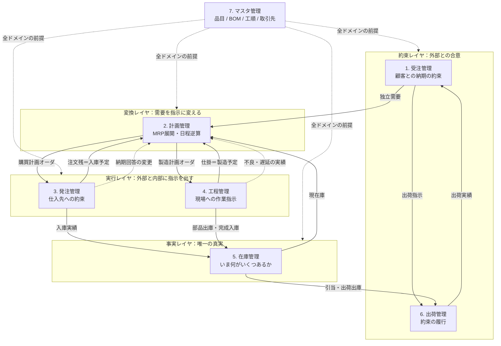

### 2.2 3つの構造的な理解ポイント

**① 情報は「計画 → 指示 → 実績」の3層で流れる**

同じオーダ番号で3層が串刺しになっていることが、生産管理システムの背骨である。
これが切れると「計画に対して実績はどうだったか」が答えられなくなり、システムは単なる伝票発行機になる。

| 層 | 実体 | 誰が作る | 変更可能性 |
|---|---|---|---|
| 計画 | 計画オーダ（PLANNED_ORDER） | システム（MRP） | **再計算で全削除・再生成される** |
| 指示 | 製造オーダ・購買オーダ・作業指示 | 人が確定（Firm）する | **再計算では消えない** |
| 実績 | 在庫トランザクション・作業実績 | 現場・仕入先 | 訂正はできるが削除できない |

この「再計算で消えるもの／消えないもの」の境界が、実装上もっとも重要な分岐点である（§7.1）。

**② 在庫は「入力するもの」ではなく「計算された結果」**

在庫残高は、必ず入出庫トランザクションの積み上げでしか変わらない。
残高を直接UPDATEできる経路を1本でも作った時点で、差異の原因追跡は不可能になる。

**③ ループが閉じて初めて「管理」になる**

受注 → 計画 → 指示 → 実績 → 計画へのフィードバック。
この戻りが無いものは「生産指示システム」であって「生産**管理**システム」ではない。

---

## §3 ドメイン別 業務目的と最小機能

### 3.1 受注管理

| 項目 | 内容 |
|---|---|
| **業務目的** | 顧客との「何を・いくつ・いつまでに」の約束を一意に確定し、社内の全計画の起点とする。同時に**納期を回答する責任**を負う唯一の窓口となる |
| **無いと何が起きるか** | 約束がメール・Excel・口頭に散り、どれが正なのか誰も答えられない。納期遅延の原因究明が「そもそも何を約束したか不明」で止まる |

**最小機能**

1. **受注登録** — 顧客、品目、数量、希望納期を登録し受注番号を採番
2. **納期回答** — 計画管理からの供給可能日を受け、**回答納期**を確定して顧客に返す
3. **受注ステータス管理** — 受付 → 回答済 → 一部出荷 → 完了
4. **受注変更・取消** — 数量／納期の変更を記録し、計画管理へ再計算を要求
5. **受注残照会** — 未完了受注の一覧（＝MRPの独立需要そのもの）

**設計上の要点**
「希望納期」と「回答納期」を**別カラムで持つ**こと。
1カラムにまとめると納期遵守率が測定不能になり、営業と工場のどちらの問題かが永久に決着しない。

---

### 3.2 計画管理

| 項目 | 内容 |
|---|---|
| **業務目的** | 需要（受注）を、**いつ・何を・いくつ・作るのか買うのか**へ変換する。在庫とリードタイムを織り込み、実行部門が動ける粒度の指示の元を作る |
| **無いと何が起きるか** | 現場が勘と経験で作り始める。部品は足りず、作らなくていいものが在庫になる |

**最小機能**

1. **需要取り込み** — 未出荷の受注明細を独立需要として取得
2. **BOM展開** — 親オーダ数量 × 員数で子品目の総所要量を算出（多階層を再帰）
3. **正味所要量計算** — 現在庫と注文残（入庫予定）を差し引く
4. **リードタイムオフセット** — 必要日からLTを引いて着手日・発注日を逆算
5. **計画オーダ生成** — 品目ごとに製造／購買の区分とペグ先を付けて生成
6. **オーダ確定（Firm）** — 計画オーダを製造オーダ／購買オーダへ転記
7. **再計算** — 需要変更・実績・納期回答変更を契機に再展開
8. **日程整合チェック** — 子オーダの完了予定が親オーダの着手日に間に合うかを検証し警告（§7.5）

**計算ルール（ミニチュア固定）**

```
総所要量   = 親オーダ数量 × 員数
供給量     = 現在庫 + 注文残（未入庫のPO） + 仕掛残（未完成のMO）
正味所要量 = max(0, 総所要量 − 供給量)
着手日     = 必要日 − リードタイム（暦日）
子の必要日 = 親の着手日
オーダ数量 = 正味所要量        ※ロットまとめなし（P3）
```

> **重要**: この供給量の式に**引当済は含めない**。理由は§7.1で詳述する。
> 「有効在庫 ＝ 現在庫 − 引当済 + 入庫予定」は**出荷可否判定の式**であって、
> MRPの正味所要計算の式ではない。この2つを混同するのが最も典型的な実装バグである。

**MRP展開の例（受注 FG-100 x10 / 回答納期 D+15）**

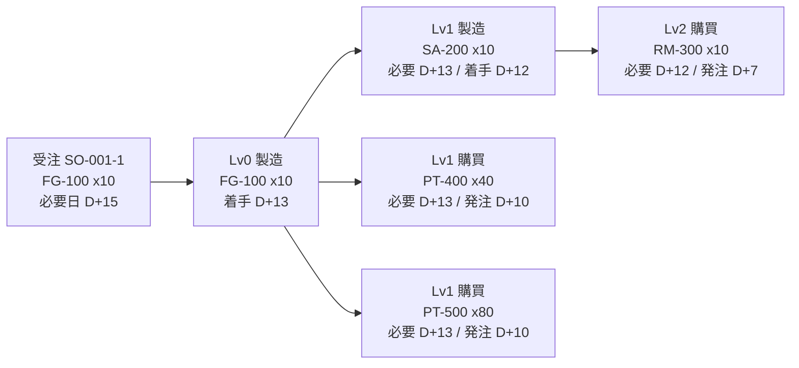

**設計上の要点**
計画オーダは再計算で消えてよいが、確定オーダは消えてはならない。
この境界が無いと、現場に出した指示が翌日勝手に変わる。

---

### 3.3 発注管理

| 項目 | 内容 |
|---|---|
| **業務目的** | 外部から調達する品目を、必要数量・必要納期で確実に確保する。**仕入先との約束**を管理し、その変動を計画へ返す |
| **無いと何が起きるか** | 部品欠品が製造直前に発覚する。仕入先の納期遅延が誰にも共有されず、現場が待機する |

**最小機能**

1. **購買オーダ発行** — 購買計画オーダから注文書を作成（仕入先、品目、数量、希望納期）
2. **納期回答受領** — 仕入先の回答納期を登録し、**入庫予定日を更新**
3. **注文残管理** — 未入庫の発注一覧（＝MRPが参照する供給量の実体）
4. **入荷計上** — 入荷数量を登録し、在庫へ入庫トランザクションを起票（P7により検収同時）
5. **分割納入対応** — 発注数量に対する累計入庫数で残数を管理

**設計上の要点**
発注管理の最大の価値は注文書の発行ではなく、
**「入庫予定日という未来の在庫情報を、常に最新に保つこと」**。
この情報が古いと、MRPの正味所要量計算が丸ごと嘘になる。

---

### 3.4 工程管理

| 項目 | 内容 |
|---|---|
| **業務目的** | 製造オーダを**工程単位の作業指示**に落とし、進捗・実績・不良を把握して、計画とのズレを検知可能にする |
| **無いと何が起きるか** | 「今どこまで進んでいるか」が現場に聞かないと分からない。不良の発生が出荷直前まで表面化しない |

**最小機能**

1. **製造オーダ発行（リリース）** — 確定オーダを現場へ引き渡す
2. **工順展開** — 工順マスタから工程ごとの作業指示を生成
3. **着手実績登録** — 工程単位に着手日時を記録し仕掛状態にする
4. **完了実績登録** — 良品数と不良数を**分けて**登録
5. **部品消費** — 第1工程完了時に「員数 × 投入数」を自動出庫（バックフラッシュ、P6）
6. **完成入庫** — 最終工程完了時に良品数を在庫へ計上
7. **仕掛（WIP）照会** — 着手済・未完了のオーダと数量

**製造オーダのステータス遷移**

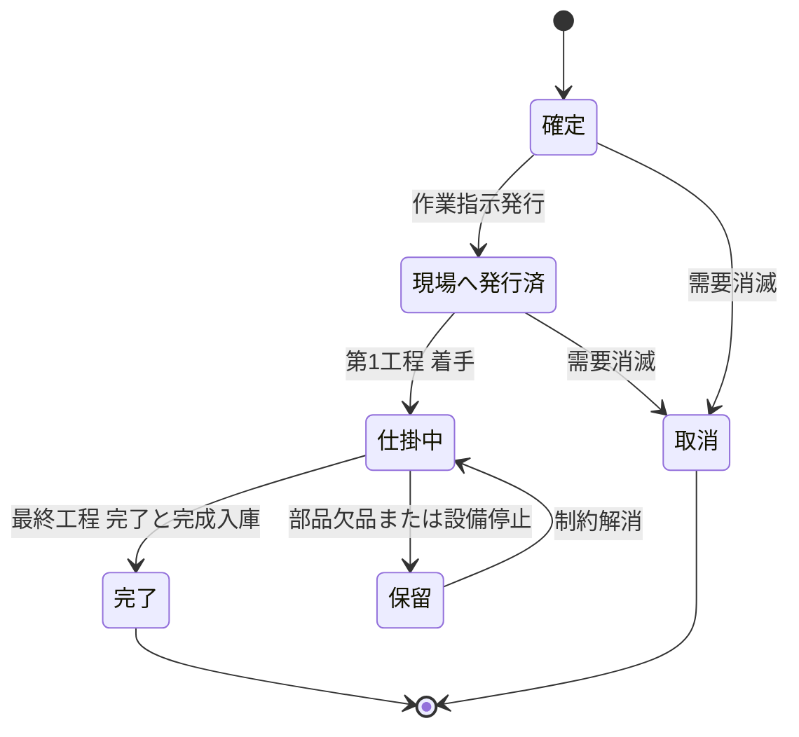

**設計上の要点**
良品数と不良数を分けて取ること。
「完了数10」しか取らない設計にすると、**計画10に対し良品9**という最も重要な差異が消える。
この差異こそが、次の追加オーダと納期再調整のトリガである。

---

### 3.5 在庫管理

| 項目 | 内容 |
|---|---|
| **業務目的** | 「いま何が、どこに、いくつあるか」を**単一の真実**として保持し、計画の前提と出荷の裏付けを提供する |
| **無いと何が起きるか** | 計画が実在しない在庫を前提に立てられ、現場で欠品が連鎖する。棚卸のたびに大きな差異が出る |

**最小機能**

1. **在庫残高照会** — 品目別の現在庫と引当済
2. **入出庫トランザクション記録** — 全ての増減を型付きで記録
3. **引当** — 出荷指示に対して在庫を確保する（引当済を増やす）
4. **出荷可能量算出** — `現在庫 − 引当済`
5. **棚卸調整** — 実地棚卸との差異を調整トランザクションとして記録

**トランザクション種別（5種のみ）**

| 種別 | 名称 | 現在庫 | 起票元 |
|---|---|---|---|
| RCV | 購買入庫 | + | 発注管理 |
| ISS | 製造出庫 | − | 工程管理（バックフラッシュ） |
| PRD | 完成入庫 | + | 工程管理 |
| SHP | 出荷出庫 | − | 出荷管理 |
| ADJ | 棚卸調整 | ± | 在庫管理 |

**設計上の要点**
**残高テーブルを直接UPDATEする経路を1本も作らないこと。**
必ず「トランザクション起票 → 残高更新」の順にする。
在庫差異の原因調査ができるかどうかは、この一点で決まる。

なお**入庫予定（on_order）は残高テーブルに持たない**。注文残から導出する。
列として持つと注文残との二重管理になり、必ず不整合を起こす（§13 R4-5）。

---

### 3.6 出荷管理

| 項目 | 内容 |
|---|---|
| **業務目的** | 受注の約束を物理的に履行し、顧客に届ける。出荷実績をもって**受注をクローズする** |
| **無いと何が起きるか** | 作ったのに出ていない在庫が滞留する。納期遵守率が測れない |

**最小機能**

1. **出荷指示作成** — 受注明細に対し、出荷予定日と数量を指定
2. **在庫引当** — 出荷可能量を確認して引当（不足なら作成不可）
3. **ピッキングリスト出力** — 現場が現物を集めるための指示
4. **出荷実績登録** — 実出荷数と実出荷日を記録し、SHP出庫を起票
5. **受注ステータス更新** — 全数出荷で受注を完了へ
6. **分割出荷対応** — 受注数量に対する累計出荷数で残数を管理

**設計上の要点**
出荷実績日と受注の**回答納期**を突き合わせて初めて納期遵守率が出る。
出荷管理は「モノを出す機能」ではなく、**「約束が守れたかを判定する機能」**である。

---

### 3.7 マスタ管理

| 項目 | 内容 |
|---|---|
| **業務目的** | 全ドメインが同じ前提で動くための共通の辞書を提供する。**マスタの品質が、計算結果の品質の上限を決める** |
| **無いと何が起きるか** | 員数が1つ違うだけで部品が欠品する。リードタイムが実態と違うだけで全計画が使えなくなる |

**最小機能**

1. **品目マスタ** — 品目コード、名称、調達区分（MAKE／BUY）、リードタイム、単位
2. **BOMマスタ** — 親品目、子品目、員数
3. **工順マスタ** — 品目、工程順序、作業区、標準時間
4. **取引先マスタ** — 顧客、仕入先
5. **BOM循環参照チェック** — 登録時に自身を祖先に持たないことを検証

**マスタが下流に与える影響**

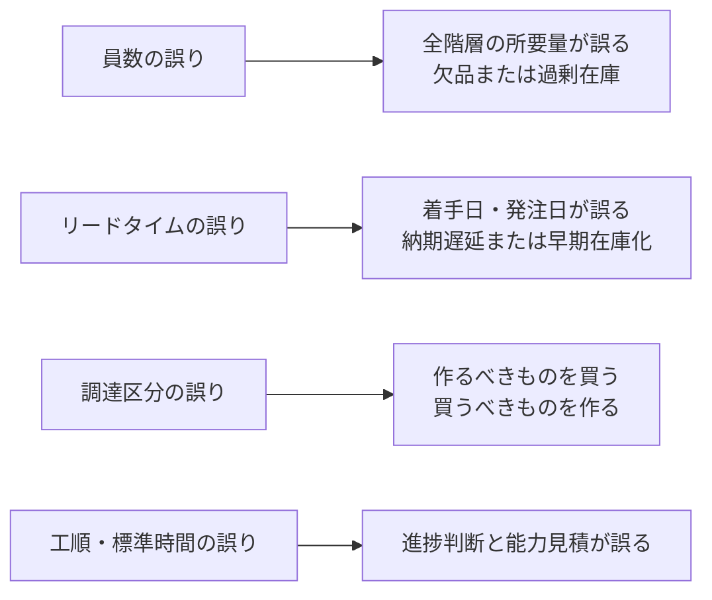

**設計上の要点**
ミニチュアでは有効日管理を外している（P9）が、実システムでは
**「いつ時点のBOMで計算したのか」**が分からないと過去の計画結果を再現できない。
Phase 2-B（トレーサビリティ）と同時に検討すべき論点。

---

## §4 データモデル

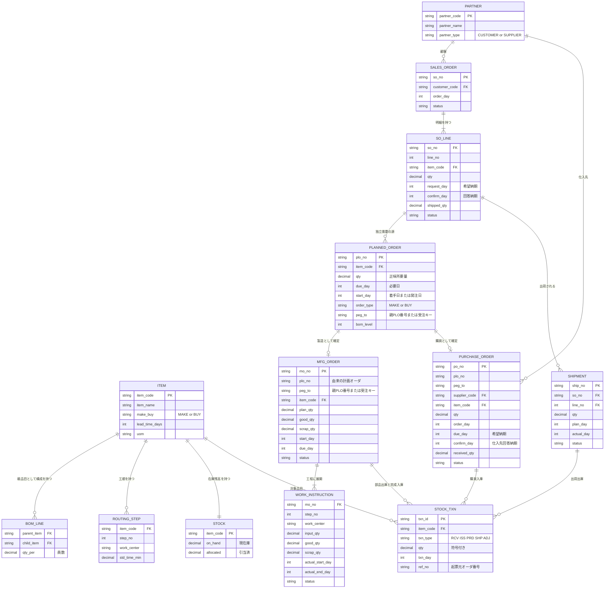

**テーブル数13**。この規模で7ドメインが全て成立する。
実システムが数百テーブルになるのは、§1で外した論点（能力、ロット、原価、拠点、改訂履歴）を戻すためである。

**日付の持ち方について**: 本ミニチュアでは全ての日付を **D0（シミュレーション開始日）からの経過日数（整数）** で保持する。
実装が単純になり、リードタイム計算が加減算だけで済む。実システムの稼働カレンダー対応はP5でスコープ外。

---

## §5 組織の管理目線と現場の管理目線

### 5.1 なぜこの2つを分けるのか

生産管理システムの導入が失敗する典型パターンは、**片方の目線だけで設計すること**である。

- **組織目線だけで作る** → 現場にとって入力負担しかない仕組みになり、実績が入らない。データが入らないので組織も何も見えない
- **現場目線だけで作る** → 現場は便利になるが、経営に必要な集計軸（期間・金額・比率）が取れず、投資判断ができない

### 5.2 2つの目線の構造的な違い

| 観点 | 組織の管理目線 | 現場の管理目線 |
|---|---|---|
| 主たる意思決定 | **資源配分とコミットメント**（受けるか、いつと約束するか、どこに人と金を割くか） | **順序と例外処理**（今日どれから着手するか、詰まった時どう回避するか） |
| 時間軸 | 月次・週次（過去の実績と将来の見通し） | 日次・時間単位（いまと直近） |
| 見る単位 | 品目群・受注群・期間・金額・比率 | 個別オーダ番号・個数・時刻・作業者 |
| 情報の性質 | 集約された統計 | 個体の状態 |
| 求めるもの | **予測可能性**（守れるかどうかを事前に知りたい） | **実行可能性**（いま動かせるかどうか） |
| 情報の向き | 実績を吸い上げて見る（Pull） | 指示を受けて動く（Push） |
| 画面設計への含意 | 集計・比較・時系列。行数は少なく、軸は多い | 一覧と入力。行数は多く、1行の操作は1タップ |

### 5.3 決定的な非対称性

> **組織が見る情報は、すべて現場が入力した実績の集計である。しかし現場は、その集計を自分の仕事に使わない。**

これが生産管理システムの定着を最も難しくしている構造である。
現場にとって実績入力は「自分に返ってこないコスト」に見える。
したがって設計者は、**実績入力に現場側の見返り**（次工程への引継ぎが楽になる、欠品が事前に見える、探し物が減る）を必ず組み込む必要がある。

ミニチュアではバックフラッシュ（P6）がその実例で、完了実績を1回入れれば部品出庫が自動で片付く。
**アプリ実装時は、この「1回の入力が複数のデータを動かす」様子を必ず画面上で見えるようにすること**（§8のデータ増分ログ）。

### 5.4 2つの目線をつなぐ構造

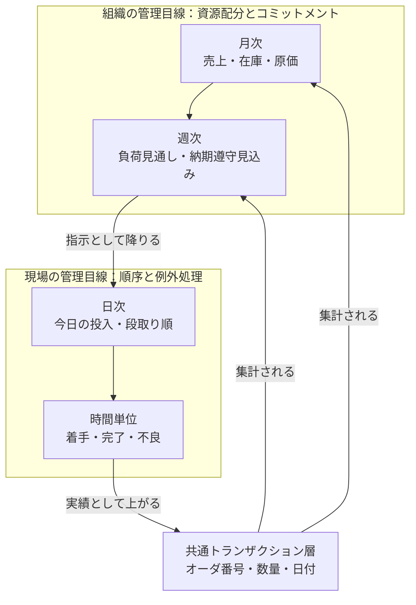

### 5.5 業務ステップごとの2目線の対比

#### Step 1 — 受注：約束をする

| | 組織の管理目線 | 現場の管理目線 |
|---|---|---|
| 問い | この注文を受けるべきか。いつと約束できるか | この時点ではまだ関与しない |
| 見るもの | 受注残高、負荷見通し、顧客別優先度 | — |
| 判断 | 回答納期の決定、優先受注の選別 | — |
| 危険 | 現場の実力を無視した納期回答 | — |

#### Step 2 — 計画：約束を指示に変換する

| | 組織の管理目線 | 現場の管理目線 |
|---|---|---|
| 問い | 今週どれだけ投入すべきか。内製と外注のどちらか | 来週自分の工程に何が何個来るのか |
| 見るもの | 品目群別の週次計画数量、部門別負荷 | 品目別・オーダ別の着手予定日 |
| 判断 | 生産量の配分、応援・残業の要否 | 段取り替えの少ない並び順の検討 |
| 危険 | 計画が粗すぎて現場が並べ替えられない | 現場が勝手に順序を変え、計画と乖離する |

#### Step 3 — 発注：外部へ約束を出す

| | 組織の管理目線 | 現場の管理目線 |
|---|---|---|
| 問い | 調達コストと仕入先の信頼性は妥当か | 明日入る部品はどれか。欠品はないか |
| 見るもの | 仕入先別納期遵守率、発注残 | 入庫予定リスト、注文残 |
| 判断 | 仕入先の切替、発注方針の見直し | 部品待ちの工程を先送りする判断 |
| 危険 | 納期回答の変更が計画に反映されない | 入庫予定を信じて段取りしたら来ない |

#### Step 4 — 工程：実行して実績を返す

| | 組織の管理目線 | 現場の管理目線 |
|---|---|---|
| 問い | 計画に対して生産は進んでいるか | いま何を、誰が、いつまでにやるか |
| 見るもの | 計画達成率、仕掛数量、リードタイム実績 | 作業指示、着手・完了状況、不良発生 |
| 判断 | 遅れの挽回策（残業、外注、優先順位変更） | 手が空いた人の再配置、不良の即時申告 |
| 危険 | 実績が日次でしか上がらず手遅れになる | 入力が作業の邪魔になり後でまとめ入力される |

#### Step 5 — 在庫：事実を保持する

| | 組織の管理目線 | 現場の管理目線 |
|---|---|---|
| 問い | 在庫は適正か。滞留していないか | 棚に現物はあるか。どこにあるか |
| 見るもの | 在庫数量、回転率、滞留日数 | 品目別現在庫、引当状況 |
| 判断 | 在庫削減方針、廃却判断 | 現物と帳簿の差異の申告 |
| 危険 | 集計値だけ見て現場の欠品リスクを見落とす | 帳簿を信じず自分用の隠し在庫を持つ |

#### Step 6 — 出荷：約束を履行して締める

| | 組織の管理目線 | 現場の管理目線 |
|---|---|---|
| 問い | 約束は守れたか | 今日の便に何を何個積むか |
| 見るもの | 納期遵守率、遅延受注一覧 | 出荷指示、ピッキングリスト |
| 判断 | 遅延要因の分析と再発防止 | 積み込み順、部分出荷の可否 |
| 危険 | 遵守率の分母定義が曖昧で改善が測れない | 実出荷日の登録が翌日になり実績がずれる |

#### Step 7 — マスタ：前提を維持する

| | 組織の管理目線 | 現場の管理目線 |
|---|---|---|
| 問い | マスタは実態を反映しているか | このリードタイム・員数は実際と違う |
| 見るもの | マスタ変更件数、計画の手修正件数 | 作業指示と実作業のズレ |
| 判断 | 変更の承認、標準値の見直し | 実態との乖離の申告 |
| 危険 | 誰も直さず、計画が信用されなくなる | 申告しても直らないので諦める |

> **§5の結論**: 組織目線と現場目線は対立するものではなく、**同じトランザクションを違う軸で集計したもの**である。
> したがって設計の要点は「両方の画面を作ること」ではなく、
> **「両方が成立するだけの粒度でトランザクションを取る」**ことにある。
> 粒度が粗ければ組織の分析が死に、入力負担が重ければ現場が死ぬ。この綱引きが生産管理システム設計の本質である。

---

# 第II部 実装編

## §6 状態遷移の完全定義

実装に必要な全エンティティの状態、遷移契機、ガード条件、副作用を定義する。

### 6.1 受注明細（SO_LINE）

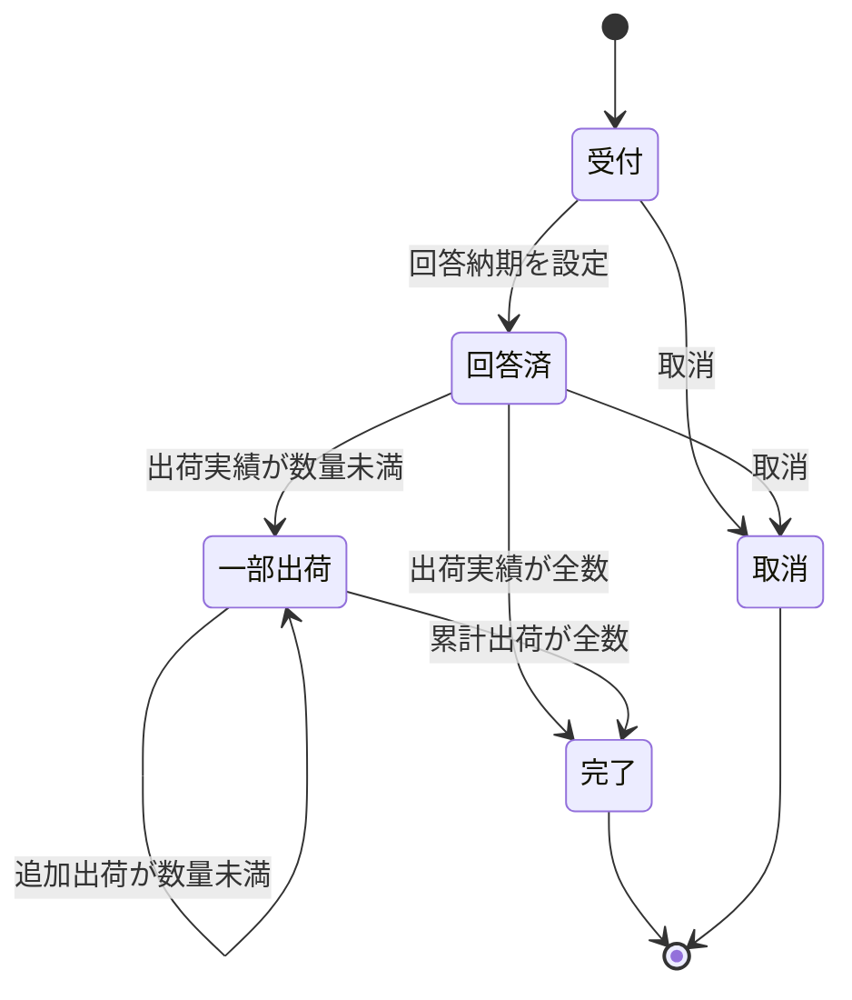

| 遷移 | 契機 | ガード条件 | 副作用 |
|---|---|---|---|
| 受付 → 回答済 | 納期回答 | `confirm_day` が設定されている | なし |
| 回答済 → 一部出荷 | 出荷実績登録 | `0 < shipped_qty < qty` | `shipped_qty` 加算 |
| 回答済／一部出荷 → 完了 | 出荷実績登録 | `shipped_qty == qty` | 親SALES_ORDERの全明細が完了なら受注も完了 |
| → 取消 | 取消操作 | `shipped_qty == 0` かつ 確定オーダに紐付く実績が無い | ペグする計画オーダを削除 |

### 6.2 計画オーダ（PLANNED_ORDER）

状態を持たない。**MRP実行のたびに全件削除・全件再生成される揮発データ**である。
確定（Firm）されると PLANNED_ORDER から削除され、MFG_ORDER または PURCHASE_ORDER として実体化する。

この「状態を持たせない」という設計判断が重要で、状態を持たせた瞬間に
「前回の計画結果はどれか」「どれを消してよいか」という判定が必要になり、実装が破綻する。

### 6.3 製造オーダ（MFG_ORDER）

§3.4の状態遷移図を参照。遷移の詳細は次の通り。

| 遷移 | 契機 | ガード条件 | 副作用 |
|---|---|---|---|
| （生成） | 計画オーダの確定 | — | 工順マスタから WORK_INSTRUCTION を全工程分生成（status=WAIT） |
| 確定 → 発行済 | リリース操作 | — | 現場画面に表示される |
| 発行済 → 仕掛 | 第1工程の着手 | — | 当該WORK_INSTRUCTION を WIP、`actual_start_day = 現在日` |
| 仕掛 → 保留 | 第1工程の完了時に部品不足 | 部品の出荷可能量 < 必要量 | 完了を中断。不足品目と不足数を警告 |
| 仕掛 → 完了 | 最終工程の完了 | 全工程が DONE | PRDトランザクション起票、`good_qty` `scrap_qty` 確定 |

### 6.4 作業指示（WORK_INSTRUCTION）

| 状態 | 意味 | 遷移契機 |
|---|---|---|
| WAIT | 未着手 | 生成時 |
| WIP | 着手済 | 着手操作（`actual_start_day` 記録） |
| DONE | 完了 | 完了操作（良品数・不良数を入力、`actual_end_day` 記録） |

**投入数の決定ルール**

```
input_qty(step) = (step が第1工程) ? MFG_ORDER.plan_qty : 前工程.good_qty
```

前工程の良品数がそのまま次工程の投入数になる。これにより不良が下流へ伝播する様子が可視化される。

### 6.5 購買オーダ（PURCHASE_ORDER）

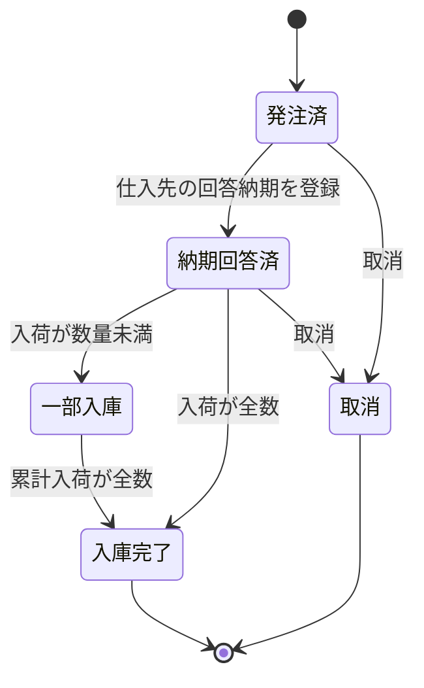

| 遷移 | 契機 | ガード条件 | 副作用 |
|---|---|---|---|
| （生成） | 計画オーダの確定 | — | `order_day = 現在日`、`due_day = 計画オーダの必要日` |
| 発注済 → 回答済 | 納期回答の登録 | — | **日程整合チェックを実行**（§7.5） |
| 回答済 → 一部／完了 | 入荷計上 | `received_qty + 入荷数 <= qty` | RCVトランザクション起票、`on_hand` 加算 |

**注意**: 状態が CLOSED になるまで、`qty − received_qty` が MRP の供給量（注文残）に算入される。

### 6.6 出荷（SHIPMENT）

| 状態 | 意味 | 遷移契機 | ガード条件 | 副作用 |
|---|---|---|---|---|
| ALLOCATED | 引当済 | 出荷指示作成 | `on_hand − allocated >= qty` | `allocated` 加算 |
| SHIPPED | 出荷済 | 出荷実績登録 | 状態が ALLOCATED | SHPトランザクション起票、`on_hand` 減算、`allocated` 減算、`SO_LINE.shipped_qty` 加算、`actual_day = 現在日` |
| CANCELED | 取消 | 引当解除 | 状態が ALLOCATED | `allocated` 減算 |

---

## §7 中核ロジックの仕様

### 7.1 MRP展開

```
function runMRP(db):
    # (1) 揮発データの全削除。確定オーダには一切触れない
    db.plannedOrders.clear()
    ploSeq = 1

    # (2) 品目別の供給量を初期化
    #     現在庫 + 注文残（未入庫PO） + 仕掛残（未完成MO）
    for item in db.items:
        supply[item.code] =
              db.stock[item.code].onHand
            + sum(po.qty - po.receivedQty
                  for po in db.purchaseOrders if po.item == item.code
                  and po.status not in [CLOSED, CANCELED])
            + sum(mo.planQty - mo.goodQty
                  for mo in db.mfgOrders if mo.item == item.code
                  and mo.status not in [DONE, CANCELED])

    # (3) 独立需要の収集（MTO：未出荷の受注明細のみ）
    demands = [ { item:  line.item,
                  qty:   line.qty - line.shippedQty,
                  due:   line.confirmDay ?? line.requestDay,
                  pegTo: pegKey(line) }              # 例 "SO-001-1"
                for line in db.soLines
                if line.status not in [CLOSED, CANCELED]
                and line.qty - line.shippedQty > 0 ]

    # (4) 需要ごとに展開
    for d in demands:
        explode(d.item, d.qty, d.due, d.pegTo, level = 0)


function explode(itemCode, grossQty, dueDay, pegTo, level):
    item = db.items[itemCode]

    # 供給量を先に食わせる（同一品目が複数需要から要求された場合、先着順に消費）
    use  = min(supply[itemCode], grossQty)
    supply[itemCode] -= use
    netQty = grossQty - use
    if netQty <= 0: return

    startDay = dueDay - item.leadTimeDays
    plo = newPlannedOrder(
              no        = "PLO-" + pad(ploSeq++),
              item      = itemCode,
              qty       = netQty,
              dueDay    = dueDay,
              startDay  = startDay,
              orderType = item.makeBuy,
              pegTo     = pegTo,
              bomLevel  = level)
    db.plannedOrders.add(plo)

    # 内製品のみBOM展開。子の必要日は親の着手日
    if item.makeBuy == MAKE:
        for b in db.bom where b.parent == itemCode:
            explode(b.child, netQty * b.qtyPer, startDay, plo.no, level + 1)
```

**設計判断①：供給量から引当済を差し引かない理由**

引当（`allocated`）は出荷指示に対して行われる。その出荷指示の元になった受注は `demands` に含まれている。
したがって供給量から引当済を差し引くと、**同じ需要を需要側と供給側の両方で控除する**ことになり、
正味所要量が過大になる。

```
誤：正味所要 = 総所要 − (現在庫 − 引当済 + 入庫予定)
正：正味所要 = 総所要 − (現在庫 + 注文残 + 仕掛残)
```

「有効在庫 ＝ 現在庫 − 引当済」は**出荷可否判定に使う式**であって、MRPの式ではない。
この2つを1つの関数にまとめようとすると必ずバグになる。用途別に別関数として実装すること。

**設計判断②：確定オーダを供給として算入する理由**

これにより「MRPを再実行しても、既に確定したオーダの分は再度計画されない」が自然に成立する。
§9のTC-05でこの性質を検証する。

**既知の簡略化**: 本アルゴリズムは深さ優先（DFS）で展開している。
同一品目が複数の親から要求される場合、正しくは**低レベルコード方式**（全親の所要を集約してから正味計算）を使う。
本ミニチュアのBOMには共通部品が無いため差は出ないが、共通部品を追加する際は必ず作り直すこと（§15 L4）。

### 7.2 引当と出荷可否判定

```
function shippableQty(itemCode):
    return db.stock[itemCode].onHand - db.stock[itemCode].allocated

function allocate(soLine, qty):
    guard qty <= shippableQty(soLine.item)
        else raise 在庫不足（不足数を返す）
    db.stock[soLine.item].allocated += qty
    create SHIPMENT(status = ALLOCATED, qty = qty, planDay = 現在日)

function shipOut(shipment):
    guard shipment.status == ALLOCATED
    db.stock[item].onHand   -= shipment.qty
    db.stock[item].allocated -= shipment.qty
    createTxn(type = SHP, item, qty = -shipment.qty, day = 現在日, ref = shipment.no)
    soLine.shippedQty += shipment.qty
    soLine.status = (soLine.shippedQty == soLine.qty) ? CLOSED : PARTIAL
    shipment.status = SHIPPED
    shipment.actualDay = 現在日
```

### 7.3 バックフラッシュ（部品消費）

```
function startStep(mo, stepNo):
    wi = workInstruction(mo, stepNo)
    guard wi.status == WAIT
    wi.status = WIP
    wi.actualStartDay = 現在日
    if stepNo == firstStep(mo): mo.status = WIP


function completeStep(mo, stepNo, goodQty, scrapQty):
    wi = workInstruction(mo, stepNo)
    guard wi.status == WIP
    guard goodQty + scrapQty == wi.inputQty

    # 第1工程の完了時に部品を一括消費（バックフラッシュ）
    if stepNo == firstStep(mo):
        for b in db.bom where b.parent == mo.item:
            required = b.qtyPer * wi.inputQty        # ★投入数ベース
            if shippableQty(b.child) < required:
                mo.status = HOLD
                raise 部品不足(b.child, 不足数 = required - shippableQty(b.child))
        for b in db.bom where b.parent == mo.item:
            required = b.qtyPer * wi.inputQty
            db.stock[b.child].onHand -= required
            createTxn(ISS, b.child, -required, 現在日, ref = mo.no)

    wi.goodQty = goodQty ; wi.scrapQty = scrapQty
    wi.status = DONE ; wi.actualEndDay = 現在日

    if stepNo == lastStep(mo):
        db.stock[mo.item].onHand += goodQty
        createTxn(PRD, mo.item, +goodQty, 現在日, ref = mo.no)
        mo.goodQty  = goodQty
        mo.scrapQty = sum(w.scrapQty for w in workInstructions(mo))
        mo.status   = DONE
    else:
        nextWi = workInstruction(mo, nextStep(stepNo))
        nextWi.inputQty = goodQty              # 良品数が次工程の投入数になる
```

**設計判断：消費量は「良品数」ではなく「投入数」ベース**

不良品も部品を消費している。良品数ベースで計算すると、不良が消費した部品が
在庫差異（帳簿にはあるのに現物が無い）として現れ、原因追跡ができなくなる。
本ミニチュアの検査工程で良品9・不良1が出るシナリオでは、部品は10個分消費されている。
この事実がPhase 2-A（原価）で「不良1個の損失額」として金額化される。

### 7.4 ペギング（紐付け）

需要と供給の対応関係を保持し、追跡可能にする仕組み。

```
pegKey(soLine)                = soLine.soNo + "-" + soLine.lineNo   # "SO-001-1"
PLANNED_ORDER.pegTo           = 親PLOの番号 または pegKey
MFG_ORDER.ploNo               = 由来の計画オーダ番号（確定後も保持）
MFG_ORDER.pegTo               = 由来した計画オーダの pegTo
PURCHASE_ORDER.ploNo / pegTo  = 同上
STOCK_TXN.refNo               = 起票元のオーダ番号（MO / PO / SHIPMENT）
```

**下流追跡（この受注のために何が動いたか）**

```
function traceFromOrder(soLine):
    frontier = { pegKey(soLine) }
    orders   = []
    while frontier is not empty:
        hit = 全MFG_ORDER + 全PURCHASE_ORDER where pegTo in frontier
        orders += hit
        frontier = { o.ploNo for o in hit }
    txns = 全STOCK_TXN where refNo in { o.no for o in orders }
    return orders, txns
```

計画オーダは確定時に削除されるが、`ploNo` を確定オーダ側に残すことで**鎖が切れない**。
この設計がPhase 2-B（トレーサビリティ）の土台になる。

### 7.5 日程整合チェック

自動リスケジュールは行わず（P13）、**警告を出して人が判断する**。§5.3の思想と一貫している。

```
function checkSchedule(db):
    alerts = []
    # 購買オーダの回答納期が、親の製造オーダの着手日に間に合うか
    for po in db.purchaseOrders where status not in [CLOSED, CANCELED]:
        parent = db.mfgOrders.find(mo => mo.ploNo == po.pegTo)
        arrival = po.confirmDay ?? po.dueDay
        if parent and arrival > parent.startDay:
            alerts.add({ level: 遅延, source: po.no, target: parent.no,
                         delayDays: arrival - parent.startDay })

    # 子の製造オーダの完了予定が、親の着手日に間に合うか
    for mo in db.mfgOrders where status not in [DONE, CANCELED]:
        parent = db.mfgOrders.find(p => p.ploNo == mo.pegTo)
        if parent and mo.dueDay > parent.startDay:
            alerts.add(...)

    # 受注への伝播：ペグ先をたどって受注キーに到達したものを納期リスクとする
    for a in alerts:
        a.affectedSoLine = rootPegKey(a.source)
    return alerts
```

**未充足需要の検知**（不良発生後に何が起きるかを見せるための機能）

```
function unmetDemand(db):
    return [ { item, shortage: 需要 − 供給 }
             for item where 需要(未出荷受注) > 供給(現在庫 + 注文残 + 仕掛残) ]
```

この値が0でないとき、画面上に「MRPの再実行が必要」と表示する。§9のTC-12がこれに該当する。

---

## §8 画面構成とユースケース

### 8.1 画面構成

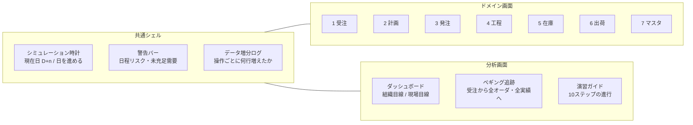

**データ増分ログが本アプリの中核**。すべての操作について
「どのテーブルに何行 INSERT / UPDATE されたか」を時系列で表示する。
これが無いと、画面はただの入力フォームになり、§5.3の「1回の入力が複数のデータを動かす」体験が失われる。

**シミュレーション時計**も必須。日を進められないと、
入荷実績日・出荷実績日が作れず、納期遵守率も仕入先納期遵守率も計算できない。

### 8.2 ユースケース一覧

| ID | ユースケース | ドメイン | 主なデータ変更 |
|---|---|---|---|
| UC-01 | 品目マスタを参照する | マスタ | — |
| UC-02 | BOMをツリー表示する | マスタ | — |
| UC-03 | 工順を参照する | マスタ | — |
| UC-04 | 受注を登録する | 受注 | SALES_ORDER +1 / SO_LINE +1 |
| UC-05 | 納期を回答する | 受注 | SO_LINE 更新（`confirm_day`、status=CONFIRMED） |
| UC-06 | MRPを実行する | 計画 | PLANNED_ORDER 全削除 → 再生成 |
| UC-07 | 計画オーダを確定する | 計画 | PLANNED_ORDER −n / MFG_ORDER +n / PURCHASE_ORDER +n / WORK_INSTRUCTION +n |
| UC-08 | 日程整合を確認する | 計画 | — （警告表示のみ） |
| UC-09 | 未充足需要を確認する | 計画 | — （警告表示のみ） |
| UC-10 | 仕入先の納期回答を登録する | 発注 | PURCHASE_ORDER 更新（`confirm_day`、status=ACKED） |
| UC-11 | 入荷を計上する | 発注 | STOCK_TXN +1（RCV）/ STOCK 更新 / PURCHASE_ORDER 更新 |
| UC-12 | 製造オーダをリリースする | 工程 | MFG_ORDER 更新（status=RELEASED） |
| UC-13 | 工程に着手する | 工程 | WORK_INSTRUCTION 更新 / MFG_ORDER 更新（status=WIP） |
| UC-14 | 工程を完了する（良品・不良を入力） | 工程 | WORK_INSTRUCTION 更新 / STOCK_TXN +n（ISS または PRD）/ STOCK 更新 |
| UC-15 | 在庫残高を照会する | 在庫 | — |
| UC-16 | 在庫トランザクション履歴を照会する | 在庫 | — |
| UC-17 | 棚卸調整を登録する | 在庫 | STOCK_TXN +1（ADJ）/ STOCK 更新 |
| UC-18 | 出荷指示を作成する（引当） | 出荷 | SHIPMENT +1 / STOCK 更新（`allocated`） |
| UC-19 | 出荷実績を登録する | 出荷 | STOCK_TXN +1（SHP）/ STOCK 更新 / SO_LINE 更新 / SHIPMENT 更新 |
| UC-20 | KPIダッシュボードを見る | 分析 | — |
| UC-21 | 受注からペギング追跡する | 分析 | — |
| UC-22 | 日を進める | 共通 | `現在日` +n |
| UC-23 | シナリオをリセットする | 共通 | 全トランザクションを初期化（マスタは保持） |

### 8.3 画面ごとの必須表示項目

| 画面 | 必ず見せるもの | 理由 |
|---|---|---|
| 受注 | 希望納期と回答納期を**並べて**表示 | 差が納期回答の実力を示す |
| 計画 | 計画オーダのペグ先とBOMレベル | 「この発注は何のためか」が追える |
| 発注 | 注文残（発注数 − 入庫数） | これがMRPの供給量の実体だと分かる |
| 工程 | 投入数・良品数・不良数を**3つ並べて** | 不良の伝播が見える |
| 在庫 | 現在庫・引当済・出荷可能量の3列 | 引当の意味が分かる |
| 出荷 | 回答納期と実出荷日を**並べて** | 納期遵守の判定根拠が見える |
| ダッシュボード | 組織目線と現場目線を**別ブロック**で | §5の主題そのもの |

---

## §9 受入テストケース（通し演習）

前提: シミュレーション開始日を D+0（暦日 2026/04/01）とする。全在庫ゼロ。

### 9.1 正常系シーケンス

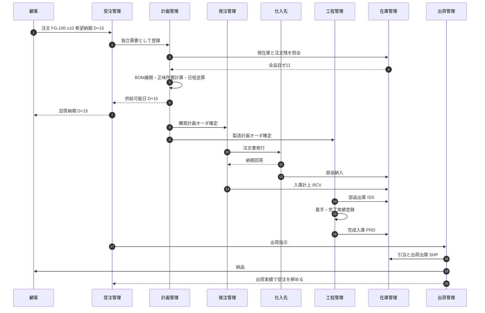

### 9.2 日程の逆算結果

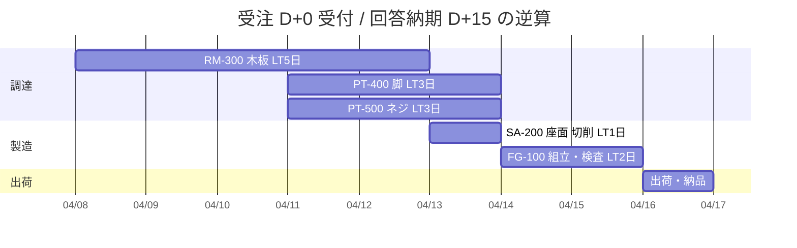

### 9.3 テストケース

| TC | 操作 | 期待結果 |
|---|---|---|
| TC-01 | マスタ初期化 | ITEM 5行 / BOM_LINE 4行 / ROUTING_STEP 3行 / PARTNER 3行。BOM循環参照なし |
| TC-02 | 受注登録 FG-100 x10 希望 D+15 | SALES_ORDER 1行 / SO_LINE 1行（status=RECEIVED） |
| TC-03 | 納期回答 D+15 | SO_LINE 更新（`confirm_day`=15、status=CONFIRMED） |
| TC-04 | **MRP実行** | PLANNED_ORDER **5行**（下表の通り） |
| TC-05 | 全計画オーダを確定 | PLANNED_ORDER 0行 / MFG_ORDER 2行 / PURCHASE_ORDER 3行 / WORK_INSTRUCTION 3行 |
| TC-06 | **MRPを再実行** | PLANNED_ORDER **0行**（確定オーダが供給に算入されるため）★重要 |
| TC-07 | PO 3件に納期回答（希望どおり） | PURCHASE_ORDER status=ACKED。日程整合チェック 警告0件 |
| TC-08 | D+12 まで進め、RM-300 を入荷 | STOCK_TXN +1（RCV +10）/ RM-300 `on_hand`=10 / PO status=CLOSED |
| TC-09 | SA-200 着手 → 完了（良品10・不良0） | STOCK_TXN +2（ISS RM-300 −10 / PRD SA-200 +10）。RM-300=0 / SA-200=10 |
| TC-10 | D+14 まで進め、PT-400・PT-500 を入荷 | STOCK_TXN +2（RCV +40 / +80） |
| TC-11 | FG-100 着手 → 工程10 組立 完了（良品10・不良0） | STOCK_TXN +3（ISS SA-200 −10 / PT-400 −40 / PT-500 −80）。3品目とも `on_hand`=0 |
| TC-12 | **工程20 検査 完了（良品9・不良1）** | STOCK_TXN +1（PRD FG-100 **+9**）/ MFG_ORDER status=DONE、`good_qty`=9 `scrap_qty`=1 |
| TC-13 | 未充足需要チェック | FG-100 が **不足1** と表示される（需要10 − 供給9） |
| TC-14 | **MRPを再実行** | PLANNED_ORDER **5行**（FG-100 x1 / SA-200 x1 / RM-300 x1 / PT-400 x4 / PT-500 x8）★payoff |
| TC-15 | 出荷指示 9個を作成 | SHIPMENT 1行（ALLOCATED）/ FG-100 `allocated`=9 / 出荷可能量=0 |
| TC-16 | D+15 で出荷実績登録 | STOCK_TXN +1（SHP −9）/ `on_hand`=0 / SO_LINE `shipped_qty`=9、status=PARTIAL |
| TC-17 | KPI確認 | 納期遵守率 100% / 直行率 90% / 計画達成率 90% / 受注残 1個 |
| TC-18 | ペギング追跡（SO-001-1） | MFG_ORDER 2件 + PURCHASE_ORDER 3件 + STOCK_TXN 9件が返る |

**TC-04 の期待値（MRP展開結果）**

| PLO | 品目 | 数量 | 区分 | 必要日 | 着手/発注日 | ペグ先 | Lv |
|---|---|---|---|---|---|---|---|
| PLO-001 | FG-100 | 10 | MAKE | D+15 | D+13 | SO-001-1 | 0 |
| PLO-002 | SA-200 | 10 | MAKE | D+13 | D+12 | PLO-001 | 1 |
| PLO-003 | RM-300 | 10 | BUY | D+12 | D+7 | PLO-002 | 2 |
| PLO-004 | PT-400 | 40 | BUY | D+13 | D+10 | PLO-001 | 1 |
| PLO-005 | PT-500 | 80 | BUY | D+13 | D+10 | PLO-001 | 1 |

### 9.4 演習の山場（TC-12〜TC-14）

不良1個により **受注10 ＞ 完成9** となる。ここで全ドメインが連動する。

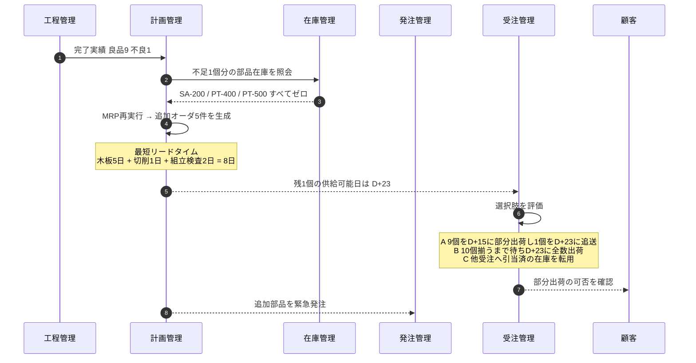

**この演習で必ず理解すること**

1. 1個の不良が**7ドメイン全てに波及する**（工程 → 在庫 → 計画 → 発注 → 受注 → 顧客 → 出荷）
2. 波及を追跡できるのは、**ペギングでデータが繋がっているから**（§7.4）
3. 判断（A／B／C）は**システムがするのではなく人がする**。システムの役割は**判断材料を即座に揃えること**
4. 現場が不良1個を即座に入力しなければ、この判断は出荷直前まで発動しない。
   これが**§5.3の非対称性の実例**である

### 9.5 例外系テストケース（納期遅延）

| TC | 操作 | 期待結果 |
|---|---|---|
| TC-E1 | RM-300 の納期回答を D+12 → D+14 に変更 | 日程整合チェックが警告1件を返す（PO の到着 D+14 > SA-200 の着手日 D+12、遅延2日） |
| TC-E2 | 警告からペギングを辿る | 影響を受ける受注として SO-001-1 が特定される |
| TC-E3 | 警告のまま製造着手を試みる | 部品在庫が無いため第1工程完了時に MFG_ORDER が HOLD になる |

**このケースが示すこと**: システムは遅延を**検知して知らせる**が、リスケジュールはしない（P13）。
自動リスケジュールを入れると、現場が把握していないうちに計画が動き、かえって混乱する。
何を自動化し、何を人に残すかは設計判断であり、技術的可否の問題ではない。

---

## §10 KPIと算出元データ

KPIは「掲げるもの」ではなく「トランザクションから計算されるもの」。
算出元が特定できないKPIは、必ず運用で形骸化する。

| KPI | 定義 | 算出元 | 主な目線 |
|---|---|---|---|
| 納期遵守率 | 実出荷日 ≤ 回答納期 の件数 ÷ 出荷完了件数 | SHIPMENT.actual_day、SO_LINE.confirm_day | 組織 |
| 回答納期充足率 | 回答納期 ≤ 希望納期 の件数 ÷ 受注件数 | SO_LINE.confirm_day / request_day | 組織 |
| 受注残 | 未完了受注の残数量 | SO_LINE.qty − shipped_qty | 組織 |
| 計画達成率 | 完了オーダの良品数 ÷ 計画数 | MFG_ORDER.good_qty / plan_qty | 両方 |
| 直行率 | 良品数 ÷ 投入数 | WORK_INSTRUCTION.good_qty / input_qty | 現場 |
| 仕掛数量 | status = WIP のオーダ数量 | MFG_ORDER | 現場 |
| 製造リードタイム実績 | 最終工程完了日 − 第1工程着手日 | WORK_INSTRUCTION.actual_start_day / actual_end_day | 両方 |
| 在庫回転 | 期間出庫数量 ÷ 平均在庫数量 | STOCK_TXN（ISS＋SHP）、STOCK.on_hand | 組織 |
| 仕入先納期遵守率 | 入庫日 ≤ 回答納期 の件数 ÷ 入庫件数 | STOCK_TXN（RCV）.txn_day、PURCHASE_ORDER.confirm_day | 組織 |
| 欠品発生件数 | 引当または出庫に失敗した回数 | 引当・バックフラッシュの失敗ログ | 現場 |
| 棚卸差異率 | ADJ数量の絶対値合計 ÷ 期末在庫数量 | STOCK_TXN（ADJ） | 両方 |
| 日程警告件数 | checkSchedule が返す警告数 | §7.5の出力 | 組織 |

> 実務では**計画手修正率**（人手で修正されたオーダ数 ÷ 生成オーダ数）が最も重要な先行指標になる。
> この値が高いシステムはマスタが実態と乖離しており、遠からず「システムは信用できない」と言われて
> 並行運用のExcelが復活する。本ミニチュアには計画の手修正機能が無いため測定対象外だが、
> 実システム設計時には必ず入れること。

---

# 第III部 拡張編

## §11 スコープ外と拡張ロードマップ

### 11.1 ロードマップ全体

方針として、**原価とトレーサビリティを能力計画より優先**する。

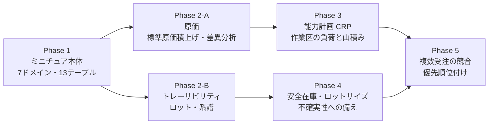

| 領域 | 外したことで説明できないこと | Phase |
|---|---|---|
| 原価 | 生産活動が金額にどう変換されるか。不良や在庫の「損失額」 | 2-A |
| トレーサビリティ | 不具合発生時の追跡範囲と回収対象の特定 | 2-B |
| 能力所要量計画（CRP） | **なぜ計画通りに作れないのか**の最大要因。ボトルネックと段取り | 3 |
| 安全在庫・ロットサイズ | 不確実性への備え方。なぜ在庫を持つのか | 4 |
| 複数受注の競合 | 優先順位付けと資源の取り合い | 5 |
| 需要予測・MTS | 見込生産の仕組み。ATP／CTPによる納期回答 | 対象外 |
| 品質管理 | 不良の「発生後」の正式なプロセス | 対象外 |
| 外注加工 | 社外在庫の管理と支給品の所有権 | 対象外 |
| 複数拠点・ロケーション | 拠点間補充と輸送リードタイム | 対象外 |
| 設計変更（ECO）とBOM有効日 | いつ時点のBOMで計算したかの再現性 | 2-Bと同時に検討 |

### 11.2 Phase 2-A：原価（最小設計）

**目的**: §5の組織目線を数量から金額へ引き上げ、不良と在庫の意味を金額で語れるようにする。

**追加テーブル**

| テーブル | 主なカラム | 用途 |
|---|---|---|
| WORK_CENTER | work_center PK、rate_per_hour | 賃率（円/時） |
| ITEM_COST | item_code PK、material_cost、labor_cost、standard_cost | 標準原価の積上げ結果 |
| ITEM（拡張） | purchase_price、sales_price | 購入品の単価、製品の売価 |
| MFG_ORDER_COST | mo_no PK、input_material、input_labor、output_standard、variance | オーダ別の原価差異 |

**標準原価の積上げロジック**

```
function rollupCost(itemCode):
    item = db.items[itemCode]
    if item.makeBuy == BUY:
        material = item.purchasePrice
        labor    = 0
    else:
        material = Σ( rollupCost(b.child).standardCost × b.qtyPer
                      for b in bom where parent == itemCode )
        labor    = Σ( step.stdTimeMin / 60 × workCenter[step.wc].ratePerHour
                      for step in routing(itemCode) )
    return { material, labor, standardCost: material + labor }
```

BOMと工順から原価が積み上がる。**マスタの品質が原価の品質を決める**という§3.7の主張が金額で実証される。

**題材モデルでの計算例**（賃率 2,000円/時）

| 品目 | 材料費 | 加工費 | 標準原価 |
|---|---|---|---|
| RM-300 木板 | 800 | 0 | **800** |
| PT-400 脚 | 250 | 0 | **250** |
| PT-500 ネジ | 20 | 0 | **20** |
| SA-200 座面ASSY | 800（RM-300 ×1） | 600（0.3h × 2,000） | **1,400** |
| FG-100 木製イス | 2,560（SA-200 1,400 + PT-400 1,000 + PT-500 160） | 1,400（0.7h × 2,000） | **3,960** |

**原価差異の可視化（§9.4の不良1個）**

```
投入（材料）= 2,560円 × 10個 = 25,600円
投入（加工）= 1,400円 × 10個 = 14,000円
投入合計                     = 39,600円
完成品振替 = 3,960円 × 9個   = 35,640円
─────────────────────────────────────
原価差異（＝不良損失）        =  3,960円
```

**組織目線ダッシュボードへの影響**

| KPI | 追加後 |
|---|---|
| 在庫 | 在庫数量 → **在庫金額** |
| 不良 | 不良数 → **不良損失額**（3,960円） |
| 受注残 | 残数量 → **受注残高（金額）** |
| 新規 | **標準原価差異**（オーダ別・期間別） |

これにより、§15の残存リスクL3（組織目線が数量ベースに偏っている）が解消される。

**実装コスト**: 中。既存テーブルへの列追加と集計ロジックの追加で済み、
在庫の粒度は変わらないため**破壊的変更にはならない**。だから先に着手できる。

### 11.3 Phase 2-B：トレーサビリティ（最小設計）

**目的**: 「この製品に使われた部品はどれか」「この部品はどの製品に使われたか」に答える。

**ペギングとロット系譜は別物**

これを混同すると実装が必ず破綻する。最重要の区別。

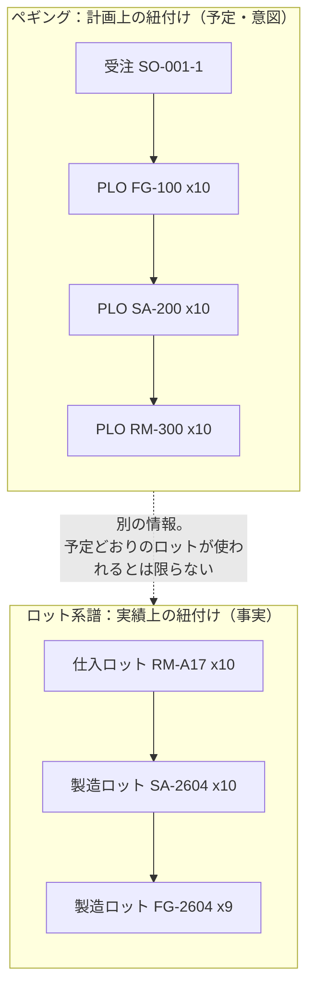

ペギングは「何のために作るか」という**意図**であり、ロット系譜は「実際に何を使ったか」という**事実**である。
先入先出で古いロットが使われれば、ペグ先と実際の消費ロットは一致しない。

**追加テーブル**

| テーブル | 主なカラム | 用途 |
|---|---|---|
| LOT | lot_no PK、item_code、source_ref、qty、created_day | ロットの実体 |
| STOCK_TXN（拡張） | lot_no | どのロットが動いたか |
| LOT_GENEALOGY | parent_lot、child_lot、mo_no、consumed_qty | 消費ロットと生成ロットの親子関係 |
| STOCK（変更） | item_code + lot_no を主キーに変更 | **在庫残高の粒度が変わる** |

**ロット採番と消費のルール（最小）**

```
入庫時（RCV）: 購買入庫ごとに1ロット採番（source_ref = PO番号）
完成入庫時（PRD）: 製造オーダごとに1ロット採番（source_ref = MO番号）
出庫時（ISS / SHP）: 先入先出（FIFO）で自動選択。複数ロットにまたがる場合は分割してTXNを起票
バックフラッシュ時: 消費したロットと生成したロットを LOT_GENEALOGY に記録
```

**追跡機能**

| 機能 | 問い | 実装 |
|---|---|---|
| 後方追跡 | この製品ロットは何を使ったか | LOT_GENEALOGY を child_lot から親へ再帰 |
| 前方追跡 | この部品ロットはどの製品になったか | LOT_GENEALOGY を parent_lot から子へ再帰。**回収範囲の特定** |

**実装コストの警告**

Phase 2-A と違い、**これは破壊的変更である**。

- 在庫残高の主キーが `item_code` から `item_code + lot_no` へ変わる
- 引当がロット単位になる
- 出庫のたびにロット選択（FIFO）の分割ロジックが必要になり、1回の出庫が複数のTXNを生む
- MRPの供給量計算はロットを意識しないため、在庫管理側だけが複雑化する

「後から足せる」と考えるのは誤りで、**在庫まわりの再実装に近い**。
Phase 2-A（非破壊的）を先に完了させてから着手すること。
シリアル番号管理（1個単位）はさらに一段重く、本ロードマップの対象外とする。

---

## §12 用語対応表

用語の合わせ込みは不要との判断だが、実装時の**命名の根拠**として、また英語文献・製品ドキュメントとの
接続のために維持する。本書のテーブル名・カラム名はこの表の英語表記に従っている。

| 日本語 | 英語 | 略号 | 本書での実装名 |
|---|---|---|---|
| 受注 | Sales Order | SO | SALES_ORDER / SO_LINE |
| 受注残 | Order Backlog | — | `qty − shipped_qty` |
| 納期回答 | Available to Promise | ATP | `confirm_day` |
| 基準生産計画 | Master Production Schedule | MPS | 本ミニチュアではMTOのため受注が代替 |
| 資材所要量計画 | Material Requirements Planning | MRP | `runMRP()` |
| 能力所要量計画 | Capacity Requirements Planning | CRP | Phase 3 |
| 計画オーダ | Planned Order | PLO | PLANNED_ORDER |
| 確定 | Firm | — | 計画オーダ → MFG／PURCHASE_ORDER |
| 製造オーダ | Manufacturing Order | MO | MFG_ORDER |
| 購買オーダ | Purchase Order | PO | PURCHASE_ORDER |
| 作業指示 | Work Instruction | — | WORK_INSTRUCTION |
| 工順 | Routing | — | ROUTING_STEP |
| 作業区 | Work Center | WC | `work_center` |
| 部品表 | Bill of Materials | BOM | BOM_LINE |
| 員数 | Quantity per | — | `qty_per` |
| 総所要量 | Gross Requirement | — | `grossQty` |
| 正味所要量 | Net Requirement | — | `netQty` |
| リードタイムオフセット | Lead Time Offsetting | — | `startDay = dueDay − LT` |
| 低レベルコード | Low Level Code | LLC | 未実装（§15 L4） |
| 引当 | Allocation | — | `allocated` |
| 出荷可能量 | Available to Ship | — | `on_hand − allocated` |
| 注文残 | Open Order / Scheduled Receipt | — | `qty − received_qty` |
| バックフラッシュ | Backflush | — | `completeStep()` の第1工程処理 |
| 仕掛 | Work In Process | WIP | MFG_ORDER.status = WIP |
| 出荷指示 | Delivery Order | DO | SHIPMENT |
| 棚卸 | Physical Inventory | — | STOCK_TXN type = ADJ |
| 紐付け | Pegging | — | `peg_to` / `plo_no` |
| 独立需要 | Independent Demand | — | 受注（MTO） |
| 従属需要 | Dependent Demand | — | BOM展開で発生する所要 |
| ロット系譜 | Lot Genealogy | — | Phase 2-B |
| 標準原価 | Standard Cost | — | Phase 2-A |
| 原価差異 | Cost Variance | — | Phase 2-A |

---

# 付録

## §13 批判的レビュー記録

経験ある生産管理システムエンジニアの視点で6周のレビューを行い、その都度反映した記録。

### 第1周（v1 → v2）：構造の欠落

| # | 指摘 | 深刻度 | 対応 |
|---|---|---|---|
| R1-1 | 在庫に「引当」の概念が無く、受注管理と出荷管理の責任境界が説明できない | 高 | §3.5に引当を最小機能として追加 |
| R1-2 | 計画管理をMRPだけで説明すると能力が完全に無視される。無限能力前提の宣言が無いのは不誠実 | 高 | §1にP2として明示 |
| R1-3 | マスタ管理が7番目で「最後にやるもの」に見える。実際は全ドメインの前提 | 中 | §2.1でマスタから全レイヤへの依存を明示 |
| R1-4 | 実績が計画へ戻るループが無い。これでは「管理」システムにならない | 高 | §2.1にフィードバックを追加、§2.2③として明記 |
| R1-5 | 時間粒度・単位が未宣言で、暦日か稼働日かで結果が変わる | 中 | §1にP5・P10として固定 |

### 第2周（v2 → v3）：運用に耐えるか

| # | 指摘 | 深刻度 | 対応 |
|---|---|---|---|
| R2-1 | 「組織目線／現場目線」が情報粒度の違いにしか見えず、意思決定の種類が違うという本質が抜けている | 高 | §5.2で定義を明確化 |
| R2-2 | 入荷／受入検査／検収／入庫の境界が曖昧。責任と所有権の移転点の宣言が必要 | 高 | §1にP7として固定 |
| R2-3 | 部品消費タイミングが未定義。これを決めないと在庫が必ず合わない | 高 | §1にP6として固定 |
| R2-4 | 演習が正常系のみで、なぜ計画と実績がズレるのかという最重要の学びが無い | 高 | §9.4に不良発生シナリオを新設 |
| R2-5 | マスタの有効日管理を最小機能に含めるのは過剰。ただし外すなら限界を書くべき | 中 | P9で割り切り、§3.7に限界を明記 |
| R2-6 | 良品数のみを取る設計では不良が在庫差異としてしか現れず原因追跡できない | 中 | §3.4に良品・不良の分離登録を追加 |

### 第3周（v3 → v4）：教材としての完成度

| # | 指摘 | 深刻度 | 対応 |
|---|---|---|---|
| R3-1 | KPIが列挙されているだけで算出元が示されていない。実装時に「取れないKPI」が必ず出る | 高 | §10にトレーサビリティ表を新設 |
| R3-2 | 「やらないこと」一覧が無く、実システムとの差分を誤解させる | 高 | §11に拡張ロードマップを新設 |
| R3-3 | シーケンス図が正常系のみで、§5の現場目線（例外処理）と対応していない | 中 | §9.4に例外系シーケンスを追加 |
| R3-4 | 英日の用語対応が無く、実製品資料や英語文献に接続できない | 中 | §12を新設 |
| R3-5 | 読むだけの資料で、手を動かす演習が無い | 高 | §9に演習手順を新設 |
| R3-6 | 「業務目的」はあるが「無いとどうなるか」が無く、機能の動機づけが弱い | 中 | §3の全ドメインに追加 |
| R3-7 | 2目線が対比表で終わっており、設計原則が導かれていない | 高 | §5.3・§5.5末尾に結論を追加 |

### 第4周（v4 → v5）：実装可能性の検証

| # | 指摘 | 深刻度 | 対応 |
|---|---|---|---|
| R4-1 | **「有効在庫 ＝ 現在庫 − 引当済 + 入庫予定」をMRPの正味所要計算にそのまま使うと、引当の対象需要を二重控除する。** 出荷可否判定式とMRP式は別物として書き分けるべき（実装時の典型バグ） | 最高 | §3.2の式を修正、§7.1に設計判断①として明記、§7.2で出荷可否判定を別関数に分離 |
| R4-2 | 状態遷移が製造オーダしか定義されておらず、受注・購買オーダ・出荷の状態が実装できない | 高 | §6で全エンティティを定義 |
| R4-3 | 「MRPを再実行しても確定オーダは消えない」が文章でしか書かれておらず、検証手段が無い | 高 | TC-06として受入テストに昇格 |
| R4-4 | 部品消費が「完了数」か「投入数」か曖昧で、不良分の消費が定義されていない | 高 | §7.3で投入数ベースと確定し、理由を明記 |
| R4-5 | STOCK.on_order を列として持つと注文残と二重管理になり必ず不整合を起こす | 高 | 導出値に変更（§3.5・§4に注記） |
| R4-6 | 日付の持ち方が未定義。暦日と稼働日、絶対日付と相対日数のどれか決めないと実装できない | 中 | §4でD0からの経過日数（整数）と確定 |

### 第5周（v5作成中）：教材としての実装

| # | 指摘 | 深刻度 | 対応 |
|---|---|---|---|
| R5-1 | 演習が「何行増えるか」までで期待値が無く、正誤判定できない | 高 | §9を期待値付き受入テストケースに格上げ |
| R5-2 | 画面とユースケースが未定義でアプリ実装に入れない | 高 | §8を新設（画面構成・UC一覧・必須表示項目） |
| R5-3 | シミュレーション時計が無いと入荷日・出荷日の実績が作れず、納期遵守率が測れない | 高 | UC-22として明示、§8.1で必須と位置づけ |
| R5-4 | 納期遅延シナリオが図示のみで、システムがどう検知するか未定義 | 高 | §7.5に日程整合チェックを新設、§9.5に例外系TCを追加 |
| R5-5 | 対象読者が開発メンバーに確定したため、業務要件とデータ構造・処理の対応を示す必要がある | 高 | 第II部を新設 |
| R5-6 | ペギングの実装方法が未定義。計画オーダが確定時に消えると鎖が切れる | 高 | §7.4で `plo_no` を確定オーダに保持する設計を明記 |

### 第6周（v5）：拡張方針との整合

| # | 指摘 | 深刻度 | 対応 |
|---|---|---|---|
| R6-1 | 拡張優先度が★表記のみで、原価とトレーサビリティを先行させる方針の最小設計が無い | 高 | §11.2・§11.3を新設 |
| R6-2 | 原価を入れると§5の組織目線が数量から金額へ変わるが、その影響が未記述 | 中 | §11.2に組織目線KPIへの影響を追記。残存リスクL3を解消見込みへ更新 |
| R6-3 | **ペギング（計画の紐付け）とロット系譜（実績の紐付け）を混同すると、トレーサビリティ実装で必ず破綻する** | 最高 | §11.3で明確に区別し図示 |
| R6-4 | トレーサビリティを「後から足せる」と書くのは誤解を招く。在庫残高の主キーが変わる破壊的変更である | 高 | §11.3に実装コストの警告を追記し、Phase 2-Aを先行させる根拠を明示 |
| R6-5 | 用語合わせ込み不要との判断だが、用語表を削るとコードの命名根拠が失われる | 低 | §12を実装名との対応表として再構成し維持 |
| R6-6 | 原価とトレーサビリティを優先すると、能力計画の不在（＝計画通りに作れない最大の理由）が長く残る | 中 | §15 L1として残存リスクに明記し、演習時に口頭で補足する前提とした |

---

## §14 再生成用プロンプト

本書と同等の成果物を生成するための再利用可能なプロンプト。【 】を差し替えて使う。

```text
# 役割
あなたは製造業の生産管理システムに20年以上携わってきたシニアエンジニア兼業務コンサルタントです。
ERPパッケージ導入と内製システム開発の両方の経験を持ち、業務要件とデータモデルの
両方を語れる立場でレビューしてください。

# 目的
生産管理システムの「ミニチュア（最小完全モデル）」を設計し、
システム全体の動きを一気通貫で可視化することで、
【対象読者：例）自チームの開発メンバー】の理解を促進する。
本ドキュメントは読み物ではなく、後続でミニチュアアプリを実装するための【実装仕様】として成立させること。

# 入力条件
- 対象業態：【例）受注生産（MTO）】
- 題材製品：【例）木製イス。2階層BOM、内製2品目・購買3品目、工程3ステップ】
- 想定拠点：【例）1工場・1倉庫】
- 用語の合わせ込み：【例）不要。一般的な用語で記述】
- 拡張の優先順位：【例）原価 → トレーサビリティ → 能力計画】

# 出力要件

## 第I部 業務編
A. スコープ宣言：ミニチュアとして「何を外したか」を表で明示する。
   最低限、生産方式／能力制約／ロットまとめ／安全在庫／時間粒度／部品消費タイミング／
   入荷と検収の関係／拠点構成／マスタ改訂履歴／単位／金額／ロット／日程再計算 について結論を書く。
B. 7ドメイン（受注・計画・発注・工程・在庫・出荷・マスタ）について
   「業務目的」「無いと何が起きるか」「最小機能5〜7項目」「設計上の要点1つ」を記述する。
   機能の羅列にせず、なぜその機能が最小要件なのかを論理的に説明すること。
C. 最小テーブル群をMermaidのerDiagramで表現する。主要テーブルは属性まで書き、15テーブル以内に収める。
D. 組織の管理目線と現場の管理目線を、業務ステップごとに対比表で示す。
   各目線について「問い」「見るもの」「判断」「危険」を書く。
   対比表の前に構造的な違い（意思決定の種類／時間軸／単位／情報の向き）を整理し、
   対比表の後に両者を繋ぐ設計原則を結論として導くこと。
   単なる粒度の違いとして説明することは禁止する。

## 第II部 実装編
E. 全エンティティの状態遷移を「状態・遷移契機・ガード条件・副作用」の表で定義する。
   主要なものはMermaidのstateDiagram-v2でも示す。
F. 中核ロジックを疑似コードで書く。最低限、MRP展開／引当と出荷可否判定／
   部品消費（バックフラッシュ）／ペギング／日程整合チェック を含める。
   各ロジックについて、実装時に誤りやすい設計判断とその理由を明記すること。
G. 画面構成とユースケース一覧（ID・名称・ドメイン・主なデータ変更）を作る。
   各画面で「必ず見せるもの」とその理由も書く。
H. 受入テストケースを作る。操作と期待結果を対にし、期待値は具体的な数値で書く。
   必ず途中に例外（不良発生など）を1件混ぜ、それが全ドメインへ波及する様子を
   Mermaidのシーケンス図で示すこと。例外系のテストケースも別途用意する。
I. KPIごとに「定義」「算出元のテーブル・カラム」「主な目線」を表にする。
   算出元が特定できないKPIは掲載しない。

## 第III部 拡張編
J. Aで外した項目について「外したことで説明できないこと」とPhase番号を示し、
   依存関係をMermaidで図示する。
K. 優先度の高い拡張2つについて最小設計（追加テーブル・ロジック・具体的な計算例）を書く。
   それぞれ「破壊的変更かどうか」を明記し、着手順の根拠とすること。
L. 用語対応表（日本語／英語／略号／実装名）を作る。

# 図の要件
- 全図はMermaidで記述する
- ノードラベルに括弧やコロンを含める場合はダブルクォートで囲む
- stateDiagram-v2 の状態IDはASCIIにし、日本語はラベルとして与える

# 作業手順（必須）
1. 初版を作成する
2. 経験ある生産管理システムエンジニアとして批判的にレビューし、
   指摘を「指摘内容・深刻度・対応方針」の表形式で列挙する
3. 指摘を反映して改訂する
4. 2〜3をあと2回繰り返す（合計3周以上）
5. レビュー記録を成果物の中に節として残す
6. 解消できなかった残存リスクを明記する

# レビューの観点（各周で観点を変えること）
- 構造の欠落（ループが閉じているか、依存関係、前提の宣言漏れ）
- 運用に耐えるか（境界の曖昧さ、在庫が合わなくなる設計、責任の所在）
- 教材としての完成度（算出元のトレーサビリティ、限界の明示、手を動かせるか）
- 実装可能性（状態遷移、計算式の曖昧さ、二重管理、日付の持ち方）
- 拡張方針との整合（破壊的変更の識別、着手順の根拠）

# 出力形式
- Markdown、図はMermaid
- 機能の羅列ではなく、論理的な因果で説明すること

# 前提が不足する場合
成果物の作成後に、精度を上げるための確認事項を5つ以内で質問すること。
質問のために作成を止めないこと。
```

---

## §15 残存リスクと確認事項

### 15.1 残存リスク（v5時点で未解消）

| # | 内容 | 影響 | 判断 |
|---|---|---|---|
| L1 | **無限能力前提**（P2）のため、「なぜ計画通りに作れないのか」の最大要因が体験できない | 大 | 原価・トレーサビリティを優先する方針のため Phase 3 まで残る。演習実施時に口頭で補足する前提とする |
| L2 | **単一受注**のため、複数受注間の資源競合と優先順位付けが体験できない | 中 | 演習の発展課題として、受注2件を同時投入する派生シナリオを別途用意する |
| L3 | 金額が登場せず、組織目線の説明が数量ベースに偏っている | 中 | Phase 2-A（§11.2）で解消予定 |
| L4 | **MRPがDFS展開**であり、共通部品（複数の親から使われる部品）があると正味所要量を誤る | 中 | 題材モデルに共通部品が無いため現時点では顕在化しない。BOM拡張時は低レベルコード方式へ作り直すこと |
| L5 | **自動リスケジュールなし**（P13）。遅延を検知しても日程は動かない | 小 | 意図的な設計。ただしアプリ実装時に「なぜ自動化しないか」を画面上で説明する必要がある |
| L6 | マスタの手修正機能が無いため、実務で最重要の先行指標である「計画手修正率」が測定できない | 小 | 演習の目的外として許容。§10に注記済み |

### 15.2 アプリ実装に入る前に確認したいこと

1. **実行形態** — 単一ファイルのブラウザアプリ（配布が容易で、その場で全員が触れる）か、Spring Boot + React の分離構成（チームの実装練習も兼ねる）か。前者なら演習に集中でき、後者なら実装レビューの題材にもなります
2. **データの永続化** — セッション内メモリのみで十分か、シナリオの保存・復元やリセット機能が必要か
3. **演習の実施形態** — 各自が個別に触るのか、勉強会で画面共有しながら進めるのか。前者なら§9のテストケースを自動判定するガイドモードを組み込む価値が高くなります
4. **Phase 2-A の同時実装** — 原価を最優先とのことなので、Phase 1 と同時に実装して「不良1個＝3,960円」まで見せるか、まず数量だけで完成させて次の題材に残すか
